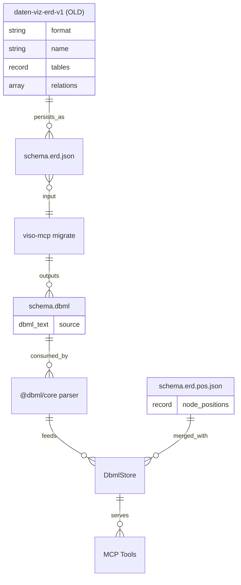

# feat: viso-mcp v1.0.0 Relaunch

## Overview

Relaunch des bestehenden `daten-viz-mcp@0.2.0` als `viso-mcp@1.0.0` (MIT-Lizenz,
npm) mit:

1. **ERD-Format-Migration Custom JSON → DBML** (via `@dbml/core` npm package)
2. **Agent-Auto-Modeling** via neue Bulk-Mutation-MCP-Tools `set_bpmn` / `set_dbml`
3. **Auto-Setup-CLI** `npx viso-mcp init` schreibt `.mcp.json` fuer Claude Code
4. **Hybrid-UX-Editor** (Canvas-first + Tools-Sidebar links + Properties-Panel
   rechts + Code-Panel toggelbar via Cmd+/)
5. **ESM-Export-Bundle + HTTP-API-Wrapper** fuer Hub-Integration (Next.js)
6. **`attachmentSlot` React-Prop** fuer Hub-seitige Screen-Recording-Integration
7. **Polish-Layer**: Dark Mode, A11y, Touch-Support, Auto-Layout, Undo/Redo,
   Command-Palette (Cmd+K)

Der Relaunch erhaelt die 41 bestehenden Tests, baut auf der vorhandenen
React-Flow + ELK + shadcn/ui-Basis auf und fuehrt kein Breaking-Renaming der
MCP-Tool-Namen durch (bleiben `diagram_*` + `process_*` fuer Agent-Kompatibilitaet).

## Problem Statement

### Was heute fehlt (aus Repo-Research)

Das bestehende `daten-viz-mcp@0.2.0` ist funktional, aber mehrere Bausteine
fehlen fuer den naechsten Nutzungs-Schritt:

1. **Agent-Experience**: Fuer Auto-Modeling aus Freitext-Prompts fehlt ein
   Bulk-Mutation-Call. Agent muss aktuell 20+ atomare Calls absetzen, um ein
   durchschnittliches Diagramm zu erstellen (arXiv 2509.24592 zeigt: JSON-
   Bulk-Editing hat bei grossen Diagrammen hoehere Zuverlaessigkeit).
2. **ERD-Expressivitaet**: Custom JSON deckt composite keys, indexes, enums,
   TableGroups nicht ab. DBML ist der community-standard mit stabilem Parser
   (`@dbml/core`, in Produktion bei dbdiagram.io / Holistics).
3. **Distribution**: Kein CLI fuer Auto-Setup. User muss `.mcp.json`
   manuell anlegen - hohe Reibung bei Erstinstallation.
4. **Hub-Integration blockiert**: tsup emittiert nur CJS. TAFKA KI-Hub
   (Next.js 16 App Router) kann den Editor nicht als React-Component
   importieren ohne ESM-Build.
5. **UX-Stub**: `AppSidebar.tsx:100-124` hat `selectedElement`-Prop
   deklariert, aber nicht wired. Properties-Panel-Funktionalitaet fehlt.
6. **Kein HTTP-Adapter**: Vite-Plugin hat REST-API auf `/__daten-viz-api/*`,
   aber standalone HTTP-Server fehlt (Hub braucht Endpoints ausserhalb Vite).

### Warum diese Probleme jetzt loesen

- **TAFKA KI-Hub** (Next.js 16, Supabase, @xyflow/react 12) kann die Komponenten
  1:1 wiederverwenden — **identische React-Flow-Version**, nur ESM-Build noetig.
- **Agent-Auto-Modeling** ist Killer-Use-Case fuer Audit-Stufe-1 (aus Audit-
  Fragebogen → BPMN generieren) und fuer IT-Roentgenbild (aus Prisma/SQL →
  DBML generieren).
- **DBML-Migration** ist einmaliger Aufwand jetzt vs. Schulden in jedem
  spaeteren Release.

## Proposed Solution

Eine phasierte Neuimplementation in 7 Phasen mit klaren Quality Gates. Jede
Phase ist einzeln shippable und bricht die bestehende Funktionalitaet nicht.

**High-Level-Approach:**

- **Phase 0 (1 Tag)**: Rebrand-Foundation (Package-Name, Repo-Rename, Format-
  Literals, ESM-Build via `tsup --format cjs,esm`)
- **Phase 1 (2-3 Tage)**: DBML-Migration mit `@dbml/core` als Storage-Adapter,
  alte `DiagramStore`-API bleibt stabil
- **Phase 2 (1 Tag)**: `set_bpmn` / `set_dbml` Bulk-Mutation-Tools mit
  RFC-7807-Error-Format
- **Phase 3 (1-2 Tage)**: Auto-Setup-CLI `viso-mcp init` mit Merge-Logik fuer
  `.mcp.json`
- **Phase 4 (3-4 Tage)**: Hybrid-UX-Editor (Tools-Sidebar + Properties-Panel +
  Code-Panel, Undo/Redo, Command-Palette)
- **Phase 5 (2 Tage)**: HTTP-API-Wrapper + ESM-Bundle + `attachmentSlot`-Prop
- **Phase 6 (2 Tage)**: Polish (Dark Mode, A11y, Touch-Support, Auto-Layout-
  Button)

**Gesamtaufwand:** 12-15 Arbeitstage fuer einen Einzelnen, 7-9 Tage bei
zwei Parallelstraengen (UI + Infrastruktur).

## Technical Approach

### Architecture

Der neue Stack baut die bestehende Struktur inkrementell aus. Gruener Bereich =
neu, gelb = refactored, weiss = bleibt wie es ist:

```
┌─ Editable Surfaces ──────────────────────────────────────────┐
│                                                              │
│  [BPMN Source]              [ERD Source]                     │
│  process.bpmn.json          schema.dbml    <-- NEW           │
│  (unchanged)                                                 │
│                                                              │
│  [Positions Sidecar]        [Positions Sidecar]              │
│  process.bpmn.pos.json      schema.erd.pos.json (unchanged)  │
│                                                              │
└──────────────────────────────────────────────────────────────┘
               ↓ read / write                   ↓
┌─ Storage Adapter Layer ──────────────────────────────────────┐
│                                                              │
│  ProcessStore (unchanged)     DbmlStore  <-- NEW             │
│                                (wraps @dbml/core,            │
│                                 implements DiagramStore      │
│                                 interface)                   │
│                                                              │
└──────────────────────────────────────────────────────────────┘
               ↓ call                              ↓
┌─ MCP Tool Layer (stdio) ──────────────────────────────────────┐
│                                                              │
│  BPMN Tools (6 existing + 1 new)                             │
│   process_add_node, process_remove_node,                     │
│   process_add_flow, process_remove_flow,                     │
│   process_get_schema, process_export_mermaid,                │
│   + set_bpmn  <-- NEW                                        │
│                                                              │
│  ERD Tools (8 existing + 1 new)                              │
│   diagram_create_table, diagram_remove_table,                │
│   diagram_add_column, diagram_remove_column,                 │
│   diagram_add_relation, diagram_remove_relation,             │
│   diagram_get_schema, diagram_export_mermaid,                │
│   + set_dbml  <-- NEW + diagram_export_sql  <-- NEW          │
│                                                              │
└──────────────────────────────────────────────────────────────┘
               ↓                                      ↓
┌─ Distribution ────────────────────────────────────────────────┐
│                                                              │
│  [CLI Entries]                                               │
│   viso-mcp serve           (existing, renamed)               │
│   viso-mcp init     <-- NEW                                  │
│   viso-mcp migrate  <-- NEW                                  │
│   viso-mcp export   <-- NEW (mermaid/sql/dbml)               │
│                                                              │
│  [Package Outputs via tsup --format cjs,esm]                 │
│   dist/server.cjs          (for MCP stdio)                   │
│   dist/server.js           (ESM, for Node imports)           │
│   dist/preview.js          <-- NEW (ESM, React Components)   │
│   dist/http-adapter.js     <-- NEW (ESM, HTTP endpoints)     │
│                                                              │
│  [Browser Editor (refactored UX)]                            │
│   Hybrid Layout: Canvas + Tools Sidebar + Props Panel        │
│   Code Panel (toggleable)                                    │
│   attachmentSlot React-Prop (Hub-injection point)            │
│                                                              │
└──────────────────────────────────────────────────────────────┘
```

### Data Model Change (ERD)

Die Format-Migration fuer ERD schneidet ab einer klaren Grenze:



Positions bleiben in `schema.erd.pos.json` separat (Git-Diff-freundlich, keine
Koordinaten-Konflikte bei Parallel-Edits).

### Implementation Phases

---

#### Phase 0: Rebrand-Foundation (1 Tag)

**Ziel:** Package-Rename, Repo-Rename, Dual-Format-Build (CJS + ESM).

**Tasks:**

- [ ] `git mv` Repo-Verzeichnis `Daten_Prozess_Visualisierungs_Tool/` →
      `viso-mcp/`
- [ ] `package.json:1` — `name: "daten-viz-mcp"` → `"viso-mcp"`, `version:
      "0.2.0"` → `"1.0.0"`, `bin: {"daten-viz-mcp"}` → `{"viso-mcp"}`
- [ ] `tsup.config.ts:5` — `format: ['cjs']` → `format: ['cjs', 'esm']`
- [ ] Rebrand-Sweep in allen Files:
  - `DATEN_VIZ_FILE` → `VISO_FILE` (keep old as deprecated alias in `src/server.ts:14-20`)
  - `daten-viz-bpmn-v1` → `viso-bpmn-v1` in `src/bpmn/schema.ts:39-44`
  - `daten-viz-erd-v1` → `viso-erd-v1` in `src/schema.ts:57-62` (alter Read-
    Support fuer Migration, siehe Phase 1)
  - `/__daten-viz-api` → `/__viso-api` in `src/preview/vite-plugin.ts:37`
  - `/__daten-viz-ws` → `/__viso-ws` in `src/preview/vite-plugin.ts:?`
  - `plugin name` + alle Kommentare
- [ ] `CLAUDE.md:1` Projekt-Name anpassen
- [ ] `README.md` rewriten (gibt es noch nicht, neu erstellen)
- [ ] `.gitignore`: `*.bpmn.json` + `*.bpmn.pos.json` ergaenzen (Inkonsistenz fix)

**Neue Dateien:**
- `README.md` (Englisch fuer npm-Community, Deutsch-Sektion fuer TAFKA-Kontext)
- `CHANGELOG.md` mit v1.0.0 Breaking Changes

**Success Criteria:**
- `npm run build` erzeugt `dist/server.cjs` UND `dist/server.js` (ESM)
- `npm test` gruen (alle 41 Tests passen nach Rebrand)
- `node dist/server.cjs --file ./test-schema.erd.json` startet MCP stdio
  erfolgreich (gleiche Funktionalitaet wie pre-rebrand)

**Estimated effort:** 1 Tag

---

#### Phase 1: DBML Migration (ERD Format Refactor) (2-3 Tage)

**Ziel:** ERD-Source-of-Truth wechselt von Custom JSON zu DBML. Bestehende
MCP-Tool-Interfaces bleiben identisch, nur die Persistenz-Schicht wird
ersetzt.

**Tasks:**

- [ ] `npm install @dbml/core` (current: 3.x, pin in package.json)
- [ ] Neue Datei `src/dbml-store.ts` — implementiert dieselbe Public-API wie
      `DiagramStore` (`load`, `save`, `getSchema`), intern:
  - `load()`: `fs.readFile('*.dbml')` → `@dbml/core.Parser.parse()` → internes
    Schema (bleibt Zod-validiert fuer Typsicherheit)
  - `save()`: internes Schema → `@dbml/core.Exporter.export()` → atomic write
    `*.dbml` (tmp+rename pattern)
  - `mergeWithPositions()`: liest `*.erd.pos.json`, merged Koordinaten
- [ ] Ersetze `DiagramStore` durch `DbmlStore` in `src/server.ts:26`
- [ ] **Schema-Mapping-Tabelle** (Referenz in `src/dbml-store.ts` als Comment):
  
  | Custom JSON | DBML Equivalent |
  |---|---|
  | `tables[name].columns[].name` | `Table.field.name` |
  | `tables[name].columns[].type` | `Table.field.type` |
  | `tables[name].columns[].isPrimaryKey` | `Table.field.pk` |
  | `tables[name].description` | `Table.note` |
  | `tables[name].columns[].description` | `Table.field.note` |
  | `relations[]` | `Ref` (with cardinality) |
  | (NEU verfuegbar) | `Table.indexes`, `enum`, `TableGroup` |

- [ ] Neue Datei `src/migrate-cli.ts` — `viso-mcp migrate <file.erd.json>`:
  - Liest altes Format (Support fuer `daten-viz-erd-v1` Read-Only!)
  - Mapped via Schema-Mapping-Tabelle
  - Schreibt `<file>.dbml` + behaelt `<file>.erd.pos.json` unveraendert
  - Erstellt Backup `<file>.erd.json.bak`
  - **Lossy-Handling**: Description → DBML Note (auf 1-Zeilen gekuerzt +
    Warn wenn Quelle > 200 Zeichen)
- [ ] Tests:
  - `src/dbml-store.test.ts` — 10+ Tests (load/save/roundtrip/positions-
    merge/empty-file/malformed-DBML)
  - `src/migrate-cli.test.ts` — 5+ Tests mit Reference-Schemas in `fixtures/`
  - 5 Reference-ERDs in `fixtures/erd-samples/`: simple, composite-keys,
    enums, multi-schema, TableGroups
- [ ] Neue MCP-Tool: `diagram_export_sql` (bereits moeglich via @dbml/core.Exporter):
  - Args: `dialect: 'postgres'|'mysql'|'mssql'|'oracle'|'snowflake'`
  - Returns: SQL DDL Text

**Resolved Design Decisions:**
- Migration-Strategie: **Explizite Pfade** (kein Auto-Recursive). `viso-mcp
  migrate <file1> <file2> ...`. Optional `--recursive <dir>` in v1.1.
- Position-Orphans: **Skip + Warn** (Positionen fuer Nodes, die in neuem DBML
  nicht mehr existieren, werden nicht mitgenommen. Log zeigt Liste.)
- Lossy-Policy: **DBML-Note mit 200-Zeichen-Cut + Warn**. Full-length-
  Descriptions in `description.meta.json` Sidecar *nicht MVP*, spaeter
  optional.
- Format-Literal-Bump: Schema-Literal wird `viso-erd-v1`. Alte Files werden
  rejected mit Message `Run: npx viso-mcp migrate <file>`.
- Rollback: `.erd.json.bak` wird erstellt, Git-Backup ist primaer.

**Success Criteria:**
- `npx viso-mcp migrate test-schema.erd.json` → erzeugt `test-schema.dbml`
  + `.bak`
- MCP-Tool `diagram_create_table` nach Migration funktioniert identisch
- `diagram_export_sql --dialect postgres` erzeugt gueltiges PostgreSQL DDL
- 5 Reference-Schemas roundtrippen 1:1 (export → import → export = identisch)
- Keine Verlust von Positionen nach Migration

**Estimated effort:** 2-3 Tage

---

#### Phase 2: Bulk-Mutation Tools (`set_bpmn` / `set_dbml`) (1 Tag)

**Ziel:** Agent kann initiales Diagramm in einem Call erzeugen.

**Tasks:**

- [ ] Neue MCP-Tool `set_bpmn` in `src/bpmn/tools.ts`:
  - Args: `json: string` (komplettes BPMN-JSON)
  - Validiert via `ProcessSchema.safeParse`
  - Bei Fehler: RFC 7807 Error-Response (`application/problem+json`, `type`,
    `title`, `detail`, `errors[]` mit Zod-Path)
  - Bei Erfolg: **REPLACE** (nicht Merge) - alte Positionen fuer nicht
    mehr existierende Nodes werden aus `*.bpmn.pos.json` gepruned
  - Returns: `{ok: true, nodeCount, flowCount}` oder Problem-Details
- [ ] Neue MCP-Tool `set_dbml` in `src/tools.ts`:
  - Args: `dbml: string` (DBML-Text)
  - Validiert via `@dbml/core.Parser.parse` (Parse-Errors mit Zeile/Spalte)
  - Bei Fehler: RFC 7807 Error + Source-Location
  - Bei Erfolg: REPLACE, Position-Prune
  - Returns: `{ok: true, tableCount, relationCount}` oder Problem-Details
- [ ] Tests:
  - `src/bpmn/tools.test.ts` erweitert: `set_bpmn` happy-path, malformed JSON,
    position-prune, ID-collision
  - `src/tools.test.ts` erweitert: `set_dbml` happy-path, malformed DBML,
    parse-error-location, position-prune

**Resolved Design Decisions:**
- **REPLACE statt MERGE** (aus Brainstorm bestaetigt)
- **Atomic** bei Parse-Fehler (File bleibt unveraendert)
- **Position-Prune sofort** (keine Orphan-Retention)
- Error-Format: RFC 7807 `application/problem+json` — industry standard,
  Claude/Cursor Agents koennen es parsen
- Return-Shape: Kurze Zusammenfassung (nicht komplettes neues Schema, spart
  Tokens)

**Success Criteria:**
- `set_dbml` mit Reference-DBML erstellt 7-Tabellen-Schema in <100ms
- Malformed DBML wirft strukturierten Problem-JSON mit Line/Col
- Position-File nach REPLACE enthaelt keine Orphan-IDs
- Existing atomic tools (`diagram_add_column` etc.) funktionieren weiter
  nach `set_dbml` identisch

**Estimated effort:** 1 Tag

---

#### Phase 3: Auto-Setup-CLI (`npx viso-mcp init`) (1-2 Tage)

**Ziel:** Ein Befehl konfiguriert Claude Code fuer Nutzung.

**Tasks:**

- [ ] `src/cli.ts` erweitern mit Subcommands (bisher nur `serve`):
  - `init` — schreibt/erweitert `.mcp.json`
  - `migrate` — (aus Phase 1)
  - `export` — standalone export (mermaid/sql/dbml)
  - `serve` — (bestehend)
- [ ] Neue Datei `src/init-cli.ts`:
  - **Workspace-Detection-Heuristik** (in Prioritaet):
    1. `.claude/` Ordner existiert → Claude-Code-Workspace
    2. `.mcp.json` bereits existiert → Merge-Modus
    3. `package.json` existiert → Node-Project (Hinweis: Installation OK)
    4. Sonst: interaktiver Prompt "Kein Claude-Code-Workspace erkannt,
       trotzdem `.mcp.json` hier anlegen?"
  - **Merge-Logik** fuer `.mcp.json`:
    - Wenn `mcpServers.viso-mcp` nicht existiert: hinzufuegen
    - Wenn `viso-mcp` existiert mit alter Config: upgrade (Prompt: "Update
      existing viso-mcp entry?")
    - Wenn nicht-viso-mcp Server existieren: diese bleiben unveraendert
  - **Config-Shape** (fuer Portabilitaet):
    ```json
    {
      "mcpServers": {
        "viso-mcp": {
          "command": "npx",
          "args": ["-y", "viso-mcp@latest", "serve",
                   "--file", "./schema.dbml",
                   "--bpmn-file", "./process.bpmn.json"]
        }
      }
    }
    ```
  - **Flags:**
    - `--dry-run`: JSON-Diff ausgeben, nix schreiben
    - `--file=<path>`: ERD-File-Pfad (default: `./schema.dbml`)
    - `--bpmn-file=<path>`: BPMN-File-Pfad (default: `./process.bpmn.json`)
    - `--global`: `~/.claude.json` statt `./.mcp.json` (opt-in)
- [ ] Tests mit `execa` + `node:fs` tmpdir:
  - `src/init-cli.test.ts` — 8+ Tests:
    - frischer Workspace, erzeugt `.mcp.json`
    - existing `.mcp.json` mit anderen Servern, merged korrekt
    - existing `viso-mcp` entry, updated nach Prompt (mocked)
    - `--dry-run` schreibt nichts
    - kein Claude-Workspace erkannt, fragt User
    - Windows-Path-Handling (mit `path.posix`)
    - idempotent bei zweitem Run
    - `--global` schreibt in Home-Verzeichnis

**Resolved Design Decisions:**
- **Project-local by default** (`./.mcp.json`), `--global` fuer `~/.claude.json`
- **Merge, nicht overwrite**
- **Prompt bei Konflikt** (nicht silent-overwrite)
- **Windows-Support** via `path.posix` fuer args, normale `path` fuer File-I/O
- **Dry-run = JSON-Diff** (human-readable unified-diff-style fuer CLI-Output,
  vollstaendiger JSON-Compare im `--verbose`)

**Success Criteria:**
- `mkdir tmp && cd tmp && npx viso-mcp init` erzeugt `.mcp.json` korrekt
- Zweiter Run = no-op (kein Prompt, kein Change)
- Merge mit bestehenden MCP-Servern erhaelt alle anderen Eintraege
- Windows-CI-Job (wenn in Zukunft) rennt gruen

**Estimated effort:** 1-2 Tage

---

#### Phase 4: Hybrid-UX-Editor Refactor (3-4 Tage)

**Ziel:** Canvas-first Hybrid-Layout mit Tools-Sidebar links, Properties-Panel
rechts, toggelbarem Code-Panel unten. Siehe Mockup `docs/designs/editor-ux-
mockup-hybrid-final.png`.

**Tasks:**

**Top-Header (`src/preview/components/shell/TopHeader.tsx`, NEW):**

- [ ] Logo + Dateiname (dynamisch aus aktiver Tab)
- [ ] "</> Code"-Toggle (oeffnet Code-Panel unten)
- [ ] "↓ Export"-Dropdown: Mermaid, SQL DDL, DBML, SVG, PNG
- [ ] **Auto-Layout-Button** (ELK one-click, ruft `useDiagramSync.applyLayout()`
      / `useProcessSync.applyLayout()`)

**Linke Sidebar — Tool Palette (`src/preview/components/shell/ToolPalette.tsx`, NEW):**

- [ ] Breite 68px, vertikal, icons-only
- [ ] Tools:
  - Pointer (active-default, keyboard `V`)
  - Pan (keyboard `H`)
  - Separator
  - Start-Event (keyboard `1`)
  - End-Event (keyboard `2`)
  - Task (keyboard `3`)
  - Gateway (keyboard `4`)
- [ ] Active-Tool-State im `useToolStore` (zustand oder context, konsistent mit
      existing patterns)
- [ ] Click-to-Place: Tool aktiv → Click auf Canvas → Node an Position

**Rechte Sidebar — Properties Panel (`src/preview/components/shell/PropertiesPanel.tsx`, NEW; ersetzt Stub in `AppSidebar.tsx:100-124`):**

- [ ] 300px Breite, einblendbar bei Selection
- [ ] Header: Node-Type + Name
- [ ] Feld LABEL: Text-Input (onChange → `updateNode({id, label})`)
- [ ] Feld TYPE: Dropdown (context-specific: BPMN → start/end/task/gateway
      Typen; ERD → column-type-Liste)
- [ ] Feld FARBE: 6 Swatches + Custom-Picker (schreibt in
      `<node>.style.color`)
- [ ] Feld KOMMENTAR: Textarea (schreibt in `<node>.description`)
- [ ] `attachmentSlot` React-Prop rendering (Phase 5)
- [ ] **Empty-State** (kein Node selektiert): Zeigt Diagram-Level-Metadata
      (Name, Format, Version) + Export-Buttons
- [ ] **Canvas-Empty-State**: Instruktiver Card "Click Shape in Sidebar or
      Cmd+K for Command Palette"

**Bottom Code Panel (`src/preview/components/shell/CodePanel.tsx`, NEW):**

- [ ] Toggelbar via Cmd+/ oder Header-Button, default collapsed
- [ ] Hoehe 200-400px (resizable)
- [ ] `@uiw/react-codemirror` oder `monaco-editor-react` mit Syntax-Highlighting
- [ ] Zeigt BPMN-JSON oder DBML-Text abhaengig von aktivem Tab
- [ ] Live-Sync mit Canvas: Text-Edit → debounce 300ms → `set_bpmn`/`set_dbml`
      → Canvas re-renders
- [ ] Parse-Fehler: Inline-Squiggles (via CodeMirror-Linter) + Footer-Error-Bar

**Core-Interactions:**

- [ ] **Undo/Redo**: History-Stack pro Diagram (canvas-only MVP, Code-Panel
      nutzt browser-native undo). Keyboard Cmd+Z / Cmd+Shift+Z
- [ ] **Auto-Save-Indicator**: Status-Dot im Header (gruen: saved, gelb: saving,
      rot: error, grau: untouched)
- [ ] **Command-Palette** (neue Komponente `src/preview/components/CommandPalette.tsx`):
  - Keyboard Cmd+K
  - Actions: "Add Task Node", "Add Start Event", "Export as Mermaid", 
    "Toggle Code Panel", "Run Auto-Layout", "Switch Diagram"
  - Fuzzy-search via `cmdk` npm-Package

**Resolved Design Decisions:**
- **Empty-State**: Beide (Canvas leer + No-Selection) sind instruktiv, nicht
  hidden
- **Code-Panel-Content**: Active-Tab-Binding (ERD-Tab aktiv → zeigt DBML;
  BPMN-Tab aktiv → zeigt BPMN-JSON)
- **Undo-Scope**: Canvas-only im MVP. Code-Panel nutzt CodeMirror built-in
  history (separater Stack). Keine cross-boundary-Undo — zu riskant.
- **Parse-Error-Location**: CodeMirror inline squiggles + Footer-Bar mit
  "Line 12: syntax error near `[pk]`"

**Success Criteria:**
- Mockup-Fidelitaet: Vergleich gegen `editor-ux-mockup-hybrid-final.png`
  innerhalb 90% visueller Aehnlichkeit
- Cmd+K oeffnet Command-Palette mit 8+ Actions
- Code-Panel toggelt instant (keine Re-Mount-Hiccups)
- Properties-Panel zeigt korrekte Felder fuer jeden Node-Typ
- Auto-Layout-Button bringt Diagramm zu stabilem ELK-Layout

**Estimated effort:** 3-4 Tage (UI + Interaktions-Feinschliff)

---

#### Phase 5: HTTP-API-Wrapper + ESM-Bundle + `attachmentSlot` (2 Tage)

**Ziel:** Hub kann Editor + MCP-Tools via Next.js importieren bzw. via HTTP
aufrufen.

**Tasks:**

**ESM-Bundle fuer React Components (`src/preview/index.ts`, NEW):**

- [ ] `export { VisoEditor } from './VisoEditor'` — Root-Component mit Props:
  ```typescript
  interface VisoEditorProps {
    bpmnFile?: string;         // Path or URL
    dbmlFile?: string;         // Path or URL
    readOnly?: boolean;
    workspaceId?: string;      // Hub-context, passes through to HTTP-API calls
    attachmentSlot?: (ctx: {
      nodeId: string;
      nodeType: string;
      diagramType: 'bpmn' | 'erd';
    }) => React.ReactNode;
    attachmentEligibleTypes?: string[];  // default: ['task', 'table']
    apiBaseUrl?: string;       // default: '/__viso-api' (Vite plugin) or custom
  }
  ```
- [ ] `export { useVisoEditor }` — Hook fuer programmatic control
- [ ] `'use client'` directive fuer Next.js Server Components

**HTTP-API-Wrapper (`src/http-adapter.ts`, NEW):**

- [ ] Standalone Express/Fastify-Server (Fastify bevorzugt: leicht, TypeScript-
      native, schneller)
- [ ] Endpoint-Shape (spiegelt MCP-Tools):
  ```
  GET    /api/workspace/:workspaceId/bpmn                    → get_schema
  POST   /api/workspace/:workspaceId/bpmn/nodes              → process_add_node
  DELETE /api/workspace/:workspaceId/bpmn/nodes/:nodeId      → process_remove_node
  POST   /api/workspace/:workspaceId/bpmn/flows              → process_add_flow
  DELETE /api/workspace/:workspaceId/bpmn/flows/:flowId      → process_remove_flow
  PUT    /api/workspace/:workspaceId/bpmn                    → set_bpmn
  GET    /api/workspace/:workspaceId/bpmn/export?format=...  → export

  (same shape for /erd/)

  GET    /api/workspace/:workspaceId/events                  → WebSocket/SSE for live updates
  ```
- [ ] **Auth**: Pass-through `Authorization`-Header an optionalen Validator-
      Callback `(token, workspaceId) => boolean | Promise<boolean>`
- [ ] **Error-Format**: RFC 7807 `application/problem+json`
- [ ] **CORS**: konfigurierbar via ENV `VISO_ALLOWED_ORIGINS` (Comma-separated),
      default `http://localhost:3000,http://localhost:3001`
- [ ] **Rate-Limiting**: None in viso-mcp (Hub-Verantwortung), but document
      recommendation
- [ ] Start via `npx viso-mcp serve --http 4000` (Flag zusaetzlich zu MCP stdio)

**`attachmentSlot` Integration:**

- [ ] In `PropertiesPanel.tsx`: Renders `attachmentSlot?.({ nodeId, nodeType,
      diagramType })` wenn Prop vorhanden UND `attachmentEligibleTypes` matcht
- [ ] Dokumentiere Hub-Integration-Pattern im README (minimal example):
  ```tsx
  // In Hub (Next.js page):
  'use client';
  import { VisoEditor } from 'viso-mcp/preview';
  import { TafkaScreenRecordingSlot } from '@/components/attachments';
  
  <VisoEditor
    workspaceId={workspaceId}
    apiBaseUrl={`/api/proxy/viso/${workspaceId}`}
    attachmentSlot={(ctx) => <TafkaScreenRecordingSlot {...ctx} />}
  />
  ```
- [ ] Tests:
  - `src/http-adapter.test.ts` — 8+ Tests: auth-pass-through, RFC-7807 errors,
    CORS preflight, WebSocket-Connect, endpoint-shape
  - `src/preview/VisoEditor.test.tsx` — React-Testing-Library: attachmentSlot
    rendering, props wiring

**Resolved Design Decisions:**
- **Fastify** statt Express (Performance, TS-native, besser dokumentiert 2026)
- **Auth-Callback-Pattern** (viso-mcp kennt keine Secrets, delegiert an Hub)
- **CORS-ENV** (nicht hardcoded, nicht wildcard)
- **WebSocket via `fastify-websocket`** (bereits in `@fastify/websocket` Plugin)
- **`attachmentSlot`-Signature**: Object-props (nicht positional), TypeScript-
  freundlich, erweiterbar

**Success Criteria:**
- `npx viso-mcp serve --http 4000` startet Server
- `curl localhost:4000/api/workspace/ws1/bpmn` returniert BPMN-Schema
- Malformed PUT body → `application/problem+json` mit 400er Status
- VisoEditor Component rendert in minimalem Next.js App Router
- `attachmentSlot` wird nur fuer `task` + `table` Nodes aufgerufen (default)

**Estimated effort:** 2 Tage

---

#### Phase 6: Polish (Dark Mode, A11y, Touch, Auto-Layout) (2 Tage)

**Ziel:** Production-Reife fuer Consultant-Zielgruppe + Audit-Compliance.

**Tasks:**

**Dark Mode:**

- [ ] Tailwind 4 Dark-Mode-Setup (`prefers-color-scheme` + manual toggle via
      `next-themes` oder eigener Context)
- [ ] CSS-Custom-Properties fuer alle Theme-Farben in
      `src/preview/styles/globals.css`
- [ ] shadcn/ui Components sind bereits dark-mode-kompatibel

**A11y (WCAG 2.1 AA):**

- [ ] Tab-Order: Header → Tool-Sidebar → Canvas → Properties → Code-Panel
- [ ] ARIA-Labels fuer alle Canvas-Nodes: "BPMN Start Event, Node ID xyz,
      Label: Registrieren"
- [ ] Keyboard-Navigation im Canvas: Arrow keys bewegen selektierten Node,
      Tab navigiert zwischen Nodes, Enter oeffnet Properties, Delete loescht
- [ ] Focus-Indicator: 2px solid primary color, sichtbar auf allen
      interaktiven Elementen
- [ ] Screen-Reader-Test mit VoiceOver (macOS) + NVDA (Windows, wenn moeglich)
- [ ] Color-Contrast-Check: Tailwind-Farben gegen WCAG-AA (4.5:1 normal, 3:1
      grosse Fonts)

**Touch-Support:**

- [ ] React Flow hat Touch out-of-the-box, aber:
  - Pinch-Zoom-Sensitivity anpassen
  - Touch-Drag-Handles groesser (44x44 Mindestgroesse WCAG)
  - Tap-to-Select (100ms delay verhindert)
- [ ] Bei Bedarf: `@use-gesture/react` fuer custom touch handlers
- [ ] iPad-Testing: Safari iOS + Chrome iOS

**Auto-Layout-Button:**

- [ ] Button im Top-Header (bereits in Phase 4 angelegt)
- [ ] One-Click ruft bestehenden ELK-Layout-Code aus
      `src/preview/layout/elk-layout.ts`
- [ ] Animated transition (CSS transform mit 300ms ease)

**Theme-Modul (`src/theme.ts`, NEW, fuer Mermaid-Exports):**

- [ ] `themeVariables`-Export: TAFKA-Brand-Colors, neutrale Palette
- [ ] `classDef`-Fragments: Fuer `daten-viz-*`-Shapes in Mermaid
- [ ] Integration in `src/export/mermaid.ts` + `src/bpmn/export-mermaid.ts`

**Resolved Design Decisions:**
- **Dark-Mode-Default**: System-Preference (nicht manuell forcen)
- **A11y-MVP-Scope**: WCAG 2.1 AA (nicht AAA, das waere overkill fuer Tool)
- **Touch-Testing**: iPad als Hauptziel (TAFKA-Workshops). Android-Tablets
  best-effort.
- **Theme-TAFKA-Colors**: Aus TAFKA-Design-System (im TAFKA_Relaunch Repo,
  Pencil.dev). Values: `--primary: #4F46E5`, `--success: #10B981`,
  `--danger: #EF4444`, `--warning: #F59E0B`.

**Success Criteria:**
- Lighthouse Accessibility Score >= 95
- VoiceOver kann komplett durch Editor navigieren
- Dark Mode schaltet ohne FOUC (Flash of Unstyled Content)
- iPad-Test: User kann BPMN-Flow erstellen ohne Tastatur
- Mermaid-Export nutzt konsistentes Theme in hell+dunkel

**Estimated effort:** 2 Tage

---

### 7. Additional Design Decisions from SpecFlow Gap-Analysis

Beyond phase-specific decisions above, the following cross-cutting decisions
are fixed before implementation:

#### MCP-Tool-Naming (kein Breaking Change)

- `diagram_*` + `process_*` Namen bleiben v1.0 API.
- Rationale: Agents (Claude Code, Cursor) haben diese Namen im Prompt-Kontext.
  Rename wuerde alle existing `.mcp.json` Configs brechen.
- In v2.0 moeglich: `viso_erd_*` / `viso_bpmn_*` Namespace, dann mit Alias-
  Support fuer 1 Release.

#### Environment-Variable-Aliasing

- `VISO_FILE` = primary
- `DATEN_VIZ_FILE` = deprecated alias, works with stderr warn message fuer
  v1.0.0. Entfernt in v1.1.
- Same fuer `VISO_BPMN_FILE` / `DATEN_VIZ_BPMN_FILE`

#### npm-Publish-Strategie

- `daten-viz-mcp@0.2.0` wird NICHT unpublished (npm-Policy, andere koennten
  es noch nutzen)
- `npm deprecate daten-viz-mcp "Moved to viso-mcp - see https://npmjs.com/viso-mcp"`
- `viso-mcp@1.0.0` published neu

#### Repo-Rename-Handling

- `git mv` im lokalen Ordner erhaelt History
- GitHub-Rename in Settings → Renames (wenn Repo public)
- `CHANGELOG.md` dokumentiert Old-Repo-URL
- Existing `.mcp.json` mit absolute paths funktionieren weiter, aber User
  sollte `npx viso-mcp init` erneut laufen

#### Format-Literal-Support-Window

- v1.0.0: nur `viso-erd-v1` und `viso-bpmn-v1` im Read-Pfad (bpmn unchanged)
- `viso-mcp migrate` liest `daten-viz-erd-v1` und schreibt `viso-erd-v1`
- v1.1+: `daten-viz-erd-v1` wird nicht mehr erkannt (forced migration)

#### Testing-Strategie

- **Unit**: Vitest fuer alle Stores, Tools, Schemas
- **Integration**: execa fuer CLI-Tests in tmpdirs
- **DBML-Roundtrip**: 5 Reference-Schemas in `fixtures/erd-samples/` 
  (simple, composite-PK+FK, enums+TableGroups, multi-schema, large 50-tables)
- **Visual Regression**: DEFERRED post-MVP (React Flow SVG-renders sind non-
  deterministisch). Statt dessen DOM-Snapshot-Tests mit `@testing-library/react`
- **MCP Smoke**: Stdio-Harness fuer `set_dbml` + `diagram_add_column` Sequenz
- **Coverage-Ziel**: 80% statements, 75% branches

#### Telemetry

- **None in MVP.** Keine Opt-in-Analytics. npm-Downloads sind ausreichende
  Signal. Spaeter bei Bedarf: PostHog self-hosted (EU-konform).

#### Node.js-Minimum

- **Node 20 LTS** (aktuell Node 22 stable, 20 weiterhin LTS bis April 2026-10)
- ESM + CJS dual-build stellt Kompatibilitaet mit aelteren Consumers sicher

## Alternative Approaches Considered

| Approach | Why rejected |
|---|---|
| **BPMN 2.0 XML als Source-of-Truth** | arXiv 2509.24592: 4x Tokens, 8% Success bei Open-Weights-LLMs. Mermaid unterstuetzt kein echtes BPMN. Custom JSON ist validiert durch Research. |
| **Mermaid als ERD-Source-of-Truth** | Fehlen composite keys, indexes, enums, TableGroups (GitHub Issue #3582). Reicht nur als Export-Format. |
| **D2 als primaeres Format** | Kein GitHub-nativer Render (HN-Discussion Oct 2025), kleinere LLM-Community. D2 vertagt als "Pretty Export" fuer Pitch-Decks. |
| **Hub als Monorepo (viso-mcp integriert)** | Verliert Wiederverwendbarkeit fuer andere MCP-User (Cursor, Cline etc.). Standalone npm + Hub bindet ein ist flexibler. |
| **@react-pdf/renderer fuer Hub-PDFs** | Memory-Leaks (Issue #718), SVG-CSS-Probleme, Next.js-16-App-Router-Inkompat. Siehe brainstorm Section "PDF-Toolchain". |
| **Touch-Support erst in v1.1** | Fabian-Feedback: iPad-Workshops sind TAFKA-Kernszenario. MVP-essential. |
| **Multi-User-Logik in viso-mcp Core** | Singleplayer-MCP ist einfacher, Hub baut Multi-User-Layer obenauf (Y.js oder Workspace-Locks). Saubere Trennung. |

## Acceptance Criteria

### Functional Requirements

- [ ] `npm run build` erzeugt `dist/server.cjs` (CJS), `dist/server.js` (ESM),
      `dist/preview.js` (ESM), `dist/http-adapter.js` (ESM)
- [ ] `node dist/server.cjs --file schema.dbml` startet MCP stdio erfolgreich
- [ ] `npx viso-mcp init` schreibt korrekte `.mcp.json` in frischem Workspace
- [ ] `npx viso-mcp init` merged korrekt in existierende `.mcp.json` mit
      anderen Servern
- [ ] `npx viso-mcp migrate test-schema.erd.json` erzeugt valide
      `test-schema.dbml` + Backup `.erd.json.bak`
- [ ] `set_dbml` Tool parst DBML, validiert, und erstellt neues Schema
- [ ] `set_bpmn` Tool parst BPMN-JSON, validiert, und erstellt neues Schema
- [ ] Malformed `set_*`-Inputs retournieren RFC-7807-Problem-JSON
- [ ] `diagram_export_sql --dialect postgres|mysql|mssql|oracle|snowflake`
      funktioniert
- [ ] Hybrid-UX-Editor zeigt Canvas mit Tools-Sidebar links + Properties-Panel
      rechts + toggelbarem Code-Panel unten
- [ ] Cmd+K oeffnet Command-Palette mit 8+ Actions
- [ ] Cmd+/ toggelt Code-Panel
- [ ] Undo/Redo (Cmd+Z / Cmd+Shift+Z) funktioniert im Canvas
- [ ] Auto-Layout-Button fuehrt ELK-Layout aus
- [ ] Export-Dropdown liefert Mermaid, SQL DDL, DBML, SVG, PNG
- [ ] HTTP-API-Server startet via `--http <port>` Flag
- [ ] `VisoEditor` React-Component kann in Next.js 16 App Router importiert
      werden
- [ ] `attachmentSlot` wird an `PropertiesPanel` gerendert fuer eligible Nodes

### Non-Functional Requirements

- [ ] **Performance**: Initial-Render <2s fuer 50-Node-Diagramm auf mid-range
      Laptop
- [ ] **Bundle-Size**: `dist/preview.js` <500kb gzipped (excluding React peer)
- [ ] **Accessibility**: Lighthouse A11y Score >= 95, WCAG 2.1 AA
- [ ] **Security**: Keine eval() / dangerouslySetInnerHTML / unsafe-CSP, CORS
      strict whitelisted
- [ ] **Portability**: `npx viso-mcp init` funktioniert auf macOS + Linux +
      Windows (CI-matrix)
- [ ] **Agent-Roundtrip-Quality**: Claude 4.5 / Opus 4.7 koennen 10-Node BPMN
      via `set_bpmn` mit 95%+ Success generieren (manuell geprueft mit 10
      Prompts)

### Quality Gates

- [ ] Alle 41 bestehenden Tests passen nach Rebrand
- [ ] Neue Tests: >= 30 weitere (DBML-Store, migrate, init-CLI, set_* tools,
      HTTP-adapter, UI-components)
- [ ] Coverage: >= 80% statements, >= 75% branches
- [ ] `npm run build` gruen
- [ ] `tsc --noEmit` ohne Errors
- [ ] Alle Features im Brainstorm MVP-Scope enthalten
- [ ] Mockup-Fidelity >= 90% visuell gegen `editor-ux-mockup-hybrid-final.png`
- [ ] 5 Reference-ERD-Schemas roundtrippen 1:1
- [ ] CHANGELOG.md dokumentiert alle Breaking-Changes
- [ ] README.md enthaelt Setup-Instructions + Minimal-Example + Hub-Integration-
      Example

## Success Metrics

**Short-term (Release-Day):**
- Tests gruen, Build gruen, alle Acceptance-Criteria erfuellt
- npm-Package published, `npx viso-mcp init` funktioniert weltweit
- Hub-Integration-Smoke-Test: TAFKA_KI_Transformationshub kann VisoEditor
  importieren

**Medium-term (2-4 Wochen):**
- Fabian nutzt das Tool taeglich fuer TAFKA-Audits und Hub-Prototyp
- Mindestens 1 externer User (Cursor/Cline) installiert via `npx init`
- Kein kritischer Bug im GitHub-Issues-Tracker

**Long-term (3-6 Monate):**
- npm-Downloads: >= 100/Woche (Indikator fuer Community-Adoption)
- TAFKA KI-Hub nutzt viso-mcp produktiv in Stufe 1 (Audit) und Stufe 2 (BPMN)
- Entscheidung getroffen ob D2-Export in v1.1 kommt (basierend auf
  Kunden-Pitch-Feedback)

## Dependencies & Prerequisites

### Neue npm-Dependencies

- `@dbml/core@^3.x` — DBML parser/exporter
- `fastify@^5.x` — HTTP server (Phase 5)
- `@fastify/websocket@^10.x` — WebSocket plugin
- `@fastify/cors@^9.x` — CORS plugin
- `@uiw/react-codemirror@^4.x` — Code-Panel editor
- `@codemirror/lang-json@^6.x` — JSON syntax highlighting
- `cmdk@^1.x` — Command palette (Linear-style)
- `execa@^9.x` — CLI testing (devDependency)
- `@use-gesture/react@^10.x` — Optional, touch gestures (Phase 6)

### Bestehende Dependencies (bleiben unveraendert)

- `@modelcontextprotocol/sdk@^1.28.0`
- `react@^19.0.0` + `react-dom@^19.0.0`
- `@xyflow/react@^12.0.0`
- `elkjs@^0.9.0`
- `tailwindcss@^4.2.2`
- `zod@^4.0.0`
- `chokidar@^4.0.0`

### External Systems

- **npm-Registry**: Publish-Rechte fuer `viso-mcp` package name (vor Phase 0
  reservieren!)
- **GitHub**: Repo-Rename `Daten_Prozess_Visualisierungs_Tool` → `viso-mcp`
- **Keine Hub-Abhaengigkeit**: viso-mcp kann standalone entwickelt werden, Hub-
  Integration ist optional

## Risk Analysis & Mitigation

| # | Risiko | Prob | Impact | Mitigation |
|---|---|---|---|---|
| 1 | `@dbml/core` API-Drift (Major-Release) | Mid | Mid | Version pin auf `^3.x`, eigener Parser-Adapter kapselt Lib, Roundtrip-Tests mit 5 Reference-Schemas |
| 2 | `@xyflow/react` v13+ Breaking Changes | Low | High | Wrapper-Components fuer alle Editor-interaktionen, Upgrade nur synchron mit Hub, Changelog-Monitoring |
| 3 | npm package name `viso-mcp` bereits belegt | Low | High | **Vor Phase 0 reservieren!** Wenn belegt: Fallback `@tafka/viso-mcp` scoped |
| 4 | Agent-Prompt-Kompatibilitaet bei Tool-Rename | - | - | Wird umgangen durch "kein Tool-Rename" Entscheidung |
| 5 | Hetzner-VPS-Ausfall blockiert Hub-PDF-Export | Low | Mid | Gotenberg-Standard-Image, Wechsel zu Railway/Fly per ENV (<1h Downtime) — **siehe brainstorm Risiken #4** |
| 6 | Mermaid-Styling-Inkonsistenzen | Mid | Low | `theme.ts` zentralisiert Styling, Fallback auf inline `style`-Direktiven, Regressions-Tests — **siehe brainstorm Risiken #5** |
| 7 | DBML-Migration verliert Descriptions > 200 Zeichen | Mid | Low | Warn-Messages mit Liste, spaeter `.meta.json`-Sidecar in v1.1 falls Feedback |
| 8 | Code-Panel Performance bei grossen DBML-Files | Mid | Low | Debounce 300ms, Virtualisierung via CodeMirror (eingebaut), nur-Diff-rendering in v1.1 |
| 9 | Touch-Support fehleranfaellig auf Android | Mid | Low | iPad als Primaerziel, Android best-effort, keine MVP-Garantie |
| 10 | Windows-CLI-Path-Bugs | Mid | Mid | Windows-CI-Job (GitHub Actions matrix), `path.posix` fuer args |

## Resource Requirements

- **Personal**: Fabian (Tech) als Hauptentwickler
- **AI-Assistance**: Claude Code als Pair-Programmer durch alle Phasen
- **Time**: 12-15 Arbeitstage bei Solo-Implementation, 7-9 Tage bei Parallel-
  Stream (UI + Infrastruktur)
- **Infrastructure**:
  - Lokaler Dev-Laptop
  - GitHub (public repo nach Relaunch)
  - npm-Registry-Account
  - Kein Hub-Prod-System noetig (Hub-Integration separat)
- **Testing**:
  - iPad (eigenes Geraet) fuer Touch-Testing
  - Windows-VM oder GitHub-Actions-Runner fuer CLI-Tests

## Future Considerations

### v1.1 (post-MVP, 2-3 Monate nach v1.0.0 Release)

- **D2-Export** als "Pretty Export" (je nach Hub-Pitch-Feedback)
- **Multi-Agent-Setup-Zweige**: Cursor, Cline, Windsurf, Zed in `init`-CLI
- **`--recursive` Migration-Mode** fuer Bulk-Migrations
- **`.meta.json`-Sidecar** fuer full-length Descriptions (ueber 200 Zeichen)
- **Concurrent `serve`-Sessions**: Port-detection, file-lock gegen
  Race-Conditions

### v2.0 (longer-term, 6+ Monate)

- **MCP-Tool-Namespace**: `viso_erd_*` / `viso_bpmn_*` mit Legacy-Aliases
- **Skill-Markdown** (SKILL.md) fuer Community-Veroeffentlichung
- **Pool/Lane-BPMN-Support**
- **BPMN 2.0 XML Import/Export** (via separate Converter-Tool)
- **Prisma/Drizzle-First-Class-Exports** (zusaetzlich zu SQL DDL)
- **Collaboration-Primitive** (Y.js-basiert, optional, Hub-gedeckt)
- **Visual-Regression-Tests** sobald React-Flow deterministischer wird

### Hub-side (TAFKA KI-Hub Repo)

- **Admin-Report-Editor** — separate Spec im Hub-Repo (siehe Brainstorm
  Section "Admin-Report-Editor (Hub-Delta)")
- **Gotenberg-Integration** — separate Spec im Hub-Repo
- **Screen-Recording-Component** `<TafkaScreenRecordingSlot>` —
  `TAFKA_KI_Transformationshub/docs/research/aktiv/2026-04-18-screen-
  recording-feasibility.md` Use-Case 2

## Documentation Plan

### Neue Dokumente

- [ ] `README.md` (Repo-Root): Englisch fuer npm, Getting-Started, Hub-Example
- [ ] `CHANGELOG.md`: Breaking-Changes v0.2.0 → v1.0.0, Migration-Guide
- [ ] `docs/api.md`: MCP-Tool-Referenz + HTTP-API-OpenAPI-Spec
- [ ] `docs/hub-integration.md`: Wie VisoEditor in Next.js 16 App Router
      einbinden
- [ ] `docs/migration-guide.md`: Schritt-fuer-Schritt von daten-viz-mcp nach
      viso-mcp
- [ ] `fixtures/erd-samples/README.md`: 5 Reference-Schemas erklaert

### Zu aktualisieren

- [ ] `CLAUDE.md`: Projekt-Name, erweiterte Qualitaetsstandards
- [ ] Cross-Reference in TAFKA KI-Hub: `TAFKA_KI_Transformationshub/docs/
      konzept/konzept.md` — Link zu viso-mcp-Repo
- [ ] Update `TAFKA_KI_Transformationshub/docs/research/aktiv/2026-04-18-
      screen-recording-feasibility.md` Use-Case 2 mit finaler
      `attachmentSlot`-Signatur

## References & Research

### Internal References

- **Brainstorm (this plan supersedes)**: `docs/brainstorms/2026-04-21-viso-mcp-
  agent-native-diagram-editor-brainstorm.md` (30kb)
- **Mockup**: `docs/designs/editor-ux-mockup-hybrid-final.png`
- **Existing tests**: 41 Tests in `src/*.test.ts` und `src/bpmn/*.test.ts`
- **Existing MCP tool patterns**: `src/tools.ts:18-296`, `src/bpmn/tools.ts:18-224`
- **Existing Vite plugin REST pattern**: `src/preview/vite-plugin.ts:37-134`
  (wird Basis fuer HTTP-Adapter)
- **Existing ELK layout**: `src/preview/layout/elk-layout.ts` (unveraendert
  nutzen)
- **Previous plans**:
  - `docs/plans/2026-03-30-feat-mvp-daten-visualisierung-plan.md`
  - `docs/plans/2026-03-30-feat-bpmn-app-shell-plan.md`
  - `docs/plans/2026-03-30-phase2-browser-preview-design-spec.md`

### External References

- **DBML Syntax**: https://dbml.dbdiagram.io/docs/
- **@dbml/core NPM**: https://dbml.dbdiagram.io/js-module/core/
- **MCP Specification**: https://modelcontextprotocol.io/
- **React Flow Docs**: https://reactflow.dev/api-reference
- **ELK.js**: https://github.com/kieler/elkjs
- **RFC 7807 (Problem Details for HTTP APIs)**: https://datatracker.ietf.org/doc/html/rfc7807
- **arXiv 2509.24592 (BPMN Assistant)**: https://arxiv.org/html/2509.24592v2
  — validates JSON > XML for LLM editing
- **WCAG 2.1 AA**: https://www.w3.org/TR/WCAG21/
- **Fastify Docs**: https://fastify.dev/docs/latest/
- **cmdk (Command Palette)**: https://cmdk.paco.me/

### Related Work

- **TAFKA KI-Hub Repo**: `/Users/fabianwillisimon/Documents/Claude_Code/
  TAFKA_KI_Transformationshub/` — Consumer of viso-mcp
- **Screen-Recording Research**: `TAFKA_KI_Transformationshub/docs/research/
  aktiv/2026-04-18-screen-recording-feasibility.md` (Use-Case 2 integriert)

### Related Commits

- `9a156ae docs(brainstorm): review-refine v2 nach document-review`
- `a0fa383 docs(brainstorm): viso-mcp v2 - Vertiefungen + Hybrid-UX-Mockups`
- `1608d4d docs(brainstorm): viso-mcp agent-natives Diagramm-Studio`
