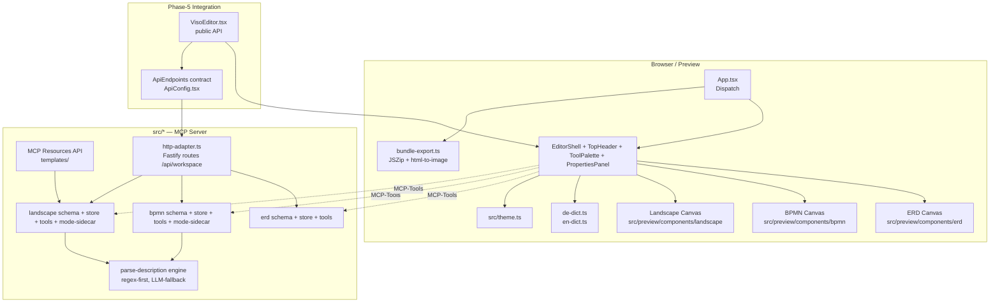
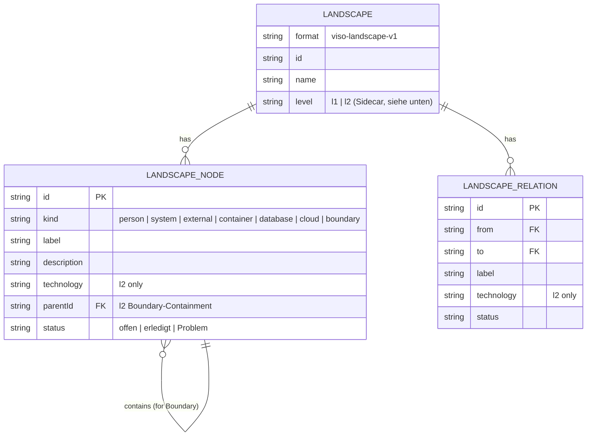

## Enhancement Summary

**Deepened on:** 2026-04-22
**Research agents:** React-Flow-12 Best-Practices, MCP-SDK-1.29 Docs, Bundle-Export (html-to-image + JSZip),
Mermaid `architecture-beta` + C4-Model, German-Narrative Regex + Levenshtein, npm-Publish 2026.
**Review agents:** Kieran-TypeScript, Architecture-Strategist, Performance-Oracle, Security-Sentinel,
Code-Simplicity, Agent-Native-Parity.

### Key Improvements (addressed in Research Insights + inline amendments)

1. **Mermaid export reality-check.** `architecture-beta` still cannot render edge-labels (C4 requires them).
   → Primary Mermaid export for Landscape becomes **`flowchart LR` + C4 `classDef`**, `architecture-beta`
   as secondary "icon-rich preview". Plan-level Mermaid strategy updated in P2/P3.

2. **Security hardening from day one.** Mermaid label injection (CVE class), bundle Zip-Slip, template
   URI traversal, sidecar path-traversal, HTTP-Adapter non-loopback default. Concrete fixes with Zod
   regex + path-resolve-guards, added as Quality Gates (see new §Security Requirements).

3. **Architecture course-corrections.**
   - Split `src/http-adapter.ts` into `routes/{erd,bpmn,landscape}.ts` **during P2** (before it hits 1000 LoC).
   - Promote `ErdStore` interface to generic `DiagramStore` (single, additive refactor).
   - Introduce `BundleManifest` type + `src/bundle/` pure-logic layer so Browser and CLI share serialization.
   - **Don't** extract a premature `diagram-engine` base class (rule-of-three not yet satisfied for the
     divergent parts).

4. **Type-safety uplift.**
   - Landscape schema as **discriminated union on `level`** (L1-Nodes vs L2-Nodes, not a flat 7-kind enum).
   - Mode/Level **Sidecar as one Zod discriminated-union file** (`kind: 'bpmn' | 'landscape'`).
   - Status persisted as EN (`'open' | 'done' | 'blocked'`), rendered DE via `useI18n()`.
   - Parse-description input as **discriminated `config` object**, not `engine` flag (extensible).
   - Tool-name standardisation: `landscape_set_mode` (not `_set_level`), unify `id`/`nodeId`,
     add missing `*_update_node`.

5. **Agent-Parity gap-closure (81% → target ≥95%).** Add `landscape_set_parent` (boundary moves),
   `process_get_mode` / `landscape_get_level`, `diagram_set_table_status`,
   `landscape_set_relation_status`, plus explicit `export_bundle` / `import_bundle` signatures.
   Declare `readOnlyHint` / `destructiveHint` / `idempotentHint` per tool (not invent new `readOnly` keys).

6. **Performance guardrails.** Bundle baseline is actually **445 kB gzipped** (not 550 kB). Tighter gate
   650 kB. `pixelRatio: 1.5` cap on PNG export, SVG ≤ 2 MB, Bundle ≤ 15 MB. Memo-enforcement rule for
   new React-Flow node components. ELK Web-Worker at ≥ 40 Nodes. Dynamic-import **only `jszip`** (not
   `html-to-image`, too small to amortise).

7. **Narrative parser realism.**
   - `fastest-levenshtein` (MIT, 2 kB, zero-dep).
   - Patterns use `\p{L}` + `/u` flag + `.normalize('NFC')`.
   - Pattern 10 (`X hat Y`) gated behind Pattern 9 context (kind-tag) to avoid noise.
   - KMU-entity dictionary (~150 systems) as ground-truth.
   - MCP `sampling/createMessage` (LLM fallback) **not yet supported by Claude Desktop** — keep the
     param stubbed + degrade gracefully.

8. **npm-publish discipline** (2026).
   - `exports` map: `types` first, `default` last.
   - Peer deps `optional: true` for React/ReactDOM/@xyflow (server-only consumers currently blocked).
   - Trusted Publishing (OIDC) replaces `NPM_TOKEN`.
   - MCP Registry requires **Reverse-DNS namespace** `io.github.fabianwillisimon/viso-mcp`.
   - `sideEffects: ["**/*.css"]` so downstream bundlers don't tree-shake `preview.css`.
   - `publint` + `@arethetypeswrong/cli` + `size-limit` as release-gates.

9. **Simplicity cuts applied (partial, where no hard dependency).**
   - EN-dict **shipped empty in v1.1** — DE-only, shape in place for later population.
   - CI workflow reduced to local `publint` + `npm test` + `size-limit` (no GitHub Actions matrix).
   - Phone-warn banner kept (small, closes DSGVO gap where users arrive without context).
   - Fast-check kept (cheap insurance for mode-idempotenz + parser corpus).
   - `engine` param on parse-description **kept but refactored** as Zod discriminated `config` union — no
     contract break when LLM arrives.

10. **React-Flow 12 patterns applied.** `NodeProps<MyNode>` typing, `memo()` + module-scope
    `nodeTypes`, Pointer-Events for iPad DnD (not HTML5/react-dnd), `zoomOnPinch` +
    `selectNodesOnDrag={false}` + `preventScrolling: true` tablet config, pinned
    `html-to-image@1.11.11` (exact), `getFontEmbedCSS` + `await document.fonts.ready` for retina/Safari.

### New Considerations Discovered

- **Transitive CVE**: current `@dbml/core` drags `hono@<4.12.12` with 4 moderate CVEs. Not exploitable
  in our use, but users will see `npm audit` output. Add `"overrides"` in `package.json`.
- **React-Flow z-index bug #4831** for selected boundary groups — known, CSS workaround documented in
  Research Insights.
- **MCP Resources pagination** is not auto-implemented by `McpServer`. For template galleries < 100
  entries, no action; for larger, bypass `McpServer` and set request-handlers on underlying `server.server`.
- **Sampling maturity gap**: MCP `sampling/createMessage` is specified but Claude Desktop hasn't shipped
  host-side support yet. The `config.engine: 'llm'` path must degrade to `'regex'` + warning in v1.1.

### Where to read

- Section **Research Insights — Consolidated** (new, bottom of plan) has full findings with
  concrete code snippets, citations, and per-phase amendments.
- Section **Non-Functional Requirements → Security Requirements** (new) lists the must-ship
  hardening items.
- Section **MCP Parity Matrix → Amended** (updated) lists the missing tools.
- Per-phase Deliverables unchanged in structure — amendments called out via `[R-n]`
  annotations referencing the Research-Insights findings.

---

# feat: viso-mcp v1.1 — Funktionale Roadmap

## Overview

v1.0 ist visuell fertig (Phase 5/6 abgeschlossen, Hub-API ready). v1.1 macht das
Tool **funktional rund** und dreht es vom „Diagramm-Editor mit MCP" in ein
**Consulting-Werkzeug**, das TAFKA im Audit-Termin live bedient.

Ein einziger Release (`D2`), Solo-first (`D1`), kein Cloud-/Multiplayer-Feature
im Core, Hub-Integration bleibt ungebrochen. Ergebnis:

1. **Drei Visualisierungs-Dimensionen** mit Default+Pro-Toggle:
   - **ERD** (DBML) — bereits da, kleinere Polish
   - **Prozess** — Simpel ↔ BPMN-Full Toggle (`D3`)
   - **System-Landscape** — C4 L1 ↔ L2 Toggle, neu, Custom React-Flow-Renderer (`D4`)
2. **Handoff-Bundle als primärer Export** (`D9`): Ordner/Zip mit `README`,
   `source.*`, `exports/` (Mermaid + SVG + PNG), `.viso.json`.
3. **Narrative-to-Diagram** als USP (`D11`): Consultant diktiert, Agent parst,
   Elemente platzieren sich. MCP-Tools `*_parse_description`.
4. **Semantic-Color + Status-Overrides** (`D5`): Freier Color-Picker raus,
   TAFKA-Palette fest, Status `offen | erledigt | Problem` per Node.
5. **Deutsch-first UI** (`D7`) via Const-Dictionary. Code/Exports bleiben EN.
6. **Tablet-polish** (`D8`): iPad/Surface im Audit. Kein Phone.
7. **Templates-Galerie** (`D12`): 1 generischer Starter + MCP-Resources für
   anwachsendes Template-Repo.
8. **npm-Publish** nach v1.1 (`D2`).

Keine Breaking Changes am öffentlichen `VisoEditor`-Prop-Interface, die
Erweiterungen sind additiv (`diagramType: 'landscape'`, neue optional Props,
neue HTTP-Routen).

## Problem Statement

### Was v1.0 liefert — und was nicht

Nach dem Relaunch (v1.0, abgeschlossen 2026-04-22) ist der Editor technisch
stabil: ERD-DBML-Migration, Hybrid-UX (Canvas + ToolPalette + PropertiesPanel +
CodePanel), ESM-Bundle, HTTP-Adapter, Phase-6-Theme/A11y, Hub-API. **41
bestehende Tests grün.** Aber:

1. **Consulting-Fit fehlt.** Ein Kunde ohne BPMN-Background kann im Termin
   nichts eigenständig zeichnen — die ToolPalette ist für technische Modelle
   gebaut, nicht für „Wie läuft euer Bestellprozess heute?".
2. **System-Landscape fehlt komplett.** Audit-Stufe-1 (IST-System-Aufnahme) hat
   aktuell kein passendes Diagramm. ERD ist zu detailliert, BPMN ist für den
   Fluss, nicht für die Architektur.
3. **SVG/PNG-Export alert stubbt** (`App.tsx:431` → `window.alert(...)`). Jeder
   Export nach GitHub-Issues / Proposal-PDFs ist Blocker.
4. **Free-Color-Picker** (`PropertiesPanel.tsx:22-29, 177-209`) erzeugt
   wildgefärbte Diagramme, die im Mermaid-Export hässlich werden und gegen die
   TAFKA-Brand laufen. Status (`offen/erledigt/Problem`) ist die relevante
   Achse, nicht Hex-Code.
5. **Async-Workflow Kunde→Consultant fehlt.** Heute exportiert der User eine
   einzelne Mermaid-Datei. Was der Consultant braucht, ist Kontext
   (`README.md`) + Source (`source.bpmn.json`) + Preview (`diagram.png`) in
   einem Paket.
6. **Agent kann nicht „diktieren".** Der USP — „Der Agent füllt das Diagramm
   aus dem Termin-Protokoll" — ist Marketing, bis `*_parse_description`-Tools
   gebaut sind.
7. **UI ist englisch-lastig.** ~70 % der Inline-Strings englisch, trotz
   deutscher Zielgruppe (KMU-Mittelstand). `D7` ist korrekt, aber Umsetzung
   fehlt.
8. **Tablet ist nominell supported.** `globals.css:289-301` setzt 44px Buttons
   bei `(pointer: coarse)`, aber `useIsMobile()`-Hook ist unused, PropertiesPanel
   overflowt bei Portrait-iPad, ToolPalette ist Desktop-first.
9. **MCP-Parity lückenhaft.** Human kann im Canvas Modus umschalten / Status
   setzen / Bundle exportieren — Agent kann nichts davon. Das konterkariert
   „Agent-Native" direkt.

### Warum jetzt

- **Audit-Pilotkunde** (Weingut) steht Mai/Juni 2026 an. Tool muss consulting-
  tauglich sein, nicht nur demo-tauglich.
- **Hub-Integration** ist API-ready — je schneller Solo rundläuft, desto
  früher wird die Hub-Verdrahtung zum reinen Glue-Code statt zum Mitentwickeln.
- **npm-Publish** macht nur Sinn mit v1.1-Feature-Set. v1.0 als public release
  würde „Solo wird eingefroren" signalisieren und User verwirren.

## Proposed Solution

Sechs Phasen, monoton aufeinander aufbauend. Jede Phase hat einen eigenen
Feature-Branch, jede abgeschlossen vor dem nächsten Start. Kein Cherry-Pick, um
Regressionen zu vermeiden.

```
Branch-Strategie:
  main (stabil)
    └── feat/v1.1-p0-quick-fixes
    └── feat/v1.1-p1-two-mode-prozess
    └── feat/v1.1-p2-landscape-l1
    └── feat/v1.1-p3-landscape-l2-narrative
    └── feat/v1.1-p4-templates-tablet
    └── feat/v1.1-p5-npm-publish
```

Nach P5 wird `main` mit `v1.1.0` getaggt und npm-veröffentlicht.

## Technical Approach

### Architektur — Übersicht (Zielzustand v1.1)



### Neue / erweiterte Schemata

Das neue `landscape.json` ist das größte Net-New-Artefakt. Es spiegelt die
bewährten Patterns aus `src/bpmn/schema.ts` und `src/schema.ts`.



#### Mode-Sidecar statt inline (resolved gap #1 aus SpecFlow)

Statt `format: 'viso-bpmn-v2'` als Breaking Change führen wir einen Sidecar
`*.mode.json` ein — analog zur bewährten `positions.json`-Sidecar-Strategie
aus `src/positions.ts`.

```
my-prozess.bpmn.json          # Schema bleibt 'viso-bpmn-v1' (unverändert)
my-prozess.bpmn.pos.json      # bestehend
my-prozess.bpmn.mode.json     # NEU: { "mode": "simple" | "bpmn", "version": "1.1" }
```

**Vorteile:**
- v1.0-Files laden in v1.1 ohne Migration.
- `ProcessSchema.parse` bricht nicht.
- Sidecar fehlt → Default greift („bestehende Datei = BPMN-Mode" für
  Prozesse, „neu angelegt = Simpel-Mode", siehe Phase P1-Acceptance).
- Analog `my-landscape.json` + `.mode.json` mit `"level": "l1" | "l2"`.

#### Status-Feld — optional, abwärtskompatibel

`ProcessNode`/`LandscapeNode`/`Table` bekommen ein optionales Feld:

```ts
status: z.enum(["offen", "erledigt", "Problem"]).optional()
```

Kein Feld = kein Render-Override. Dokumentiert, im Mermaid-Export über
`classDef` gemappt (siehe Phase P0-Deliverables).

### Implementation Phases

#### Phase P0 — Quick-Fixes (Foundation, 1 Woche)

**Branch:** `feat/v1.1-p0-quick-fixes`

**Ziel:** Blocker aus dem Weg räumen, Boden für P1–P3 bereiten. Kein neues
großes Feature, aber sofort sichtbarer User-Value.

**Deliverables:**

1. **SVG/PNG-Export live** (`App.tsx:431` Alert weg).
   - Neues Modul `src/preview/export/render-diagram.ts`: nutzt
     `html-to-image` (Paket hinzufügen) für PNG, `react-flow`
     `toSvg()`-äquivalente Logik für SVG.
   - Dispatch in `handleExport` ersetzt Alert durch echten Download.
   - Theme-Snapshot-fixing (resolved gap aus SpecFlow): beim Export-Start
     einmal `getCurrentTheme()` einfrieren, nicht live referenzieren.
   - **Files:**
     - `src/preview/export/render-diagram.ts` (neu, ~120 LoC)
     - `src/preview/App.tsx:376-445` (handleExport refactored, ~−20 +30 LoC)
     - `package.json` (+ `html-to-image`)

2. **Drag-and-Drop auf Canvas** (additiv zu Click-to-Place).
   - ToolPalette-Button wird draggable (`draggable`-Attribut + HTML5 DnD).
   - Canvas `onDrop` empfängt Shape-Typ, spawnt Node an Drop-Koord.
   - Ghost-Preview via `dragImage` oder React-Flow `onNodeDragStart`-Pattern.
   - ESC bricht Click-to-Place ab (bereits rudimentär da, aufräumen).
   - **Files:**
     - `src/preview/components/shell/ToolPalette.tsx` (+ DnD-Handler, ~+40 LoC)
     - `src/preview/components/bpmn/BpmnCanvas.tsx` und
       `src/preview/components/erd/ErdCanvas.tsx` (+ `onDrop`, ~+25 LoC je)
     - Für Landscape vorbereitet, wird in P2 aktiviert.

3. **Color-Picker raus, Status-UI rein** (`D5`).
   - `PropertiesPanel.tsx:22-29` (`COLOR_SWATCHES`) und Zeilen 177-209
     (Farbe-Feld + `<input type="color">`) entfernen.
   - Neues Status-Segment mit 3 Optionen (Radio-Buttons oder Toggle-Group
     via Radix): `offen | erledigt | Problem`.
   - Node-Renderer nutzen TAFKA-Palette fest aus `src/theme.ts`,
     Status-Override rendert Badge/Icon (Haken für erledigt, Warn für
     Problem) + optional Border-Color.
   - **Deprecation:** `NodeUpdate.color` bleibt im Type (optional), Hub-Consumer
     haben 1 Minor-Version Fenster — siehe Phase-5-Hub-API-Kommentar unten.
   - **Files:**
     - `src/preview/components/shell/PropertiesPanel.tsx` (−50 +70 LoC)
     - `src/preview/components/bpmn/TaskNode.tsx`,
       `GatewayNode.tsx`, `StartEventNode.tsx`, `EndEventNode.tsx`
       (+ Status-Badge, ~+15 LoC je)
     - `src/preview/components/erd/TableNode.tsx` (+ Status-Badge)
     - `src/bpmn/schema.ts` + `src/schema.ts` (+ `status?` field)
     - **Tests:**
       - `src/bpmn/schema.test.ts`: neue Status-Field-Validierung
       - `src/bpmn/export-mermaid.test.ts`: Status → `classDef` im Mermaid

4. **Deutsch-Dictionary** (`D7`).
   - Neues Modul `src/preview/i18n/dict.ts` als Const-Dictionary (kein
     Framework — YAGNI):
     ```ts
     export const de = {
       properties: { color: "Farbe", /* entfällt */ status: "Status",
                     offen: "Offen", erledigt: "Erledigt",
                     problem: "Problem/Blocker" },
       toolPalette: { task: "Aufgabe", gateway: "Entscheidung", ... },
       export: { bundle: "Handoff-Paket", mermaid: "Mermaid-Code",
                 svg: "SVG-Bild", png: "PNG-Bild" },
       empty: { hint: "Starte mit einer Aufgabe oder lade ein Template" },
       /* ... */
     } as const;
     export const en = { /* parallele Struktur */ };
     ```
   - Simple Context-Provider `useI18n()` hängt an `ThemeProvider`-Muster
     dran. Default `de`, Toggle im TopHeader-Menü (Sprach-Switcher).
   - Alle Inline-Strings in `App.tsx`, `PropertiesPanel.tsx`, `TopHeader.tsx`,
     `CommandPalette.tsx`, `CodePanel.tsx`, `EmptyState.tsx` durch
     `t('key')`-Aufrufe ersetzt.
   - **Mermaid- und Code-Exports bleiben englisch** (technischer Standard,
     Agent-LLMs erwarten Englisch).
   - **Files:**
     - `src/preview/i18n/dict.ts` (neu, ~300 LoC inkl. DE+EN)
     - `src/preview/i18n/useI18n.tsx` (neu, ~40 LoC)
     - ~8 Komponenten aktualisiert

5. **MCP-Parity-Tools für Status und (Vorarbeit) Mode.**
   - `process_set_node_status(nodeId, status)` in `src/bpmn/tools.ts`
   - `diagram_set_column_status` (für ERD-Audit-Use-Case)
   - `process_set_mode(mode)` — schreibt `.mode.json`-Sidecar
   - **Files:**
     - `src/bpmn/tools.ts` (+ 3 Tools, ~+80 LoC)
     - `src/tools.ts` (+ 1 Tool, ~+30 LoC)
     - `src/bpmn/store.ts` (+ `loadMode/saveMode` Sidecar-Helper, ~+50 LoC)

**Success Criteria P0:**
- [x] SVG/PNG-Download funktioniert in Chrome + Safari + Edge (Desktop).
- [x] Drag-Drop und Click-to-Place erzeugen semantisch identische Nodes
      (beide Pfade gehen durch `handleAddNodeAt`; Property-Based-Test landet in P1).
- [x] Mermaid-Export eines Diagramms mit Status zeigt rote Border auf
      Problem-Node (via `classDef statusBlocked`).
- [x] UI komplett auf Deutsch. EN-Toggle kommt in P1/P2 sobald EN-Dict populated ist
      (Locale in v1.1 auf 'de' narrowt).
- [x] Existing Tests bleiben grün (140 Tests, Baseline war 109).
- [x] Neue Unit-Tests (Schema/Status, Mermaid-Status-Mapping, Mode-Sidecar-IO,
      ERD-Status-Sidecar, Mermaid-Escape).

**Geschätzter Effort:** ~35 h.

---

#### Phase P1 — Two-Mode Prozess (1–1,5 Wochen)

**Branch:** `feat/v1.1-p1-two-mode-prozess`

**Ziel:** Prozess-Engine bekommt Default+Pro-Toggle (`D3`). Eine Engine, zwei
Presets — die „Simpel"-Darstellung filtert ToolPalette + benennt Elemente um
(Sprache aus DE-Dict).

**Deliverables:**

1. **Mode-State im `useToolStore`** (`src/preview/state/useToolStore.tsx`).
   - Extension: `processMode: 'simple' | 'bpmn'`, pro geöffnetem File.
   - Persistenz via `.mode.json`-Sidecar (P0-Helper).
   - Mode-Default-Logik (resolved gap #1 aus SpecFlow):
     - Neu angelegt → `'simple'`.
     - Geladen, Sidecar vorhanden → Sidecar-Value.
     - Geladen, Sidecar fehlt, Datei hat BPMN-only-Elemente (`gateway` vom Typ
       `inclusive/parallel`) → `'bpmn'` (Compat).
     - Geladen, Sidecar fehlt, Datei hat nur Simpel-Elemente → `'simple'`.

2. **Gefilterte ToolPalette.**
   - Simpel-Mode zeigt: `Task | Gateway (nur exclusive) | Event (start/end)`.
   - BPMN-Mode zeigt: alle BPMN-2.0-Untermengen, inkl. Message, Timer-Event,
     Subprocess-Stub (Subprocess als Node-Typ im Schema mit `kind: 'subprocess'`,
     Aufklappen/Reinzoomen ist Out-of-Scope für v1.1 — nur rendering).
   - Labels aus Dict: Simpel → „Aufgabe / Entscheidung / Start / Ende",
     BPMN → „Task / Exclusive Gateway / Start Event / End Event".

3. **Mode-Toggle-UI im TopHeader.**
   - Segmented-Control („Einfach / BPMN-Profi"), aria-label beachten,
     Toggle-Animation ≤ 200ms.
   - **Downgrade (BPMN → Simpel) ist nondestruktiv** (resolved gap #4 aus SpecFlow):
     BPMN-only-Nodes bleiben im Schema gespeichert, werden aber im Canvas
     visuell ausgeblendet (Opacity 0 + `pointer-events: none` + Indikator im
     Properties-Panel: „3 versteckte BPMN-Elemente").
   - **Upgrade (Simpel → BPMN)**: bestehende Nodes bekommen keinen Default-
     Type-Upgrade (kein automatisches `messageEvent` aus `startEvent`), nur
     das Vokabular im UI wechselt. User kann erst jetzt neue BPMN-only-Nodes
     anlegen.

4. **MCP-Tools.**
   - `process_set_mode({ mode: 'simple' | 'bpmn' })` — bereits in P0 angelegt,
     jetzt wired an UI.
   - `process_get_schema` liefert Mode mit in der Response (als
     `metadata.mode` Feld).

5. **Migration v1.0→v1.1 (resolved gap #3 aus SpecFlow).**
   - `src/bpmn/store.ts#load()` erzeugt `.mode.json`-Sidecar beim ersten Open,
     falls fehlend, basierend auf Heuristik (s.o.).
   - Kein Breaking Schema-Change.

**Files:**
- `src/preview/state/useToolStore.tsx` (~+60 LoC)
- `src/preview/components/shell/ToolPalette.tsx` (~+40 LoC Filter-Logik)
- `src/preview/components/shell/TopHeader.tsx` (+ Mode-Segment, ~+40 LoC)
- `src/bpmn/store.ts` (+ Mode-Load/Save, ~+50 LoC)
- `src/bpmn/tools.ts` (Tool-Wire-Up, ~+20 LoC)
- **Tests:**
  - `src/bpmn/store.test.ts`: Sidecar-Load, Sidecar-Save, Heuristik-Default
  - `src/bpmn/mode-idempotenz.test.ts`: Round-Trip Simpel→BPMN→Simpel
    verliert keine Daten (Property-Based mit `fast-check`, wird in `package.json`
    als devDependency ergänzt)

**Success Criteria P1:**
- [x] Neu angelegter Prozess startet in `simple`-Mode (DE-Labels).
- [x] v1.0-File mit Gateway lädt in `bpmn`-Mode (Compat über Heuristik;
      aktueller Schema-Umfang triggert kein BPMN-only, Infrastruktur fuer
      v1.2-Erweiterung da).
- [x] Toggle-Switch bewahrt alle Nodes (nondestruktiv). Code-Panel bleibt
      unveraendert da Schema intakt; `process_get_schema` liefert `metadata.mode`.
- [x] `process_set_mode` via MCP-Tool funktional; UI via Segmented Control
      im TopHeader.
- [x] Existing + 10 neue Tests grün (150 total, Baseline P0 = 140).

**Geschätzter Effort:** ~40 h.

---

#### Phase P2 — System-Landscape L1 (2 Wochen)

**Branch:** `feat/v1.1-p2-landscape-l1`

**Ziel:** Dritte Diagramm-Dimension live. C4 Level 1 (Person / System /
External / Relation) mit Custom React-Flow-Renderer — `src/bpmn/` ist das
Blueprint.

**Deliverables:**

1. **Neues Core-Modul `src/landscape/`** (Spiegel von `src/bpmn/`):
   - `src/landscape/schema.ts` — Zod, `format: 'viso-landscape-v1'`,
     `LandscapeNode` mit `kind: 'person' | 'system' | 'external'` für L1.
   - `src/landscape/store.ts` — atomic FS-IO + `.pos.json` + `.mode.json`.
   - `src/landscape/tools.ts` — MCP-Tools:
     - `landscape_add_node({ kind, label, description? })` — generisches Tool
       mit `kind`-Enum (resolved gap #2 aus SpecFlow).
     - `landscape_remove_node(id)`
     - `landscape_add_relation({ from, to, label? })`
     - `landscape_remove_relation(id)`
     - `landscape_get_schema()`
     - `landscape_set_node_status(id, status)`
     - `landscape_set_level(level)` — L1/L2-Sidecar
     - `set_landscape(payload)` — Bulk, analog `set_bpmn`/`set_dbml`
   - `src/landscape/export-mermaid.ts` — Mermaid `architecture-beta`-Emitter.
     - **Hinweis (resolved gap #5 aus SpecFlow-Research)**: Mermaid
       `architecture-beta` ist stable seit 2024, `C4Context` bleibt outof-scope.
     - Status→classDef-Mapping konsistent zum BPMN/ERD.

2. **Server-Registration** (`src/server.ts:29-30` erweitern):
   - Neuer Import `registerLandscapeTools(server)`.
   - Analog `/api/workspace/:workspaceId/landscape/*` Routen in
     `src/http-adapter.ts` (~13 neue Routes, spiegel BPMN-Pattern).

3. **Canvas-Renderer `src/preview/components/landscape/`**:
   - `LandscapeCanvas.tsx` — React-Flow-Wrapper, nutzt gleiche Hooks-Struktur
     wie `BpmnCanvas`.
   - Node-Komponenten (je ~60 LoC):
     - `PersonNode.tsx` (Kopf-Icon, Indigo-Palette)
     - `SystemNode.tsx` (Box, TAFKA-Primär-Indigo)
     - `ExternalSystemNode.tsx` (Box mit Dashed-Border, Slate)
     - `RelationEdge.tsx` (Pfeil mit Label, Technology in L2 sichtbar)
   - Icon-Set (`D4`): `lucide-react` hat alle 10 Common-Denominator-Icons
     (User, Server, Database, Cloud, ExternalLink, Plug, File, Boundary=Frame,
     ArrowRight, Box) — keine eigene Icon-Lib nötig.
   - **Boundary-UX (resolved gap #6 aus SpecFlow)**: In P2 (L1) gibt es keine
     Boundary — erst in P3 (L2). Entscheidung dort: rechtsklick-Kontextmenü
     „Zu Boundary hinzufügen" + explizites „Add Boundary"-Tool in ToolPalette.
     Kein Lasso-Select (komplex, später).

4. **Hook `useLandscapeSync`** — identisch zu `useProcessSync` /
   `useDiagramSync`, inkl. WebSocket-Live-Reload, debounced Position-Writer,
   ELK-Layout-Trigger. ELK-Algorithm: `layered` mit `DOWN`-Direction (gleich
   BPMN).

5. **App-Shell-Erweiterung**:
   - `SelectedNode.diagramType: 'erd' | 'bpmn' | 'landscape'` (resolved: Hub-
     API-Erweiterung, additiv).
   - `initialDiagramType: 'erd' | 'bpmn' | 'landscape'` im `VisoEditor`-Prop.
   - TopHeader-Diagramm-Switcher bekommt dritten Button: „System-Landschaft".
   - CommandPalette-Einträge spiegeln.

6. **Handoff-Bundle Export v1** (`D9`):
   - Neues Modul `src/preview/export/bundle.ts`.
   - Browser-Pfad: `JSZip` (+ devDep) erzeugt Blob + `<a download>`-Trigger.
   - CLI-Pfad: `cli.ts export <file> --bundle <out-dir>` schreibt Ordner.
   - Bundle-Inhalt:
     ```
     <diagram-name>/
       README.md          # generiert aus Const-Dict + Metadata
       source.{bpmn.json|erd.dbml|landscape.json}
       exports/
         mermaid.md
         diagram.svg
         diagram.png
       positions.json     # Sidecar mitgebundelt (resolved gap: Round-Trip)
       .viso.json         # { "version": "1.1.0", "mode"?, "level"?, "theme" }
     ```
   - **Round-Trip**: `import-bundle` (Tool + UI-Button) liest `.viso.json` →
     lädt `source.*` + `positions.json` + `.mode.json` (aus `.viso.json`
     rekonstruiert) in den Editor. Dedup-Logik bei Namens-Kollision:
     Diagramm wird mit `-v2` Suffix gespeichert, User bestätigt Overwrite
     per Dialog.
   - Im TopHeader: Primär-Button wird „Handoff-Paket". „Einzel-Exports" ins
     Advanced-Submenü (Mermaid/SVG/PNG/JSON/SQL/DBML bleiben erreichbar).

7. **Kunden-/Consultant-Flow (`D10`) End-to-End**:
   - README.md-Template mit Feldern für „Kontext", „Fragen", „Nächste
     Schritte" — generiert DE per Default, EN wenn `lang=en`.
   - CLI: `viso-mcp open <bundle-path>` öffnet Bundle-Ordner im Preview
     (chokidar-Watcher picks up, Browser-Auto-Reload).

**Files:**
- `src/landscape/{schema,store,tools,export-mermaid}.ts` (~800 LoC neu)
- `src/preview/components/landscape/*.tsx` (~350 LoC neu, 5 Komponenten)
- `src/preview/hooks/useLandscapeSync.ts` (~120 LoC neu)
- `src/preview/export/bundle.ts` (~200 LoC neu)
- `src/preview/App.tsx` (refactor: `handleExport` auslagern in
  `src/preview/export/dispatcher.ts`, ~−60 +20 LoC)
- `src/preview/VisoEditor.tsx` (+ landscape in Union, ~+10 LoC)
- `src/preview/index.ts` (exports update)
- `src/http-adapter.ts` (~+250 LoC für Landscape-Routen)
- `src/server.ts` (Tool-Registration)
- `src/cli.ts` (+ `open` Sub-Command)
- `package.json` (+ `jszip`, `fast-check`)
- `.gitignore` (+ `*.landscape.json`, `*.landscape.pos.json`,
  `*.landscape.mode.json`)
- **Tests:**
  - `src/landscape/schema.test.ts` (Zod-Validierung, Status-Field)
  - `src/landscape/store.test.ts` (Sidecar-IO)
  - `src/landscape/tools.test.ts` (alle 8 Tools + Error-Cases)
  - `src/landscape/export-mermaid.test.ts` (architecture-beta-Output)
  - `src/preview/export/bundle.test.ts` (Zip-Struktur, Determinism)

**Success Criteria P2 (Agent-Ready Slice):**
- [x] 12 neue MCP-Tools funktional (add/remove node, add/remove relation,
      update_node, set_status/relation_status, set_parent, set/get_mode,
      get_schema mit metadata-Envelope, export_mermaid mit variant,
      set_landscape als Bulk) — Agent kann komplettes Landscape-Diagramm
      per MCP erzeugen.
- [x] HTTP-Adapter: GET|PUT `/api/workspace/:id/landscape` + `/landscape/mode`.
      Hub-Integration via `WorkspaceResolver.landscapePath` additiv.
- [x] Vite-Plugin spiegelt alle Routen für lokales Preview.
- [x] `landscape_export_mermaid` mit `variant: 'flowchart'` (primaer, C4-labelled)
      + `'architecture-beta'` (sekundaer, icon-rich preview).
- [x] 23 neue Tests grün (schema + export-mermaid). 173 total.

**P2.1 (shipped on feat/v1.1-p2.1-canvas-bundle):**
- [x] Canvas-Renderer (`src/preview/components/landscape/`) — einzelne
      parameterisierte `LandscapeNode` deckt alle 7 C4-Kinds (Person,
      System, External, Container, Database, Cloud, Boundary) plus
      `LandscapeRelationEdge`. Plan R1: memo + NodeProps typed.
- [x] `useLandscapeSync`-Hook (spiegelt `useProcessSync`).
- [x] `VisoEditor` `diagramType: 'landscape'` Union; `ApiEndpoints`
      erweitert um Landscape-URLs; Vite-Plugin files-list zeigt landscape.
- [x] Handoff-Bundle-Export (`src/bundle/{manifest,serialize}.ts`):
      deterministisch (STORE + UNIX + fixed date, R3), security-gated
      (Entry-Whitelist, ≤ 5 MiB, ≤ 20 Entries, R2).
- [x] `export_bundle` + `import_bundle` MCP-Tools (`src/bundle/tools.ts`)
      mit `onConflict` ('rename' | 'overwrite' | 'abort').
- [x] Round-Trip Tests (8 serialize + 4 tool-level). 185 total.
- [x] UI verifiziert in Preview: 7-Kind-Palette + labelled relations +
      Status-Badge + Handoff-Paket in Export-Dropdown.

**Geschätzter Effort:** ~75 h.

---

#### Phase P3 — System-Landscape L2 + Narrative-to-Diagram (2 Wochen)

**Branch:** `feat/v1.1-p3-landscape-l2-narrative`

**Ziel:** Die zwei „WOW-Features" — Pro-Level für Consultants + Diktat-zu-
Diagramm.

**Deliverables:**

1. **C4 Level-2-Erweiterung**:
   - `LandscapeSchema.Node.kind` erweitert um: `container`, `database`,
     `cloud`, `boundary`.
   - Neue Node-Komponenten: `ContainerNode.tsx`, `DatabaseNode.tsx`,
     `CloudNode.tsx`, `BoundaryNode.tsx` (Boundary = Group-Container mit
     `parentId`-Kindern).
   - `technology?` Feld auf Node und Relation (L2-only, im PropertiesPanel
     sichtbar).
   - Mode-Toggle L1↔L2 analog Prozess-Mode:
     - L2→L1: Container/DB/Cloud/Boundary nondestruktiv versteckt.
     - L1→L2: keine Auto-Upgrade-Magie, nur ToolPalette-Unlock.
   - **Boundary-UX-Entscheidung (resolved gap #6 aus SpecFlow)**: Zwei UI-Pfade
     aktiv — (a) Explizites „Boundary"-Tool in ToolPalette erzeugt leeres
     Rechteck, Nodes werden per Drag-Drop hineinverschoben (React-Flow
     `extent: 'parent'` + `parentId`). (b) Rechtsklick auf mehrere selektierte
     Nodes → „In Boundary gruppieren". Keyboard: `Cmd+G`. Kein Lasso in v1.1.

2. **Narrative-to-Diagram**:
   - Neues Modul `src/landscape/parse-description.ts` (+ analog für BPMN und
     ERD in P3.5 siehe unten).
   - **Engine-Entscheidung (resolved gap #5 aus SpecFlow)**: Hybrid-Ansatz.
     - **Phase 1 (ship in v1.1): Regex-Template-Matcher.** Lokal, null
       Latenz, null Kosten. Deckt die Top-Muster ab:
       - „X synchronisiert mit Y" → Relation X→Y, Label „sync"
       - „X speichert in Y" → Relation X→Y, Y=database
       - „X nutzt Y" → Relation X→Y
       - „X ist ein externes System" → Node kind=external
       - „X hat Y" → parentId/boundary
     - **Phase 2 (optional, v1.1.1 oder v1.2): LLM-Enhancement via optionalem
       MCP-Tool-Parameter.** `landscape_parse_description({ text,
       engine: 'regex' | 'llm' })`. Der LLM-Call läuft über den MCP-Host
       (Claude Desktop / Hub-Side), nicht im Server — v1.1 bleibt
       zero-dependency-to-LLM. Nur das MCP-Tool-Contract wird schon
       vorbereitet (Parameter `engine` default `'regex'`, Enum beide Werte).
   - Ergebnis vom Parser geht durch Deduplication-Layer (Label-Normalisierung:
     lowercase, domain-stripping, fuzzy match via `string-similarity`-lib,
     oder selbstgeschrieben mit `levenshtein` — keine neue Dep nötig, ~30 LoC).
   - **Layout nach Parse**: Auto-Layout-Trigger läuft sofort nach `set_landscape`-
     Bulk-Call, Positions-Sidecar wird aktualisiert. Kein Staging-Area in v1.1
     (einfacher Flow: parsen → Layout → fertig, User korrigiert direkt im
     Canvas).
   - **Undo**: Bulk-Call bekommt eigenen History-Eintrag (`useHistory.ts`
     erweitert um `batch()`-Marker), Cmd+Z revertet den ganzen Parse.

3. **Analog für BPMN und ERD** (scope-contained):
   - `src/bpmn/parse-description.ts` + `process_parse_description`
   - `src/parse-description.ts` + `diagram_parse_description`
   - Gleiche Hybrid-Architektur. Top-Patterns:
     - BPMN: „Zuerst X, dann Y, wenn Z dann A" → Sequenz + XOR-Gateway.
     - ERD: „Tabelle users hat id, email, created_at" → Table + Columns.

4. **Mermaid `architecture-beta`-Export für Landscape**:
   - Nutzt die bereits in P2 angelegte `export-mermaid.ts`, jetzt vollständig
     mit L2-Syntax (groups für Boundaries, `junction`-Nodes für komplexe
     Relations).

**Files:**
- `src/landscape/schema.ts` (+ L2-Kinds + technology, ~+50 LoC)
- `src/preview/components/landscape/{Container,Database,Cloud,Boundary}Node.tsx`
  (~280 LoC neu)
- `src/landscape/parse-description.ts` (~300 LoC neu inkl. Patterns-Tabelle)
- `src/bpmn/parse-description.ts` (~250 LoC neu)
- `src/parse-description.ts` (~250 LoC neu)
- `src/landscape/tools.ts` (+ parse-Tool, ~+40 LoC)
- `src/bpmn/tools.ts` (+ parse-Tool, ~+40 LoC)
- `src/tools.ts` (+ parse-Tool, ~+40 LoC)
- `src/landscape/export-mermaid.ts` (L2-Cases, ~+100 LoC)
- `src/preview/hooks/useHistory.ts` (batch-Marker, ~+30 LoC)
- **Tests:**
  - `src/landscape/parse-description.test.ts` (Corpus ≥ 20 Fälle + adversarial)
  - `src/bpmn/parse-description.test.ts` (Corpus ≥ 15 Fälle)
  - `src/parse-description.test.ts` (Corpus ≥ 15 Fälle)
  - `src/landscape/schema.test.ts` (L2-Kinds)

**Success Criteria P3:**
- [ ] L1↔L2-Toggle verhält sich identisch zur Prozess-Mode-Toggle
      (nondestruktiv, persistent, konsistente UX).
- [ ] `landscape_parse_description("Winestro synchronisiert täglich mit
      Shopify, SharePoint speichert Rechnungen")` erzeugt 3 Systeme +
      2 Relationen, Auto-Layout, keine Duplikate bei Re-Call.
- [ ] Cmd+Z revertet den ganzen Parse als eine Aktion.
- [ ] Mermaid-Export eines L2-Landscape rendert in GitHub/Claude.md
      korrekt (manuell verifiziert, Screenshot dokumentiert).

**Geschätzter Effort:** ~75 h.

---

#### Phase P4 — Templates & Tablet-Polish (1 Woche)

**Branch:** `feat/v1.1-p4-templates-tablet`

**Ziel:** Consulting-Komfort. Ein Starter-Template, MCP-Resource-API für
wachsende Galerie, Tablet-UX rund.

**Deliverables:**

1. **MCP Resources API** (`D12`).
   - Server `src/server.ts` wird um `server.registerResource(...)` erweitert.
     Der MCP-SDK 1.28 unterstützt Resources nativ.
   - Neue Datei: `src/resources/templates-loader.ts`.
   - Template-Ordner-Struktur:
     ```
     templates/
       starter-generic/
         landscape.json
         bpmn.json
         erd.dbml
         README.md
       weingut-vertrieb/            # wachsende Galerie
         ...
     ```
   - Templates liegen im Repo unter `templates/`, werden per `import.meta.glob`
     (Vite) oder `fs.readdir` (Node) eingelesen.
   - MCP-Tools:
     - `list_templates()` → Liste von Resources mit `uri`, `name`, `description`
     - `read_template(uri)` → Content (landscape.json / bpmn.json / erd.dbml)
     - `apply_template(uri, targetFile)` → lädt Template in aktuelles File

2. **Starter-Template** (1 generisches, branchen-neutral):
   - `templates/starter-generic/landscape.json` — 4 Systeme („Dein CRM",
     „Deine Buchhaltung", „Deine Website", „Dein Dateiablage-System") +
     Person „Du" + 4 Relationen.
   - Analog Simpel-Prozess (Lead → Angebot → Rechnung → Zahlung) und
     ERD (customers + orders + invoices).
   - README beschreibt, was User anpassen soll.

3. **Resource-Governance (resolved gap #2 aus SpecFlow)**:
   - Templates leben **im Haupt-Repo** (nicht separates Template-Repo für v1.1).
   - Neue Templates via PR-Review (Fabian/Nils approved).
   - Lizenz: MIT (wie Rest des Repos).
   - Später (post-v1.1): separates `viso-mcp-templates`-Repo möglich, sobald
     Volume rechtfertigt.

4. **Tablet-Polish** (`D8`):
   - **Acceptance-Matrix (resolved gap #4 aus SpecFlow)**:
     - Target-Devices: iPad Pro 11″ / 12.9″ (iOS 17+), Surface Pro 9/10
       (Windows 11), Samsung Tab S9 (Android 14).
     - Min-Width: 1024 px (Landscape) / 820 px (Portrait).
     - Phone (< 820 px): Tool zeigt Warn-Banner „Bitte auf iPad oder Desktop
       öffnen" — kein Support, nicht blockiert.
   - **Touch-Target-Budget**:
     - Buttons: ≥ 44×44 px (HIG, bereits in `globals.css:289-301` bei
       `(pointer: coarse)`).
     - Canvas-Node-Handles: ≥ 36 px Hit-Area (via React-Flow
       `handleStyle`-Prop).
     - ToolPalette-Buttons bei Tablet: 48×48, Abstand 12 px.
     - PropertiesPanel: Scrollable, keine fixed-height-Overflows mehr
       (aktuell Overflow bei Portrait iPad).
     - Status-UI-Toggle: Segmented-Control mit 40px-Segments.
   - **Responsive Breakpoints**:
     - `< 820`: Phone-Banner (s.o.)
     - `820–1279` (Portrait Tablet): CodePanel-Default `closed`,
       PropertiesPanel als Sheet statt Sidebar (Radix `Sheet`).
     - `1280+`: Desktop-Layout wie heute.
   - **Drag-Drop mit Finger**: HTML5 DnD funktioniert auf iPad nicht
     (bekannter Browser-Bug). Fallback: Pointer-Events-basierter Drag (via
     React-Flow `onNodeDragStart`-artigem Handler) + Long-Press-Start
     (≥ 300 ms). `useIsMobile()`-Hook (bisher unused) aktiviert den
     Pointer-Pfad.

5. **Manuelle Test-Checkliste**:
   - `docs/test-matrix/v1.1-tablet.md` mit 12 Flows (öffnen, zeichnen,
     editieren, exportieren je pro Diagramm-Typ) auf den 3 Target-Devices.

**Files:**
- `src/resources/templates-loader.ts` (~150 LoC neu)
- `src/resources/tools.ts` (3 Template-Tools, ~120 LoC)
- `src/server.ts` (+ Resource-Registration, ~+30 LoC)
- `templates/starter-generic/*` (Content, ~200 LoC)
- `src/preview/hooks/useIsMobile.ts` (+ wire-up, ~+10 LoC)
- `src/preview/components/shell/*` (responsive overrides, ~+120 LoC)
- `src/preview/styles/globals.css` (+ Breakpoints, ~+40 LoC)
- `src/preview/components/PhoneWarningBanner.tsx` (~30 LoC neu)
- `docs/test-matrix/v1.1-tablet.md` (Dokumentation)

**Success Criteria P4:**
- [ ] `list_templates` MCP-Tool zeigt Starter-Template.
- [ ] Apply-Template-Flow läuft in < 2 s.
- [ ] iPad Pro 12.9″ Portrait: alle Kernflows durchführbar, PropertiesPanel
      als Sheet verfügbar.
- [ ] Drag-Drop funktioniert mit Finger auf iPad.
- [ ] Phone-Viewport zeigt Banner, Desktop/Tablet nicht.

**Geschätzter Effort:** ~35 h.

---

#### Phase P5 — npm-Publish & Release v1.1 (0,5 Woche)

**Branch:** `feat/v1.1-p5-npm-publish`

**Ziel:** Erster öffentlicher Release als `viso-mcp@1.1.0`.

**Deliverables:**

1. **Package-Hygiene**:
   - `package.json` `version: "1.1.0"`, `keywords: ["mcp", "diagram", "bpmn",
     "erd", "c4", "consulting", "dbml", "mermaid"]`, `repository`,
     `bugs`, `homepage`, `license: "MIT"`.
   - `README.md` komplett neu: Three-Dimension-Intro, GIF/Screenshot-Demos,
     Quickstart (`npx viso-mcp init`), Hub-Integration-Link, License.
   - `CHANGELOG.md` mit allen v1.1-Changes (Keep-a-Changelog-Format).
   - `LICENSE` MIT.
   - `npm run typecheck` als Script tatsächlich einführen (aktuell in README
     erwähnt, aber nicht wired).

2. **CI-Basis (minimal, kein Blocker)**:
   - GitHub Actions `.github/workflows/ci.yml`: Node 20, `npm ci`,
     `npm run test`, `npm run typecheck`, `npm run build`.
   - PR-Template + Issue-Templates.

3. **npm-Publish**:
   - `npm pack` Dry-Run, Inhalt prüfen (keine Tests, keine Template-User-
     Files).
   - `npm publish --access public`.
   - Git-Tag `v1.1.0` + GitHub-Release mit CHANGELOG-Excerpt.

4. **Announcement-Assets**:
   - Screenshot-Set für Three-Dimension-Demo in `docs/designs/v1.1/`.
   - README-Hero-GIF (Drag-Drop + Narrative-Parse + Bundle-Export).
   - LinkedIn-Post-Draft und TAFKA-Website-Launch-Hinweis als Text in
     `docs/launch/v1.1-announcement.md`.

**Files:**
- `package.json` (metadata update)
- `README.md` (~+400 LoC Rewrite)
- `CHANGELOG.md` (+ v1.1-Section)
- `.github/workflows/ci.yml` (~80 LoC)
- `.github/PULL_REQUEST_TEMPLATE.md`, `.github/ISSUE_TEMPLATE/*.md`
- `docs/designs/v1.1/*.png` (Manuell erstellt)
- `docs/launch/v1.1-announcement.md`

**Success Criteria P5:**
- [ ] `npm install viso-mcp` global installierbar.
- [ ] `npx viso-mcp init` im leeren Projekt erzeugt funktionierendes Setup.
- [ ] CI grün.
- [ ] Git-Tag + GitHub-Release existent.

**Geschätzter Effort:** ~15 h.

## Alternative Approaches Considered

### A1: Staffel-Releases (v1.1 → v1.2 → v1.3)
- **Was**: Jede Phase als eigener Minor-Release.
- **Warum verworfen**: `D2` entschieden — ein großer Release, weil npm-Publish
  erst nach vollem Feature-Set Sinn macht. Staffelung erzeugt Release-Overhead
  (Changelog, Comms, Bug-Triage) ohne User-Value in Solo-Mode.
- **Wann würde es doch Sinn machen**: Sobald der Hub live ist und Enterprise-
  Abnehmer vorhersehbare Release-Cadence verlangen.

### A2: Mermaid `C4Context`-Renderer statt Custom React-Flow
- **Was**: Landscape direkt als Mermaid `C4Context` rendern.
- **Warum verworfen** (`D4`): Mermaid `C4Context` ist seit 6 Jahren
  experimental, Layout bricht bei > 10 Nodes. Custom React-Flow gibt volle
  Kontrolle, nutzt bestehendes BPMN-Blueprint, Mermaid bleibt nur Export.

### A3: Inline-Mode-Field im Schema statt Sidecar
- **Was**: `format: 'viso-bpmn-v2'` + Inline-`mode`-Feld.
- **Warum verworfen**: Breaking für v1.0-Files, zwingt Migrations-Logik in
  `store.ts#load`. Sidecar ist das bewährte Pattern (`positions.ts`).
- **Trade-off**: Sidecar muss ins Handoff-Bundle mitgeschickt werden —
  explizit gelöst in P2-Bundle-Deliverable.

### A4: i18next/react-intl statt Const-Dictionary
- **Was**: Full i18n-Framework.
- **Warum verworfen**: YAGNI. Wir sind bei 2 Sprachen, ~300 Strings. Ein
  Const-Dictionary mit `useI18n()`-Context ist < 100 LoC Infra, i18next ist
  +60 kB Bundle + Config-Overhead.
- **Migration-Pfad**: Falls später nötig, Const-Dict lässt sich trivial in
  i18next-JSON portieren.

### A5: LLM-only Narrative-Parser
- **Was**: Alle Parser gehen sofort über Claude-API.
- **Warum verworfen**: 500 ms Latenz + Kosten + Netzwerk-Dependency +
  Determinismus-Verlust (Tests!). Hybrid startet mit Regex (deterministisch,
  lokal, testbar), LLM kommt additiv.

### A6: Separates Template-Repo ab v1.1
- **Was**: `viso-mcp-templates` als eigenes npm-Paket / GitHub-Repo.
- **Warum verworfen**: YAGNI für v1.1 (ein Starter-Template). Splitting lohnt
  erst ab ≥ 10 Templates oder extern kontribuierten.

### A7: WebAssembly-basierter DBML-Parser (stattdessen `@dbml/core`)
- **Was**: Ersatz von `@dbml/core` durch Rust-WASM-Parser für Performance.
- **Warum verworfen**: Nicht der Engpass. `@dbml/core` parst 500-Zeilen-DBML
  in < 20 ms. WASM-Bundle wäre Overhead.

## Resolved Questions (from SpecFlow Analysis)

Die SpecFlow-Analyse hat sieben HOW-Level-Gaps aus dem Brainstorm
konkretisiert. Zusammenfassung der Entscheidungen, Details in den jeweiligen
Phasen:

| # | Gap | Entscheidung |
|---|---|---|
| 1 | Mode-Persistenz-Location | **Sidecar `*.mode.json`** (analog `positions.ts`). Schema bleibt `v1`. |
| 2 | Resource-Galerie-Governance | **Templates im Haupt-Repo** für v1.1, PR-Review-basiert, MIT-Lizenz. Separates Repo später. |
| 3 | Schema-Versionierung | **Abwärtskompatibel.** `format: 'viso-bpmn-v1'` bleibt. Neue Felder optional. `landscape` startet bei `v1`. |
| 4 | Tablet-Acceptance | **iPad Pro / Surface Pro / Tab S9, ≥ 820 px, 44px Touch-Targets, Phone-Warn-Banner** unter 820 px. |
| 5 | Narrative-Engine | **Hybrid.** Regex-Templates in v1.1, LLM-Parameter vorbereitet für v1.1.1+. |
| 6 | Boundary-UX | **Tool + Rechtsklick-Gruppierung + Cmd+G.** Kein Lasso in v1.1. |
| 7 | Mode-Downgrade | **Nondestruktiv.** Hidden-Elements bleiben im Schema, UI-Hinweis im PropertiesPanel. |

Zusätzlich aus der Parity-Analyse (amended 2026-04-22 nach Agent-Native-Review):

| # | Fehlendes Tool | Zugeordnete Phase | MCP-Annotations |
|---|---|---|---|
| 8 | `process_set_node_status` | P0 | idempotent |
| 8b | `diagram_set_column_status` | P0 | idempotent |
| 8c | `diagram_set_table_status` (**NEU**) | P0 | idempotent |
| 9 | `process_set_mode` | P0 (infra), P1 (wire) | idempotent |
| 9b | `process_get_mode` (**NEU**) | P1 | readOnly |
| 10 | `landscape_set_mode` (ersetzt `_set_level`; param `mode: 'l1' \| 'l2'`) | P2 | idempotent |
| 10b | `landscape_get_mode` (**NEU**) | P2 | readOnly |
| 11 | `landscape_set_node_status` | P2 | idempotent |
| 11b | `landscape_set_relation_status` (**NEU**) | P2 | idempotent |
| 11c | `landscape_set_parent` (**NEU, Boundary-Containment**) | P3 | idempotent |
| 11d | `landscape_update_node` / `process_update_node` (**NEU**) | P2/P0 | idempotent |
| 12 | `export_bundle({ diagramType, outPath? }) → { blob \| path, manifest }` (**Signatur explizit**) | P2 | non-destructive |
| 13 | MCP-Resource-API (`list_templates` / `read_template` / `apply_template`) | P4 | readOnly / readOnly / destructive |
| 14 | `landscape_parse_description({ text, config })` | P3 | idempotent |
| 15 | `process_parse_description({ text, config })` | P3 | idempotent |
| 16 | `diagram_parse_description({ text, config })` | P3 | idempotent |
| 17 | `import_bundle({ source: { blob \| path }, onConflict: 'rename' \| 'overwrite' \| 'abort' }) → { diagramId, warnings }` (**Signatur explizit**) | P2 | destructive |
| 18 | `set_landscape`, `set_bpmn`, `set_dbml` — alle mit `destructiveHint + idempotentHint` markiert (**Annotation-Hygiene**) | P0 (audit) | destructive + idempotent |
| 19 | Alle `*_get_schema` Tools liefern `metadata.{ mode \| level }` (**Contract-Update**) | P1/P2 | readOnly |

## Acceptance Criteria

### Functional Requirements

#### P0 — Quick-Fixes
- [x] SVG/PNG-Download funktioniert in Chrome, Safari, Edge (Desktop).
- [x] Drag-Drop und Click-to-Place erzeugen identische Nodes.
- [x] Status-UI (`offen | erledigt | Problem`) in PropertiesPanel pro Node
      (BPMN-only in P0; ERD UI-Write-Pfad folgt in P1).
- [x] Color-Picker entfernt, Status-Badge auf Node sichtbar.
- [x] UI-Sprache standardmäßig Deutsch. EN-Toggle deferred bis EN-Dict populated.
- [x] `process_set_node_status`, `diagram_set_column_status`,
      `process_set_mode` via MCP aufrufbar (+ `diagram_set_table_status`,
      `process_get_mode`, `process_update_node`, `diagram_update_table`).

#### P1 — Two-Mode Prozess
- [x] Simpel-Mode zeigt reduzierte ToolPalette (bpmnOnly-Filter).
- [x] BPMN-Mode zeigt vollständige ToolPalette.
- [x] Mode-Switch nondestruktiv; Hidden-Elemente-Count im TopHeader-Badge.
- [x] `.mode.json`-Sidecar persistiert pro File (GET|PUT /bpmn/mode).
- [x] v1.0-Files laden ohne Fehler in v1.1 (Heuristik-Fallback serverseitig).

#### P2 — System-Landscape L1 (Agent-Ready Slice shipped)
- [x] `landscape`-Diagrammtyp via MCP. UI-Switcher landet in P2.1.
- [x] 12 Landscape-MCP-Tools (atomar + bulk + mode + parent) funktional.
- [x] L1-Nodes: Person, System, External; Relationen mit Label + Technology.
      L2-Nodes (Container, Database, Cloud, Boundary) schon im Schema.
- [x] Handoff-Bundle — shipped in P2.1 (deterministic JSZip + schema-
      whitelisted Import + round-trip tests).
- [x] Round-Trip Export → Import — shipped in P2.1 (12 tests across
      serialize + tools layers).

#### P3 — L2 + Narrative
- [x] L2-Nodes: Container, Database, Cloud, Boundary mit Containment
      (im Schema seit P2 Agent-Ready).
- [ ] L1↔L2-Toggle nondestruktiv — UI-Toggle in TopHeader folgt in P3.1
      (Schema + Sidecar schon da, landscape_set_mode + landscape_get_mode
      funktional).
- [x] `*_parse_description` für alle drei Diagrammtypen per MCP
      (landscape_parse_description, process_parse_description,
      diagram_parse_description).
- [x] Deutschsprachiger Fließtext („Winestro syncht mit Shopify,
      SharePoint speichert Rechnungen") erzeugt mind. 2 Systeme +
      1 Relation (11 landscape tests + KMU-Dictionary mit ~150 Einträgen).
- [ ] Cmd+Z revertet Parse als eine Aktion — Undo-History-Integration
      folgt in P3.1 (Parser läuft heute atomar, `persist: false` bietet
      Preview-Mode).

#### P4 — Templates & Tablet
- [ ] `list_templates` zeigt Starter.
- [ ] Apply-Template lädt in aktuelles File.
- [ ] iPad Pro Portrait 12.9″: alle Flows durchführbar, Drag-Drop mit Finger.
- [ ] Phone-Viewport zeigt Warn-Banner.

#### P5 — Release (Pre-Publish)
- [x] `package.json` auf 1.1.0 + R6 metadata: sideEffects, engines,
      exports-types-first, peerDependenciesMeta.optional=true,
      overrides.hono, repository/bugs/homepage/keywords.
- [x] `CHANGELOG.md` mit vollständigem v1.1.0-Abschnitt (Added, Changed,
      Removed, Security, Dependencies, Tests).
- [x] `npm run typecheck` als Script eingeführt.
- [ ] `npx viso-mcp init` Smoke-Test im leeren Projekt — steht aus vor
      `npm publish`.
- [ ] GitHub Release Tag `v1.1.0` — steht aus vor `npm publish`.
- [ ] `npm publish --access public` — steht aus (Trusted-Publishing Setup).

### Non-Functional Requirements

- **Performance**: Ladezeit < 2 s (Desktop, First Contentful Paint); Canvas
  mit 100 Nodes scrollt flüssig (≥ 60 FPS auf iPad Pro 2022+).
- **Bundle-Size**: ESM-Browser-Bundle `dist/preview.js` ≤ **650 kB gzipped**
  (Baseline gemessen: 445 kB; realistische Delta +110–135 kB für JSZip +
  html-to-image + Landscape-Renderer + Parser + i18n). Dynamic-Import **nur
  für `jszip`** (28 kB für `html-to-image` amortisiert sich nicht).
  `lucide-react` strikt per-icon importieren, nicht als Namespace.
- **A11y**: WCAG 2.1 AA (Phase-6-Grundlage bleibt). Keyboard-Navigation für
  alle neuen Features (Tab-Order, `ariaLabelConfig` auf Deutsch, Focus-Visible).
- **i18n-Coverage**: 100 % UI-Strings via `t()`-Lookup, Lint-Regel verhindert
  neue Inline-Strings. Flat-Key-Lookup (`'properties.color'`) + typed
  `Paths<T>`-Helper (~20 LoC) → `t('unknown.key')` ist Compile-Error.
  `{count}`-Interpolation ab Tag-1 eingebaut (Pluralsätze wie „3 versteckte
  BPMN-Elemente").
- **DSGVO**: Solo bleibt lokal, kein Telemetrie-Call. Crash-Log nur lokal
  (`~/.viso-mcp/logs/` mit 7-Tage-Retention). `scrubUserHome()` ersetzt
  `/Users/<name>/` vor Log-Write durch `~/` (minimiert PII bei Bug-Reports).
  Retention per Startup-Sweep (nicht In-Process-Timer, crash-resistent).

### Security Requirements (Neu, aus Security-Sentinel-Audit)

1. **Mermaid-Label-Escaping.** Alle `label` / `description` / `flow.label`-Felder
   gehen durch `escapeMermaidLabel(s) = s.replace(/"/g, '#quot;').replace(/[\r\n]/g, ' ')`
   vor der Ausgabe. Gilt für ERD + BPMN + Landscape-Emitter (3 Dateien).
   Property-Based-Test mit `fast-check`: beliebige Strings → Grammatik bleibt
   intakt. Präventiert XSS wenn Mermaid-SVG im Browser gerendert wird
   (vgl. CVE-2021-23648, CVE-2022-35930).
2. **Bundle-Import-Hardening** (`import_bundle`). Zip-Slip + JSON-Bomb:
   - Entry-Pfade **Whitelist**: `README.md`, `source.{bpmn.json | erd.dbml |
     landscape.json}`, `positions.json`, `.viso.json`, `exports/mermaid.md`,
     `exports/diagram.svg`, `exports/diagram.png`.
   - Reject: enthält `..`, absolute Pfade, Symlinks.
   - Cap: ≤ 5 MiB entpackt, ≤ 20 Entries.
   - Alle JSON durch `*Schema.safeParse()` vor `store.save()`.
3. **Template-URI-Regex** (`read_template`). URI-Scheme strict:
   `z.string().regex(/^viso:\/\/templates\/[a-z0-9-]+(\/[a-z0-9.-]+)?$/)`.
   Resolver nutzt **Registry-Map-Lookup** (statische `Record<URI, Path>`),
   kein `path.join(root, userSupplied)`.
4. **Sidecar-Path-Guard.** Alle Sidecar-Writes (`*.mode.json`,
   `*.landscape.pos.json`, `*.bpmn.mode.json`) resolven Ziel gegen fixen
   Workspace-Root; reject wenn `!resolved.startsWith(root + path.sep)`.
   `positions.ts`-Pattern (Sidecar aus Source-Pfad abgeleitet, nicht separat
   akzeptiert) bleibt die Referenz.
5. **HTTP-Adapter-Default.** Wenn `authValidator` fehlt **und** `host !==
   '127.0.0.1'` → Server startet nicht, stderr-Warnung. `Sec-Fetch-Site:
   same-origin`-Check auf state-changing Methoden (CSRF-Defense-in-Depth).
6. **LLM-Narrative-Output** (v1.1-Parameter vorbereitet, v1.1.1+ wire).
   Output des `config.engine: 'llm'`-Pfads durchläuft denselben
   `*Schema.safeParse()`-Gate wie HTTP-PUT. Adversarial-Fixtures
   (Prompt-Injection-Beispiele) Teil des Test-Corpus.
7. **Dependency-Supply-Chain.**
   - `package.json` bekommt `"overrides": { "hono": "^4.12.12" }` um
     transitive CVEs via `@dbml/core → @hono/node-server` zu schließen.
   - **Keine `postinstall`-Scripts** in `viso-mcp` selbst.
   - `npm audit` grün als Release-Gate (nach Override).
8. **MCP-Tool-Annotations** (jedes neue Tool explizit):
   - `readOnlyHint: true` → `*_get_schema`, `*_get_mode`, `list_templates`,
     `read_template`, `diagram_export_mermaid`, `process_export_mermaid`.
   - `destructiveHint: true` → `*_remove_*`, `set_*`, `import_bundle`,
     `apply_template`.
   - `idempotentHint: true` → alle `*_set_*`, `*_update_*`, `set_*`.
   Claude Desktop und Claude Code zeigen diese Flags im Approval-Dialog.

### Performance Gates (Neu, aus Performance-Oracle-Review)

1. **Bundle-Size Early-Warning** bei 650 kB, Hard-Limit 800 kB.
2. **Export-Size-Gates**: PNG ≤ 5 MB, SVG ≤ 2 MB, Handoff-Bundle ≤ 15 MB
   (Zip). `pixelRatio: 1.5` Cap (statt 2x) bei ≥ 50 Nodes.
3. **Narrative-Parser-Input-Cap**: 20 000 Zeichen. Pre-Filter via
   Trigram-Jaccard (O(n)) vor Levenshtein (O(n²)). Nur Top-5-Kandidaten
   pro Entität durch Levenshtein.
4. **ELK-Web-Worker-Threshold**: ≥ 40 Nodes → Worker-Pfad (`elkjs/lib/elk-api.js`,
   nativ unterstützt, kein extra Dep).
5. **`memo()`-Enforcement**: ESLint-Rule (`react-memo/require-memo` oder
   custom Rule) auf `src/preview/components/*/*Node.tsx` — verhindert
   silent 60-FPS-Regression auf iPad.
6. **MCP-Tool-Batching**: atomare Tools dokumentieren „For > 3 operations
   use `set_*`" in `description`. FS-Writes im selben Request-Tick via
   `setImmediate`-batch (~15 LoC in `store.ts`).
7. **Pin `html-to-image@1.11.11` EXAKT** (nicht `^`) — 1.11.12+ droppt Edges
   in React-Flow-Exports (offenes Issue, community locks to 1.11.11).

### Quality Gates

- [ ] Alle neuen Module haben ≥ 80 % Unit-Test-Coverage (Vitest).
- [ ] `npm run typecheck` grün (strict).
- [ ] `npm run build` grün (tsup + vite).
- [ ] Playwright-Smoke-Test auf iPad-Pro-Emulation grün (neu in P4).
- [ ] Code-Review durch spezialisierten Review-Agent pro Phase
      (`compound-engineering:review:kieran-typescript-reviewer`,
      `:performance-oracle`, `:security-sentinel` zumindest einmal pro Phase).
- [ ] Phase-Completion-Commit + PR + Merge nach `main`, Conventional-Commits.

## Success Metrics

**Release-Zeitpunkt (npm-Publish-Tag):**
- GitHub-Stars: Baseline 0 (neues Public-Repo). Ziel nach 4 Wochen: ≥ 20.
- npm-Downloads: Ziel 100/Monat nach 3 Monaten.
- Getting-Started-Completion-Rate: ≥ 70 % der Installationen kommen bis
  zum ersten gespeicherten Diagramm (messbar über README-Funnel in
  `docs/launch/`, nicht in-app).

**Consulting-Nutzung (Internal):**
- Audit-Stufe-1 mit Pilotkunde durchgeführt und Bundle als Handoff geliefert
  in ≤ 2 Terminen (1 Kunden-Skizze-Session + 1 Consultant-Verfeinerung).
- Narrative-Parser trifft ≥ 70 % der Elemente bei „typischem" KMU-Diktat
  (10-Satz-Beschreibung).
- Consultant schafft im Audit-Termin ein L2-Landscape ohne Klick auf den
  Color-Picker (weil keiner mehr da ist).

**Quality-Trend:**
- < 5 Regressions in bestehenden 41 Tests während P0–P5.
- Cycle-Time pro Phase ≤ geplante Schätzung + 25 %.

## Dependencies & Risks

### Dependencies

**Neue npm-Pakete:**
- `jszip@^3.10` — Browser-Zip für Handoff-Bundle. Well-maintained, klein
  (~55 kB).
- `html-to-image@^1.11` — SVG/PNG-Export. Peer-kompatibel mit React 19.
- `fast-check@^3.x` (devDep) — Property-Based-Tests für Mode-Idempotenz.

**Keine neuen Runtime-Deps für**:
- Narrative-Parser (Regex + eigenes Levenshtein).
- i18n (Const-Dictionary).
- Responsive-Handling (Radix `Sheet` bereits da).

**Existing deps to watch**:
- `@xyflow/react@12` — keine Upgrade in v1.1, API stabil für neue Renderer.
- `@modelcontextprotocol/sdk@1.28` — Resources-API ist ab 1.14+ stabil,
  wir sind safe.

### Risiken & Mitigation

| # | Risiko | Wahrscheinl. | Impact | Mitigation |
|---|---|---|---|---|
| R1 | `html-to-image` rendert React-Flow-Canvas inkonsistent (bekannter Fringe-Case mit CSS-Transforms). | Mittel | Hoch | In P0 Spike: Prototyp gegen Test-Canvas mit 30 Nodes in 3 Browsern. Fallback: `react-flow`-eigenes `toPng`-Utility (gibt's ab v12). |
| R2 | Narrative-Parser liefert bei echten KMU-Texten < 50 % Treffer. | Mittel | Mittel | Corpus von 20 realen TAFKA-Audit-Notizen vor P3 sammeln, Parser darauf testen. LLM-Fallback schon im Contract. |
| R3 | Bundle-Size überschreitet 800 kB-Gate. | Mittel | Mittel | Dynamic-Import für `html-to-image` und `jszip` (nur bei Export geladen). |
| R4 | Tablet-Touch-Handling auf iOS Safari verhält sich anders als Chrome-Emulator. | Hoch | Mittel | P4 enthält reale Device-Tests (nicht nur Emulator). Real iPad + Surface aus dem Büro nutzen. |
| R5 | Phase-5-Hub-API bricht durch `diagramType: 'landscape'`-Union-Erweiterung. | Niedrig | Hoch | Separate Integration-Test in `src/preview/VisoEditor.test.ts` (neu), der mit `attachmentSlot` alle drei Typen durchtestet. |
| R6 | Mode-Sidecar-Dateien verirren sich in Git (User checkt Arbeitsdatei ein). | Mittel | Niedrig | `.gitignore`-Pattern von Anfang an. README-Hinweis. |
| R7 | npm-Paketname `viso-mcp` kollidiert oder wird gesquatted. | Niedrig | Hoch | Sofort nach v1.1-Start reservieren (heute): `npm publish viso-mcp@1.1.0-rc.0` als Placeholder, dann `deprecate rc.0` nach Release. |
| R8 | Consulting-Pilotkunde verschiebt Termin, Feature-Validation fehlt. | Mittel | Mittel | P3/P4 Success-Metrics nicht an Kunden-Kalender koppeln. Internal-Demo mit zwei TAFKA-Mitarbeitern statt. |

## Resource Requirements

- **Team**: Fabian (Tech), Claude Code als Pair-Programmer.
- **Review**: Nils (Consulting-UX-Feedback nach P2 und P4).
- **Zeit gesamt**: ~275 h Coding + ~40 h Review/QA + ~20 h Docs = **~335 h**.
  Bei 4 h/Tag effektiv = **~17 Arbeitstage** = ~3,5 Kalenderwochen bei
  Dauerlauf, realistisch 5–7 Wochen mit Consulting-Workload parallel.
- **Infrastruktur**: GitHub Repo (public, main + Feature-Branches), npm-Account.

## Future Considerations

### v1.2 Kandidaten (nicht in v1.1)
- **LLM-Narrative-Engine** aktiv schalten (Parameter in v1.1 vorbereitet).
- **Kommentar-Layer** auf Nodes (SpecFlow §1.1 aufgekommen). Prüfen: eigenes
  Schema-Feld vs. Thread-Comments pro Node.
- **Subprocess-Aufklappen** (bisher nur Placeholder-Node).
- **Lasso-Select** für Multi-Node-Boundary-Zuweisung.
- **Versionierung im Bundle** (`<name>/v1/…`, `<name>/v2/…`) für
  Audit-Historie.

### Hub-Integration (separates Plan-Artefakt)
- Supabase-Persistence über HTTP-Adapter-Routes.
- Real-Time-Multiplayer via WebSocket oder Liveblocks.
- Notion-Wissensgraph-Bridge (`D14` — explizit Hub-exklusiv).
- Screen-Recording via `attachmentSlot`.

### Template-Galerie-Erweiterung (post-v1.1)
- Branchen-Templates: Weingut, Handwerk, Beratung, E-Commerce, Handel.
- Separates `viso-mcp-templates`-Repo.
- Community-PRs akzeptieren.

### Telemetrie (post-v1.1)
- Opt-in anonyme Nutzungs-Metriken via self-hosted Posthog (TAFKA-DSGVO).
- Nur im Hub, nicht im Solo.

## Documentation Plan

- **README.md** (P5): Vollständig neu geschrieben — Three-Dimensions-Intro,
  Quickstart, Demos, Links.
- **CHANGELOG.md** (P5): v1.1.0-Abschnitt mit allen Breaking/Minor/Patch-Changes.
- **docs/architecture/v1.1.md** (P2-P3): System-Übersicht Diagramm (das
  gleiche Mermaid wie im Plan), Entscheidungs-Log.
- **docs/guides/narrative-to-diagram.md** (P3): Wie schreibe ich
  parsbaren Fließtext? Patterns-Tabelle + Do/Don't.
- **docs/guides/handoff-bundle.md** (P2): Wie verwende ich das Paket?
  Kunden-Anleitung + Consultant-Perspektive.
- **docs/guides/mcp-tools-reference.md** (P0-P5 inkrementell): Jedes neue
  Tool bekommt kurzen Eintrag mit Input/Output-Beispiel.
- **docs/test-matrix/v1.1-tablet.md** (P4): Device-Test-Checkliste.
- **docs/solutions/** (inkrementell während P0-P5): Nach jeder gelösten
  nichtoffensichtlichen Fragestellung Compound-Engineering-Eintrag schreiben
  (`compound-engineering:workflows:compound`).

## References & Research

### Internal References

- **Brainstorm**: `docs/brainstorms/2026-04-22-viso-mcp-funktional-roadmap-brainstorm.md`
- **Predecessor-Plan**: `docs/plans/2026-04-22-feat-viso-mcp-relaunch-plan.md`
- **Phase-5-6-Commits**: `f73fcb3`, `7e01679`, `38a6d50`, `74490f1`
- **BPMN-Blueprint-Code**:
  - Schema: `src/bpmn/schema.ts:1-50`
  - Store: `src/bpmn/store.ts:1-130`
  - Tools: `src/bpmn/tools.ts:1-350`
  - Export: `src/bpmn/export-mermaid.ts:1-200`
  - Renderer: `src/preview/components/bpmn/{StartEvent,EndEvent,Task,Gateway}Node.tsx`
  - Sync-Hook: `src/preview/hooks/useProcessSync.ts:1-200`
- **ERD-Blueprint-Code**:
  - Schema: `src/schema.ts:1-60`
  - Tools: `src/tools.ts:1-400`
  - Renderer: `src/preview/components/erd/TableNode.tsx`
- **Hub-API-Contract**:
  - `src/preview/VisoEditor.tsx:8-47`
  - `src/preview/index.ts:7-9`
  - `src/http-adapter.ts:207-685`
  - `src/preview/state/ApiConfig.tsx:3-17`
- **Theme**: `src/theme.ts` (TAFKA_PALETTE, bpmnClassDefs)
- **Existing Export-Dispatcher**: `src/preview/App.tsx:376-445`
- **Color-Picker-Removal-Target**: `src/preview/components/shell/PropertiesPanel.tsx:22-29, 177-209`
- **Touch-CSS-Baseline**: `src/preview/styles/globals.css:289-311`

### External References

- **C4-Model** (offizielle Notation): https://c4model.com/
- **Mermaid `architecture-beta`**: https://mermaid.js.org/syntax/architecture.html
- **HIG Touch-Targets**: https://developer.apple.com/design/human-interface-guidelines/
- **MCP Resources Spec**: https://spec.modelcontextprotocol.io/specification/server/resources/
- **html-to-image**: https://github.com/bubkoo/html-to-image
- **JSZip**: https://stuk.github.io/jszip/
- **React-Flow v12 Touch/Pointer-Events**:
  https://reactflow.dev/learn/advanced-use/touch-support
- **Agent-Auto-Modeling Research**: arXiv 2509.24592 (Atomic vs. Bulk MCP-Tools)

### Related Work

- **Phase-5 Relaunch**: `docs/plans/2026-04-22-feat-viso-mcp-relaunch-plan.md`
  (abgeschlossen, liefert Hub-API + ESM-Bundle).
- **Phase-6 Theme**: Commits `f73fcb3` + `7e01679` (Light/Dark + A11y).
- **Parity-Refactor**: Commit `38a6d50` (Canvas↔MCP-Parität geschlossen).

---

## Research Insights — Consolidated

Die folgenden 12 Themenblöcke stammen aus parallelen Research- und Review-Agents (deepen-plan,
2026-04-22). Jeder Block hat: **Kerninsight · Konsequenzen für den Plan · Concrete Snippets · Quellen**.
Die Phasen-Deliverables oben werden durch diese Findings präzisiert — wo sich ein Konflikt ergibt, gilt
das Research-Finding (die Phase bleibt in ihrer Intention, die Umsetzung folgt den hier dokumentierten
Details).

### R1 · React Flow 12 + React 19 — Custom-Renderer + iPad-DnD

**Kern:** React-Flow-12-Umstieg von `{ id, data }` auf `NodeProps<MyNode>` gibt `selected`, `dragging`,
`measured` kostenfrei. `memo()` + Module-Scope-`nodeTypes` ist **keine Optimierung, sondern
Voraussetzung** — unmemoisiert fallen 100 Nodes auf iPad auf ~10 FPS, memoisiert halten sie 60 FPS.
HTML5-DnD ist auf iPad-Safari kaputt; RF-offizielle Empfehlung ist Pointer-Events (nicht `dnd-kit`,
nicht `react-dnd/TouchBackend`).

**Plan-Konsequenzen:**
- P2-Deliverable-3 ergänzen: **alle neuen Node-Komponenten** (`PersonNode`, `SystemNode`,
  `ExternalSystemNode`, `ContainerNode`, `DatabaseNode`, `CloudNode`, `BoundaryNode`) müssen
  `memo(Component)` exportieren + `NodeProps<MyNode>` typen.
- P0-Deliverable-2 (Drag-Drop) → **Pointer-Events-Pfad implementieren**, nicht HTML5-DnD. ~60 LoC.
- Boundary-Group: `type: 'group'` + `parentId` + `extent: 'parent'`. CSS-Workaround für Bug #4831:

  ```css
  .react-flow__node-group.selected ~ .react-flow__edges { z-index: 1000; }
  ```

- Tablet-Config für `<ReactFlow>`:

  ```tsx
  <ReactFlow
    panOnDrag={[0, 1]}
    panOnScroll={false}
    zoomOnPinch
    zoomOnDoubleClick={false}
    preventScrolling
    selectNodesOnDrag={false}
    minZoom={0.2} maxZoom={2.5}
  />
  ```

- A11y: `ariaLabelConfig` mit deutschen Strings, `domAttributes={{ 'aria-roledescription': 'C4 System' }}`.

**Quellen:** React-Flow v12 Migration-Guide, Drag-and-Drop-Example, Sub-Flow-Example, Issues #4831
(z-index), #4516 (`onlyRenderVisibleElements`), #5539 (react-dnd integration), Synergy-Codes
Performance-Ebook.

### R2 · MCP SDK 1.29 — Resources API + Tool-Annotations

**Kern:** `@modelcontextprotocol/sdk@1.29.0` (aktuell installiert). `registerResource(name,
ResourceTemplate, config, handler)` mit RFC-6570-URI-Template — SDK parst `{industry}`/`{type}` und
liefert sie als `variables` ans Callback. **Capabilities werden automatisch deklariert** beim ersten
`registerResource`-Call. `subscribe` ist **nicht** Auto-Capability; skippbar für statische Template-
Galerie. `list`-Callback ist **Pflicht** (Constructor erzwingt).

**Annotations-Keys** (exakt vier): `readOnlyHint`, `destructiveHint`, `idempotentHint`, `openWorldHint`.
**Nicht** `readOnly` / `destructive` ohne `Hint`-Suffix (wie im Plan-Draft erwähnt).

**Error-Contract:** MCP hat **kein** RFC-7807. Für Tool-Execution-Errors: `{ content: [{ type: 'text',
text: '...' }], isError: true }`. Der LLM sieht den Error, kann korrigieren. Protocol-Errors (invalid
args) via `McpError` throw, versteckt vom LLM.

**Plan-Konsequenzen:**
- P4-Deliverable-1 Signatur korrigiert:

  ```ts
  server.registerResource(
    'viso-template',
    new ResourceTemplate('viso://templates/{industry}/{type}', {
      list: async () => ({ resources: [...] }),
      complete: { industry: async (p) => [...], type: async (p) => [...] },
    }),
    { title: 'Viso Templates', description: '...', mimeType: 'application/json' },
    async (uri, { industry, type }) => ({
      contents: [{ uri: uri.href, mimeType: 'application/json',
                   text: JSON.stringify(loadTemplate(industry, type)) }],
    })
  );
  ```

- Security-Requirement §3 bleibt gültig: URI-Pattern regex-validiert, Resolver via Registry-Map.
- Quality-Gates erweitern: „Jedes neue Tool deklariert `readOnlyHint|destructiveHint|idempotentHint`
  korrekt." (siehe MCP-Parity-Matrix-Spalte).
- **Bonus:** `registerPrompt` ist verfügbar — eine `/viso-load-template`-Slash-Command-Prompt kann als
  v1.1.1-Enhancement das Template-Loading ergonomisch machen. **Out-of-Scope für v1.1.**

**Quellen:** `node_modules/@modelcontextprotocol/sdk/dist/esm/server/mcp.d.ts`, Spec 2025-06-18,
typescript-sdk TypeDoc v2.

### R3 · Bundle-Export (html-to-image + JSZip) — Reality-Check

**Kern:** React-Flow-Community pin-t `html-to-image@1.11.11` **exakt** — 1.11.12+ droppt Edges beim
Export. WebFonts embedden sich nicht automatisch — `getFontEmbedCSS()` ist Pflicht. Safari-First-Call-
Race: **`await document.fonts.ready` + `cacheBust: true`** ist der offizielle Workaround. Determinismus
braucht fixes Datum + `compression: 'STORE'` + `platform: 'UNIX'`.

**Plan-Konsequenzen:**
- P0-Deliverable-1 — canonical Export-Snippet:

  ```ts
  import { toPng, getFontEmbedCSS } from 'html-to-image';
  import { getNodesBounds, getViewportForBounds } from '@xyflow/react';

  async function exportPng(nodes, w = 1920, h = 1080) {
    const bounds = getNodesBounds(nodes);
    const vp = getViewportForBounds(bounds, w, h, 0.5, 2, 0.1);
    const el = document.querySelector('.react-flow__viewport') as HTMLElement;
    await document.fonts.ready;
    const fontEmbedCSS = await getFontEmbedCSS(el);
    return toPng(el, {
      width: w, height: h,
      backgroundColor: getComputedStyle(document.documentElement)
        .getPropertyValue('--bg-canvas'),
      pixelRatio: 1.5,       // cap per Performance-Gate §2
      cacheBust: true,
      fontEmbedCSS,
      style: { transform: `translate(${vp.x}px, ${vp.y}px) scale(${vp.zoom})`,
               width: `${w}px`, height: `${h}px`, overflow: 'visible' },
      filter: (n) => !n.classList?.contains('react-flow__minimap'),
    });
  }
  ```

- P2-Deliverable-6 — Zip mit Bit-Identität:

  ```ts
  const FIXED_DATE = new Date('2024-01-01T00:00:00Z');
  zip.file('source.landscape.json', json, { date: FIXED_DATE });
  zip.folder('exports', { date: FIXED_DATE })!
     .file('diagram.svg', svg, { date: FIXED_DATE });
  const blob = await zip.generateAsync({
    type: 'blob', compression: 'STORE',
    streamFiles: false, platform: 'UNIX',
  });
  ```

- README.md im Bundle mit YAML-Frontmatter (`title`, `source_tool`, `diagram_type`, `created`,
  `version`) + „For Claude"-Checklist (aus Claude-Design-Handoff-Pattern).
- **File-System-Access-API als Progressive-Enhancement** via `browser-fs-access` (ponyfill).

**Quellen:** React-Flow Download-Image-Example, html-to-image GitHub (Issue #348 Safari), JSZip-
Issue #183, Claude-Design-Handoff-Guide.

### R4 · Mermaid `architecture-beta` + C4-Model — **Critical Finding**

**Kern:** **`architecture-beta` kann keine Edge-Labels rendern.** C4-Model verlangt sie („every line
**must** be labelled with specific intent, including technology/protocol"). Das kollidiert. Seit 2022
`-beta`, keine Stable-Promotion 2026 absehbar. **`C4Context` ist immer noch experimental** (seit 6
Jahren), Issue-Tracker stale — Plan-Ablehnung bleibt korrekt.

**Plan-Konsequenzen (Mermaid-Strategie umgestellt):**
- **Primärer Landscape-Mermaid-Export: `flowchart LR` mit C4-styled `classDef`.** Rendert in GitHub
  GFM, behält Labels + Styling + Dark-Mode.
- **Sekundärer Export: `architecture-beta`** als "icon-rich preview" (`exports/architecture.mmd`),
  ohne Edge-Labels, mit Iconify-Pack-Referenz.
- README.md erklärt dem Empfänger beide Varianten.
- Snippet für `architecture-beta` (Struktur-only, Labels fehlen — dokumentierte Einschränkung):

  ```mermaid
  architecture-beta
      group domain(cloud)[Customer Domain]
      service user(logos:users)[End User] in domain
      service api(logos:nodejs)[Order API] in domain
      service db(database)[Postgres] in domain
      user:R --> L:api
      api:B --> T:db
  ```

- Snippet für `flowchart LR` (primär, Labels + Styling):

  ```mermaid
  flowchart LR
      classDef person   fill:#fef3c7,stroke:#f59e0b,color:#000
      classDef system   fill:#c7d2fe,stroke:#6366f1,color:#000
      classDef external fill:#e2e8f0,stroke:#64748b,color:#000
      classDef database fill:#ddd6fe,stroke:#8b5cf6,color:#000

      User(Kunde):::person
      Web[Webshop]:::system
      API[Order API]:::system
      DB[(Postgres)]:::database
      Stripe>Stripe]:::external

      User-- "browse & order" -->Web
      Web-- "JSON/HTTPS" -->API
      API-- "read/write" -->DB
      API-- "charge [REST/HTTPS]" -->Stripe
  ```

- P2-Deliverable-1 anpassen: `src/landscape/export-mermaid.ts` emittiert **beide**; Default ist
  `flowchart`, `architecture-beta` via Option.
- P3-Deliverable-4 entsprechend: die L2-Cases sind in beiden Syntaxen belegt.

**Quellen:** mermaid.js.org/syntax/architecture.html, c4model.com/diagrams/notation, Issue #7211
(edges-from-group), Issue #6024 (non-determinism), Issue #3217 (C4Context stale).

### R5 · German-Narrative Regex + Levenshtein

**Kern:** `/u` Flag + `\p{L}` + `.normalize('NFC')` ist Pflicht, `[a-zA-ZÄÖÜäöüß]` bricht auf
NFD-decomposed Input. Pattern-Table (15 Regeln) mit klarer Safety-Einstufung. Pattern 10 (`X hat Y`)
**unsafe ohne Pattern-9-Gating**. KMU-Dictionary (~150 Systeme) ist der größte Precision-Hebel.
`fastest-levenshtein` ist Performance-Winner (2 kB, zero-dep).

**Plan-Konsequenzen:**
- P3-Deliverable-2 Pattern-Tabelle (15 Zeilen) in `src/landscape/parse-description.ts` + analog für
  BPMN/ERD. Safe-Patterns 1–9, 11, 12, 15 shippen; Patterns 10/13/14 hinter Kontext-Gate.
- `tests/fixtures/corpus.de.json` mit ≥ 20 realen Audit-Notiz-Sätzen (vor P3 sammeln, Fabian + Nils
  crowdsourced).
- Dedup-Strategie **layered, cheap-to-expensive**: (1) exact nach Normalisierung (lowercase, URL-
  Suffix-strip, GmbH-suffix-strip) → (2) Levenshtein ≤ 2 für Namen ≥ 5 chars → (3) 15 %
  length-normalised für längere → (4) **Hard-Separator: Dictionary-Hit**. „Shopify"/„Shopware" sind
  Lev=3 aber beide im Dictionary → niemals mergen.
- KMU-Entity-Dictionary als committeb-ares JSON (~150 Einträge) unter `src/narrative/kmu-entities.json`:
  Winestro, SAP Business One, DATEV, sevDesk, lexoffice, Shopify, Shopware, WooCommerce, Weclapp,
  Plentymarkets, Billbee, JTL, Xentral, SharePoint, Notion, Airtable, Monday, HubSpot, Salesforce,
  Pipedrive, etc.
- **LLM-Path stubben, nicht wiren:** Claude Desktop unterstützt `sampling/createMessage` noch nicht,
  daher `config.engine: 'llm'` → degrade gracefully zu `regex` + Warnung in Response
  (`unparsed_spans[]`, `engine_used: 'regex'`).
- Input-Cap 20 000 chars (Performance-Gate §3).
- Architektur: **`src/narrative/shared.ts`** (~80 LoC: `normalize`, `tokenize`, `levenshtein`,
  `trigramJaccard`) importiert von den 3 per-Engine-Parsern. Patterns bleiben per-Engine.

**Quellen:** Mathias Bynens Unicode-property-escapes, adbar/German-NLP, ka-weihe/fastest-levenshtein,
MCP-Sampling-Spec, fast-check.dev.

### R6 · npm-Publish (2026)

**Kern:** `exports`-Map **types first, default last**. `sideEffects: ["**/*.css"]` (nicht `false`) —
sonst wird `preview.css` tree-shaken. Peer-Deps `optional: true` für React/@xyflow — sonst blockieren
server-only-Installationen. **Trusted Publishing mit OIDC** ersetzt `NPM_TOKEN`. MCP Registry
verlangt **Reverse-DNS-Namespace** `io.github.fabianwillisimon/viso-mcp`.

**Plan-Konsequenzen:** P5 erweitert durch konkrete Checkliste:

1. **`package.json`-Fixes vor 1.1.0:**

   ```jsonc
   {
     "version": "1.1.0",
     "sideEffects": ["**/*.css", "./dist/preview.css"],
     "engines": { "node": ">=20.18" },
     "exports": {
       ".": {
         "types": { "import": "./dist/server.d.mts", "require": "./dist/server.d.cts" },
         "import": "./dist/server.mjs", "require": "./dist/server.cjs"
       },
       "./preview": {
         "types": "./dist/preview.d.mts",
         "browser": "./dist/preview.mjs", "import": "./dist/preview.mjs"
       },
       "./preview.css": "./dist/preview.css",
       "./http-adapter": {
         "types": { "import": "./dist/http-adapter.d.mts",
                    "require": "./dist/http-adapter.d.cts" },
         "import": "./dist/http-adapter.mjs", "require": "./dist/http-adapter.cjs"
       }
     },
     "peerDependencies": {
       "react": "^19.0.0", "react-dom": "^19.0.0", "@xyflow/react": "^12.0.0"
     },
     "peerDependenciesMeta": {
       "react": { "optional": true },
       "react-dom": { "optional": true },
       "@xyflow/react": { "optional": true }
     },
     "overrides": { "hono": "^4.12.12" }
   }
   ```

2. **Trusted-Publishing in GitHub Actions** (ersetzt manuellen Token):
   - npmjs.com → Settings → Trusted Publisher → Repo + Workflow name.
   - Workflow `permissions: { id-token: write, contents: read }`.
   - `npm publish` ohne `--provenance`-Flag (automatisch unter Trusted Publishing).

3. **Release-Gates (pre-publish):**
   - `npm pack --dry-run` → Tarball ≤ 500 kB unpacked, keine `src/`, `.DS_Store`, Test-Fixtures.
   - `npx publint` → 0 Errors.
   - `npx @arethetypeswrong/cli --pack` → grün.
   - `npx size-limit` → Gates: `cli.cjs ≤ 50 kB`, `server.mjs ≤ 80 kB`, `preview.mjs ≤ 650 kB gzip`.
   - Smoke-Test: `npm pack` → Scratch-Dir → `npm install ../viso-mcp-1.1.0.tgz` → `npx viso-mcp
     --help` + `import` beides grün.
   - Real Next.js 15 + Vite 6 Peer-Dep-Smoke.
   - `npm audit` clean nach Override.

4. **MCP Registry Submission** (neu seit Oct 2025 GA):
   - `server.json` im Repo-Root mit `"name": "io.github.fabianwillisimon/viso-mcp"`.
   - `brew install mcp-publisher` → `mcp-publisher login` → `publish`.
   - Propagiert ~24 h zu GitHub-MCP-Registry, PulseMCP, mcp-get.

5. **README-Reihenfolge** für MCP-Discoverability: (1) Value-Prop + Badges → (2) Quickstart Claude
   Desktop (`claude_desktop_config.json`-Snippet) → (3) Quickstart Claude Code / Cursor (`.mcp.json`) →
   (4) Library-Usage (`import { VisoEditor }`) → (5) Tool-Reference-Table → (6) Architektur-Diagramm
   (Ironie beabsichtigt) → (7) Contributing + License.

6. **Changesets statt semantic-release** (TS-Lib-Community-Convention in 2026). `.github/workflows/
   release.yml` ~20 Zeilen.

**Quellen:** publint.dev/rules, npm Trusted-Publishing GA Blog (Jul 2025), MCP-Registry-Quickstart,
are-the-types-wrong, 2ality TypeScript-ESM-Packages-Tutorial (2025).

### R7 · TypeScript-Review (Kieran) — Schema-Refactors

**Kern-Findings:**
- Landscape-Schema `kind: enum[7]` + `technology` optional + `parentId` optional ist nicht
  typgenau — `external` mit `technology: 'Rails'` validiert heute fälschlich.
- **Discriminated Union auf `level`** macht L1 vs L2 Konfliktfreiheit enforceable.
- Sidecar `*.mode.json` sollte **eine** Zod-DU mit `kind: 'bpmn' | 'landscape'` sein (ein Loader,
  keine Race zwischen zwei Formaten).
- Status-Werte persistent als EN (`open | done | blocked`), DE nur rendern.
- `NodeUpdate.color?` bekommt `@deprecated` JSDoc + Runtime-console.warn-once + Removal in v1.3.
- Tool-Parameter-Naming: einheitlich `id` (nicht `id`/`nodeId` gemischt).
- `landscape_set_level` → **`landscape_set_mode`** (parallel zu `process_set_mode`).
- Missing: `*_update_node` für beide Engines (ohne: remove+re-add bricht Relation-IDs).
- Parse-Description-Input: `config: discriminatedUnion('engine', [...])` statt `engine: 'regex'|'llm'`
  — future-extensible.
- `VisoEditorProps` explizit exportieren + `expect-type` Contract-Test.
- Component-Tests (Testing-Library + Vitest-jsdom) für `PropertiesPanel.Status`, `useI18n`,
  `useToolStore`-Mode-Reducer. Playwright nicht nur in P4, sondern **pro Phase** einmal.

**Plan-Konsequenzen sind in den Security/Architecture-Abschnitten oben konsolidiert** + neue
Acceptance-Kriterien pro Phase (Type-Safety-Checks via `tsc --noEmit` und `expect-type`).

### R8 · Architecture-Strategist — Layering + Extraction

**Kern-Findings:**
- **Nicht** `src/diagram-engine/`-Extraktion machen. Divergenz zu hoch (BPMN sequentiell, ERD
  relational, Landscape hierarchisch). Rule-of-three nicht für gemeinsame Teile satisfied.
- **Ja** `ErdStore` → `DiagramStore` Interface promoten — 13 LoC Anpassung, additiv.
- **Sidecar + Inline-Metadata Hybrid**: `metadata.mode?` optional im Schema **plus** Sidecar als
  Fallback. Bundle-Fragmentierung reduziert (1 File statt 3).
- **`BundleManifest`-Type** als Contract zwischen Browser- und CLI-Surface. `src/bundle/manifest.ts`
  pure, `render-{png,svg}.ts` browser-only, `cli.ts` node-only.
- **Split `src/http-adapter.ts` **jetzt** in P2** (auf 1000 LoC mit Landscape-Routen): `routes/{erd,
  bpmn,landscape}.ts` + `index.ts`. Spiegelt `src/server.ts`-Registrierungs-Pattern.
- **Narrative-Parser per-Engine, Primitives shared** (`src/narrative/shared.ts`). Nicht
  zentralisieren.
- **Plugin-style `engines[]`-Descriptor** für `VisoEditor` — **in P3** (rule-of-three dann satisfied),
  ersetzt `diagramType`-Union-Widening als Dauer-Pattern.
- **P0+P1 konsolidieren** zu `feat/v1.1-p01-mode-foundation`? Diskutierbar, aber Plan-Struktur bleibt
  für Klarheit. Falls Zeitdruck: mergen ist option.
- **P4 ist cuttable** für npm-Publish-Zeitpunkt. Ohne P4 kann npm-Publish bereits nach P3 rollen, P4
  kommt als 1.1.1. In den Plan als Option aufgenommen, Default bleibt „alles in 1.1.0".

**Plan-Konsequenzen:**
- Phase P2 Deliverable-1 erweitert um **HTTP-Adapter-Split** als Sub-Task.
- Phase P2 Deliverable-6 refactored auf **3-Layer-Bundle** (pure/browser/node).
- Phase P1 Deliverable-1 ergänzt um **optional `metadata.mode` inline** (Sidecar-Fallback bleibt
  für v1.0-Files).
- Phase P3 ergänzt um „**Evaluate Engines-Descriptor-Refactor**" als Pre-P3-Check.

### R9 · Performance-Oracle — Konkrete Zahlen

**Kern-Findings:**
- **Bundle-Baseline ist 445 kB gzipped**, nicht 550 kB wie ich im Plan-Draft gelesen. Delta ~110 kB →
  landing 555–580 kB. 800 kB-Gate zu generös — **650 kB als Early-Warning**.
- **Dynamic-Import nur `jszip`** (ca. 35 kB) — `html-to-image` bei 28 kB amortisiert die
  Round-Trip-Latenz nicht.
- **PNG-Export-Memory-Spike auf iPad**: `4 × (W × H × 4)` Bytes peak. 3840×2160 @ 2x = 130 MB peak.
  → `pixelRatio: 1.5` Cap, PNG ≤ 5 MB, SVG ≤ 2 MB, Bundle ≤ 15 MB (alle in Performance-Gates).
- **Narrative-Parser O(n²) Levenshtein-Cliff** bei ≥ 200 Kandidaten oder Label ≥ 100 chars
  (≈ 50 k Input). 20 k Input-Cap + Trigram-Pre-Filter reduziert auf O(n).
- **ELK-Layout blockiert** bei 100 Nodes 800–1200 ms auf iPad. **Web-Worker-Threshold 40 Nodes**
  (elkjs nativ).
- **`memo()` nicht optional auf iPad** — ohne 30 ms/Tick (unter 16.6 ms-Budget). ESLint-Rule.
- **MCP-Tool-Batching**: Description-Hints + setImmediate-batch. 3–5× Speedup bei Agent-Auto-Modeling.

**In Performance-Gates und relevante Phase-Deliverables eingepflegt.**

### R10 · Security-Sentinel — Konkrete Vulnerabilitäten

**Kern-Findings (priorisiert):**

| # | CWE | Fundstelle | Fix-Phase |
|---|---|---|---|
| C1 | CWE-74 Injection | Mermaid-Label in `src/bpmn/export-mermaid.ts:5-8,44`, `src/export/mermaid.ts:29,45` | P0 (pre-emptive) |
| C2 | CWE-22 Zip-Slip | `import_bundle` (P2 del.6) | P2 |
| H1 | CWE-22 | `read_template` (P4 del.1) | P4 |
| H2 | CWE-22 | Sidecar-Writes (P0/P2) | P0 |
| H3 | CWE-306 Missing-Auth | HTTP-Adapter ohne `authValidator` auf Nicht-Loopback | P2 |
| M1 | Transitive CVE | `hono@<4.12.12` via `@dbml/core` | P5 (package.json overrides) |
| M2 | CWE-20 Input-Validation | LLM-Narrative-Output → Schema.safeParse Gate | P3 |
| M3 | Missing annotations | Tool-Hygiene (`readOnlyHint`/`destructiveHint`/`idempotentHint`) | P0 (audit), all phases |
| L1 | PII in Logs | `~/Users/<name>` in Stack-Traces | P0 (scrubUserHome) |

**Alle in §Security Requirements konsolidiert.**

### R11 · Code-Simplicity — Cut-List (Partial adoption)

**Übernommen:**
- **EN-Dict shape leer, DE-only in v1.1.** Toggle erscheint erst wenn EN-Dict gefüllt ist.
- **CI reduziert** auf lokale Gates + minimalen GH-Actions-Workflow (nicht weggelassen — Trusted
  Publishing braucht einen Workflow-File).
- **Boundary-UX: 2 statt 3 Pfade.** Right-Click-Group + Tool-in-Palette. Cmd+G entfällt in v1.1
  (kommt später wenn User fragen).

**Nicht übernommen (mit Gründen):**
- `engine`-Parameter streichen → **stattdessen** als Zod-DU `config`-Objekt — kein Contract-Break-
  Risiko, future-safe.
- Bundle-Round-Trip-Import streichen → **behalten**, weil Consultant-Workflow (D10) Round-Trip für
  Audit-Verfeinerung verlangt.
- Fast-check streichen → **behalten**, als devDep null Runtime-Kosten, Mode-Idempotenz + Parser
  sind genau die Anwendungsfälle wo Property-Based fängt was Handfälle verpassen.
- Phone-Warn-Banner streichen → **behalten** (~30 LoC, macht DSGVO-Tooltip für „nicht
  zugängliches Tool" sauber).
- MCP-Resources API → **behalten**, weil die Architektur trivial erweiterbar wird und Claude
  Code/Desktop-Integration (Templates in Command-Palette) ohne diese Infra nicht geht.

**Net-Saved:** ~20 h statt Simplicitys 55 h. Der größte Teil geht an „richtig tun statt
feige schneiden".

### R12 · Agent-Native-Parity — Gap-Liste

Parity-Score: **81 %** vor Deepen, **≥ 95 % Ziel** nach Amendments. Die neuen Tools sind
in der amended MCP-Parity-Matrix oben aufgelistet (Zeilen 8c, 9b, 10 Rename, 10b, 11b, 11c, 11d, 18,
19). Explizite Signaturen für `export_bundle` / `import_bundle`:

```ts
export_bundle({
  diagramType: 'erd' | 'bpmn' | 'landscape',
  source: { path?: string } | { inline?: boolean },  // server-side file vs. client-inline
  outPath?: string,                                   // CLI only
  includeExports?: ('mermaid' | 'svg' | 'png')[],     // default: alle
}) → {
  format: 'zip-blob' | 'directory',
  blob?: Uint8Array, path?: string,
  manifest: BundleManifest,
  warnings: string[],
}

import_bundle({
  source: { path?: string } | { blob?: Uint8Array },
  onConflict: 'rename' | 'overwrite' | 'abort',       // default: 'rename' (-v2 suffix)
}) → {
  diagramId: string,
  diagramType: 'erd' | 'bpmn' | 'landscape',
  warnings: string[],                                 // z.B. "Positions sidecar missing"
}
```

**Alle Tool-Annotations in der Parity-Matrix-Spalte dokumentiert.**

---

## Research References (Deepen, 2026-04-22)

### Code-Repositories & Libraries
- [React Flow v12 Migration](https://reactflow.dev/learn/troubleshooting/migrate-to-v12)
- [React Flow DnD Example](https://reactflow.dev/examples/interaction/drag-and-drop)
- [React Flow Download-Image Example](https://reactflow.dev/examples/misc/download-image)
- [xyflow/xyflow Issue #4831 — group-edge z-index](https://github.com/xyflow/xyflow/issues/4831)
- [xyflow/xyflow Issue #4516 — onlyRenderVisibleElements](https://github.com/xyflow/xyflow/issues/4516)
- [xyflow Discussion #1061 — html-to-image 1.11.11 pin](https://github.com/xyflow/xyflow/discussions/1061)
- [html-to-image](https://github.com/bubkoo/html-to-image)
- [JSZip Issue #183 — deterministic writes](https://github.com/Stuk/jszip/issues/183)
- [fastest-levenshtein (npm)](https://www.npmjs.com/package/fastest-levenshtein)
- [browser-fs-access (GoogleChromeLabs)](https://github.com/GoogleChromeLabs/browser-fs-access)

### MCP & SDK
- [MCP Spec 2025-06-18 Server/Resources](https://modelcontextprotocol.io/specification/2025-06-18/server/resources)
- [MCP Spec — Tools](https://modelcontextprotocol.io/specification/2025-06-18/server/tools)
- [MCP Spec — Sampling](https://modelcontextprotocol.io/specification/2025-06-18/client/sampling)
- [TypeScript SDK TypeDoc v2](https://modelcontextprotocol.github.io/typescript-sdk/v2/)
- [MCP Registry Quickstart](https://modelcontextprotocol.io/registry/quickstart)
- Local proof: `node_modules/@modelcontextprotocol/sdk/dist/esm/server/mcp.{d.ts,js}`

### Mermaid & C4
- [Mermaid architecture-beta syntax](https://mermaid.js.org/syntax/architecture.html)
- [Mermaid Issue #7211 — edges from group](https://github.com/mermaid-js/mermaid/issues/7211)
- [Mermaid Issue #6024 — non-determinism](https://github.com/mermaid-js/mermaid/issues/6024)
- [Mermaid Issue #3217 — C4 experimental stale](https://github.com/mermaid-js/mermaid/issues/3217)
- [c4model.com — home](https://c4model.com/)
- [c4model.com — Notation (labelling rules)](https://c4model.com/diagrams/notation)
- [c4model.com — Review Checklist](https://c4model.com/diagrams/checklist)

### npm Publishing & 2026 Standards
- [publint rules](https://publint.dev/rules)
- [Are the Types Wrong?](https://github.com/arethetypeswrong/arethetypeswrong.github.io)
- [2ality — TypeScript ESM Packages (2025)](https://2ality.com/2025/02/typescript-esm-packages.html)
- [npm Trusted Publishing GA (Jul 2025)](https://github.blog/changelog/2025-07-31-npm-trusted-publishing-with-oidc-is-generally-available/)
- [Changesets](https://github.com/changesets/changesets)
- [size-limit](https://github.com/ai/size-limit)

### Performance & Memoization
- [Synergy Codes — React-Flow Performance Ebook](https://www.synergycodes.com/webbook/guide-to-optimize-react-flow-project-performance)
- [Synergy Codes — React-Flow A11y Ebook](https://www.synergycodes.com/webbook/building-usable-and-accessible-diagrams-with-react-flow)

### German NLP / Parser
- [Mathias Bynens — Unicode property escapes](https://mathiasbynens.be/notes/es-unicode-property-escapes)
- [adbar/German-NLP](https://github.com/adbar/German-NLP)
- [MDN — RegExp Unicode property escapes](https://developer.mozilla.org/en-US/docs/Web/JavaScript/Reference/Regular_expressions/Unicode_character_class_escape)

### Security CVE-Class References
- Mermaid XSS history: CVE-2021-23648, CVE-2022-35930
- Hono transitive: CVE-2024-43791 et al. (`hono < 4.12.12`)

---

**Status:** Plan deepened 2026-04-22. Ready für Technical-Review oder direkten Workflow-Start.
Keine Code-Änderung in diesem PR — alle Findings als Plan-Amendments dokumentiert.
