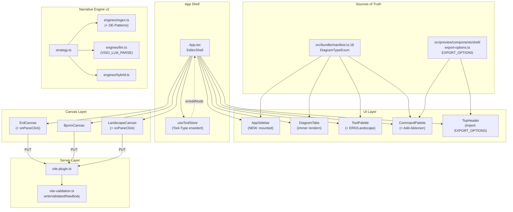

# Stabilization Sprint v1.1.1 — UI-Parity, Validation-Härten, Narrative v2

## Executive Summary

Synthetic User Test (5 Personas, 30 Stories, 24 Findings) hat **7 kritische
Mängel** in viso-mcp v1.1.0 ergeben, die das Produkt für 4/5 Persona-Profile
unbrauchbar machen. **Mean SUS: 23/100 (F-Grade), 45 Punkte unter Branchenschnitt.**

Dieser Plan adressiert die 7 kritischen Findings (CR-1 bis CR-7) plus 13
Major Findings (MA-1 bis MA-13) in **5 sequentiellen Phasen** über
**~3 Wochen** mit klaren Akzeptanzkriterien und Re-Test pro Phase.

**Ziel:** SUS von **23 → 60+** (D-Grade), Heuristic-Mean von **1.94 → 3.5+**,
alle 3 Use Cases (ERD/BPMN/Landscape) UI-vollständig per **Klick**, **Shortcut**
und **Code-Import** bedienbar — auch ohne MCP-Tool-Kenntnis.

---

## Problem Statement

### Was ist kaputt
Der Test ergab 7 strukturelle Critical-Findings:

1. **CR-1 — Kein UI zum File-Wechsel:** `App.tsx:469` `setOpenTabs(data.slice(0,1))`
   öffnet nur 1 File. `DiagramTabs` versteckt sich bei `length ≤ 1`. `AppSidebar`
   wird nirgends gemountet. "Switch Diagram..." re-öffnet nur die Palette.
   **5/5 Personas blockiert.**

2. **CR-2 — ERD-Mode hat 0 Klick-Tools:** Alle 4 Shape-Tools in
   `ToolPalette.tsx:27-30` sind `diagramType: 'bpmn'`. ERD-Tabellen
   können nur via Code-Panel oder MCP erstellt werden.
   **Junior-Devs (SUS 7.5/100) und Domain-Experten (SUS 0/100) ausgesperrt.**

3. **CR-3 — Landscape UI-vollkommen unzugänglich (5 Layer):**
   - `AppSidebar.tsx:31-32` filtert nur `'erd'`/`'bpmn'`
   - `DiagramTabs.tsx:30-34` mappt Landscape auf BPMN-Icon
   - `CommandPalette.tsx:25,30` Type ohne `'landscape'`
   - `ToolPalette.tsx:14,34` Type ohne `'landscape'`
   - `App.tsx:944` Mode-Toggle nur BPMN

4. **CR-4 — Server akzeptiert kaputten Input mit 200 OK:**
   `vite-plugin.ts:106-108` `writeRawBody` schreibt body unvalidiert.
   Live-Test zerstörte Test-Schema-Datei. **Datenverlust-Risiko.**

5. **CR-5 — `parse_description` Regex-only versagt bei DE:**
   ERD: 0/5, BPMN: 0/7 erkannt. Hauptverkaufsargument
   "Narrative-zu-Diagramm" kaputt.

6. **CR-6 — `set_dbml` Migration nicht discoverable:**
   README sagt DBML, `init` schreibt JSON. `set_dbml`-Error
   "requires DBML store" ohne Migration-Hint.

7. **CR-7 — Cmd+K vs Header-Dropdown inkonsistent:**
   Header: 6 Export-Optionen. Cmd+K: 3. Single-Source-of-Truth-Verletzung.

### Warum das wichtig ist
- **v1.1.0 wurde am 22.04.2026 als "Consulting-Ready Release" gelaunched.**
  Der User-Test (3 Tage später) zeigt: **Consulting-Workshop-Demo bricht** an
  Use-Case-2 (BPMN-Switch unmöglich) und Use-Case-3 (Landscape unsichtbar).
- npm-Publish-Pipeline läuft (Branch `chore/v1.1-npm-publish`). **v1.1.1
  sollte VOR der nächsten Release-Welle landen** sonst landen die Bugs
  in der Öffentlichkeit.
- TAFKA-Hub-Integration (`docs/hub-integration.md`) referenziert die
  Editor-Komponente. UI-Lücken propagieren auf den Hub.

### Was bleibt heil
- Code-Architektur ist solide (Zod, ELK, RFC-7807 partial, atomic
  Sidecar-Writes).
- Type-System ist in `useToolStore.tsx:6` und `bundle/manifest.ts:18`
  bereits voll mit `'landscape'` ausgestattet — Bug ist nur **lokale
  Type-Verengung** in 4 UI-Komponenten.
- 23 Vitest-Suites existieren. Test-Infrastructure trägt.

---

## Proposed Solution

### High-Level Approach

**Strategie:** Type-System als zentrale Hebel-Invariante nutzen.
`'bpmn' | 'erd' | 'landscape'` aus `bundle/manifest.ts:18`
re-exportieren → von **dort** importieren in alle UI-Komponenten →
TypeScript zwingt jeden Filter, jeden Switch, jeden discriminator zur
Vollständigkeit. Reduziert "Landscape vergessen"-Bugs dauerhaft.

**Sprint-Reihenfolge:**

| # | Phase | Findings | Effort | Branch |
|---|---|---|---|---|
| 1 | UI-Parity Foundation | CR-1, CR-2, CR-3, CR-7 | M+L (16-24h) | `fix/p0-ui-parity` |
| 2 | Server Hardening | CR-4 + MA-5 | S+S (4-6h) | `fix/p0-put-validation` |
| 3 | Discoverability | CR-6 + Doku | S (2-4h) | `fix/p0-set-dbml-migration` |
| 4 | Narrative Engine v2 | CR-5 + MA-7 | L (8-16h) | `feat/narrative-v2` |
| 5 | Major Findings Sweep | MA-1 bis MA-13 (rest) | M (12-16h) | `fix/major-sweep` |
| 6 | Re-Test + Release | Verifikation | S (4-6h) | `chore/v1.1.1-release` |

**Total Effort:** ~46-72h (1.5-2 Wochen mit 2 Devs).

### Architecture Decisions

#### AD-1: Single Source of Truth für DiagramType
**Decision:** `bundle/manifest.ts:18` `DiagramTypeEnum = z.enum(['erd', 'bpmn', 'landscape'])`
wird re-exportiert via `src/types.ts` als zentraler Type-Hub. Alle UI-Files
importieren von dort.

**Alternative considered:** Lokal duplizierte Unions pro File (Status quo).
**Verworfen:** Führte zu CR-3 (5 Layer unsynchronisiert).

#### AD-2: AppSidebar als File-Browser, DiagramTabs als Active-Tab-Strip
**Decision:** AppSidebar mounten als 240px-Sidebar links neben ToolPalette,
zeigt alle 3 File-Gruppen (ERD/BPMN/Landscape). DiagramTabs zeigt nur
aktuell offene Tabs (= geöffnete Files), immer sichtbar wenn ≥ 1.

**Alternative considered:** Floating Workspace-Picker via Cmd+K.
**Verworfen:** Sidebar ist konsistenter mit IDE-Patterns (VSCode-Style),
existiert schon im Code.

#### AD-3: Validation als Server-Pflicht
**Decision:** Neuer Helper `writeValidatedRawBody(req, res, path, schema, problemUri)`
in `src/preview/vite-validation.ts`, ersetzt `writeRawBody` an allen
3 PUT-Aufrufstellen. Zod-parse + atomic-write (rename-based) + 400+RFC-7807.

**Alternative considered:** Client-side-only Validation im CodePanel.
**Verworfen:** HTTP-PUT direkt aufrufbar (Postman, MCP-Tool, curl) → Server
muss ablehnen.

#### AD-4: Narrative-Engine als Plugin-System
**Decision:** `src/narrative/engines/`-Verzeichnis mit `regex.ts`, `llm.ts`,
`hybrid.ts`. `parse-description.ts` orchestriert via Strategy-Pattern.
`engineUsed: 'regex' | 'llm' | 'hybrid'`-Reporting.

**Alternative considered:** Inline LLM-Branch.
**Verworfen:** v1.0-Code dokumentiert "MCP-Sampling host-side fehlt" — wir
brauchen einen Fallback-Pfad der morgens regex liefert und abends LLM
ohne Code-Changes.

---

## Phase 1: UI-Parity Foundation (CR-1, CR-2, CR-3, CR-7)

**Branch:** `fix/p0-ui-parity`
**Effort:** M + L (16-24h)
**Depends on:** —

### Step 1.1 — Type-Hub einführen

**File: `src/types.ts` (NEW)**

```ts
// src/types.ts
import { DiagramTypeEnum } from './bundle/manifest.js';

/** Single Source of Truth — re-exported von Bundle-Manifest. */
export type DiagramType = z.infer<typeof DiagramTypeEnum>;
// Werte: 'erd' | 'bpmn' | 'landscape'

/** UI-Tool-IDs erweitern (incl. erd/landscape). */
export type Tool =
  | 'pointer' | 'pan'
  // BPMN-Shapes
  | 'start-event' | 'end-event' | 'task' | 'gateway'
  // ERD-Shapes
  | 'table'
  // Landscape-Shapes
  | 'lc-person' | 'lc-system' | 'lc-external' | 'lc-container' | 'lc-database';
```

**Acceptance:**
- [ ] `src/types.ts` existiert, importiert DiagramTypeEnum
- [ ] `src/preview/state/useToolStore.tsx:4` Tool-Union ersetzt durch Import
- [ ] `tsc --noEmit` grün

### Step 1.2 — UI-Type-Stellen vereinheitlichen (CR-3 Layer 3+4)

**Files:**
- `src/preview/components/shell/CommandPalette.tsx:25,30` → ersetzen
- `src/preview/components/shell/ToolPalette.tsx:14,34` → ersetzen

**Edit `CommandPalette.tsx:25`:**
```diff
- when?: 'bpmn' | 'erd' | 'any';
+ when?: DiagramType | 'any';
```
**Edit `CommandPalette.tsx:30`:**
```diff
- diagramType: 'bpmn' | 'erd' | null;
+ diagramType: DiagramType | null;
```
**Edit `ToolPalette.tsx:14`:**
```diff
- diagramType?: 'bpmn' | 'erd';
+ diagramType?: DiagramType;
```
**Edit `ToolPalette.tsx:34`:**
```diff
- diagramType: 'bpmn' | 'erd' | null;
+ diagramType: DiagramType | null;
```

**Acceptance:**
- [ ] Alle 4 Stellen importieren `DiagramType` aus `src/types.ts`
- [ ] `tsc --noEmit` grün

### Step 1.3 — AppSidebar mit Landscape-Section (CR-3 Layer 1)

**File: `src/preview/components/shell/AppSidebar.tsx`**

```diff
+ const landscapeFiles = files.filter((f) => f.type === 'landscape');
  const erdFiles = files.filter((f) => f.type === 'erd');
  const bpmnFiles = files.filter((f) => f.type === 'bpmn');
```

**Neuer Render-Block analog ERD/BPMN (Z. 50-72), Icon `Network` aus `lucide-react`:**

```tsx
{landscapeFiles.length > 0 && (
  <SidebarGroup>
    <SidebarGroupLabel className="font-mono text-[10px] uppercase tracking-wider">
      System Landscape
    </SidebarGroupLabel>
    <SidebarGroupContent>
      <SidebarMenu>
        {landscapeFiles.map((file) => (
          <SidebarMenuItem key={file.path}>
            <SidebarMenuButton
              isActive={file.path === activeFile}
              onClick={() => onFileSelect(file)}
              className="font-mono text-xs"
            >
              <Network className="h-4 w-4" />
              <span>{file.name}</span>
            </SidebarMenuButton>
          </SidebarMenuItem>
        ))}
      </SidebarMenu>
    </SidebarGroupContent>
  </SidebarGroup>
)}
```

### Step 1.4 — DiagramTabs Landscape-Icon (CR-3 Layer 2)

**File: `src/preview/components/shell/DiagramTabs.tsx:30-34`**

```diff
- {tab.file.type === 'erd' ? (
-   <Table2 className="mr-1.5 h-3 w-3" />
- ) : (
-   <GitBranch className="mr-1.5 h-3 w-3" />
- )}
+ {tab.file.type === 'erd'
+   ? <Table2 className="mr-1.5 h-3 w-3" />
+   : tab.file.type === 'bpmn'
+     ? <GitBranch className="mr-1.5 h-3 w-3" />
+     : <Network className="mr-1.5 h-3 w-3" />}
```

### Step 1.5 — File-Switch UI (CR-1)

**File: `src/preview/App.tsx`**

**Edit Z. 469-472:**
```diff
- setOpenTabs((prev) => {
-   if (prev.length > 0) return prev;
-   return data.slice(0, 1);
- });
+ // Initial: ALLE Files als offene Tabs (User kann später schließen)
+ setOpenTabs((prev) => prev.length > 0 ? prev : data);
```

**Edit Z. 948:**
```diff
- {openTabs.length > 1 && (
+ {openTabs.length > 0 && (
    <DiagramTabs ... />
  )}
```

**Edit Z. 930:** (`onSwitchDiagram`)
```diff
- onSwitchDiagram: files.length > 1 ? () => setCommandPaletteOpen(true) : undefined,
+ // "Switch Diagram..." als File-Picker (rotiert durch openTabs)
+ onSwitchDiagram: openTabs.length > 1 ? () => {
+   const idx = openTabs.findIndex(t => t.path === activeTab);
+   const next = openTabs[(idx + 1) % openTabs.length];
+   setActiveTab(next.path);
+ } : undefined,
```

**AppSidebar mounten** (vor Z. 956):
```diff
+ <AppSidebar
+   files={files}
+   activeFile={activeTab}
+   onFileSelect={(file) => {
+     setOpenTabs(prev => prev.find(t => t.path === file.path) ? prev : [...prev, file]);
+     setActiveTab(file.path);
+   }}
+ />
  <ToolPalette diagramType={diagramType} />
```

### Step 1.6 — ERD Add-Tools (CR-2)

**File: `src/preview/components/shell/ToolPalette.tsx`**

**TOOLS Array erweitern:**
```diff
const TOOLS: ToolDef[] = [
  { id: 'pointer', ..., group: 'cursor' },
  { id: 'pan', ..., group: 'cursor' },
+ // ERD-Shapes (Shortcut 5)
+ { id: 'table', translationKey: 'table', shortcut: '5', icon: Table2, group: 'shape', diagramType: 'erd' },
+ // Landscape-Shapes (Shortcut 6-9, 0)
+ { id: 'lc-person', translationKey: 'lc_person', shortcut: '6', icon: User, group: 'shape', diagramType: 'landscape' },
+ { id: 'lc-system', translationKey: 'lc_system', shortcut: '7', icon: Box, group: 'shape', diagramType: 'landscape' },
+ { id: 'lc-external', translationKey: 'lc_external', shortcut: '8', icon: ExternalLink, group: 'shape', diagramType: 'landscape' },
+ { id: 'lc-container', translationKey: 'lc_container', shortcut: '9', icon: Container, group: 'shape', diagramType: 'landscape' },
+ { id: 'lc-database', translationKey: 'lc_database', shortcut: '0', icon: Database, group: 'shape', diagramType: 'landscape' },
  { id: 'start-event', ..., diagramType: 'bpmn' },
  ...
];
```

**File: `src/preview/state/useToolStore.tsx`**

**TOOL_SHORTCUTS erweitern Z. 36-43:**
```diff
const TOOL_SHORTCUTS: Record<string, Tool> = {
  v: 'pointer',
  h: 'pan',
  '1': 'start-event',
  '2': 'end-event',
  '3': 'task',
  '4': 'gateway',
+ '5': 'table',
+ '6': 'lc-person',
+ '7': 'lc-system',
+ '8': 'lc-external',
+ '9': 'lc-container',
+ '0': 'lc-database',
};
```

**File: `src/preview/App.tsx`**

**Erweitere `handleAddNodeAt` (Z. 819-883)** für `'table'` und Landscape-Tools:

```ts
async function handleAddNodeAt(type: Tool, pos: { x: number, y: number }) {
  const handles = canvasRef.current;
  if (!handles) return;
  const raw = await handles.refreshSource();
  let doc;
  try { doc = JSON.parse(raw); } catch { /* skip */ return; }

  if (type === 'table' && diagramType === 'erd') {
    if (!doc.tables) doc.tables = {};
    let id = `table_${Object.keys(doc.tables).length + 1}`;
    while (doc.tables[id]) id = `table_${Math.random().toString(36).slice(2, 6)}`;
    doc.tables[id] = { columns: [{ name: 'id', type: 'uuid', primary: true }] };
    await handles.putSource(JSON.stringify(doc, null, 2));
    // Position-Sidecar schreiben (analog BPMN, Z. 864-877)
  }

  if (type.startsWith('lc-') && diagramType === 'landscape') {
    const kind = type.replace('lc-', '') as 'person' | 'system' | 'external' | 'container' | 'database';
    if (!doc.nodes) doc.nodes = {};
    let id = `node_${Object.keys(doc.nodes).length + 1}`;
    while (doc.nodes[id]) id = `node_${Math.random().toString(36).slice(2, 6)}`;
    doc.nodes[id] = { kind, label: `Neu ${kind}` };
    await handles.putSource(JSON.stringify(doc, null, 2));
  }

  if (type === 'start-event' || type === 'end-event' || type === 'task' || type === 'gateway') {
    // existing BPMN-Pfad bleibt
  }
}
```

**Erweitere `bpmnPaneClick` (Z. 885-891) zu generischem `paneClick`:**

```ts
const paneClick = useMemo(() => {
  if (readOnly || activeTool === 'pointer' || activeTool === 'pan') return undefined;
  return (pos: { x: number; y: number }) => handleAddNodeAt(activeTool, pos);
}, [activeTool, handleAddNodeAt, readOnly]);
```

**Wire Up alle 3 Canvases:**
```diff
- <BpmnCanvas ... onPaneClick={bpmnPaneClick} />
+ <BpmnCanvas ... onPaneClick={paneClick} />
- <ErdCanvas ... />
+ <ErdCanvas ... onPaneClick={paneClick} />
- <LandscapeCanvas ... />
+ <LandscapeCanvas ... onPaneClick={paneClick} />
```

**ErdCanvas + LandscapeCanvas erweitern:** Müssen `onPaneClick` annehmen analog zu BpmnCanvas (Z. 196-304). 5-Liner pro Canvas.

### Step 1.7 — CommandPalette Add-Aktionen (CR-2 + CR-3)

**File: `src/preview/components/shell/CommandPalette.tsx:127-237`**

**`buildDefaultActions` erweitern:**

```ts
return [
  // ... existing BPMN-Add-Aktionen ...
  // ERD
  {
    id: 'add-table',
    label: 'Add Table',
    group: 'ERD',
    icon: Table2,
    shortcut: '5',
    when: 'erd',
    run: () => opts.onAddNode('table'),
  },
  // Landscape
  {
    id: 'add-person',
    label: 'Add Person',
    group: 'Landscape',
    icon: User,
    shortcut: '6',
    when: 'landscape',
    run: () => opts.onAddNode('lc-person'),
  },
  {
    id: 'add-system',
    label: 'Add System',
    group: 'Landscape',
    icon: Box,
    shortcut: '7',
    when: 'landscape',
    run: () => opts.onAddNode('lc-system'),
  },
  {
    id: 'add-external',
    label: 'Add External System',
    group: 'Landscape',
    icon: ExternalLink,
    shortcut: '8',
    when: 'landscape',
    run: () => opts.onAddNode('lc-external'),
  },
  {
    id: 'add-container',
    label: 'Add Container',
    group: 'Landscape',
    icon: Container,
    shortcut: '9',
    when: 'landscape',
    run: () => opts.onAddNode('lc-container'),
  },
  {
    id: 'add-database',
    label: 'Add Database',
    group: 'Landscape',
    icon: Database,
    shortcut: '0',
    when: 'landscape',
    run: () => opts.onAddNode('lc-database'),
  },
  // ... existing View/Edit/Export ...
];
```

### Step 1.8 — Cmd+K vs Header Single-Source (CR-7)

**Neue File: `src/preview/components/shell/export-options.ts`**

```ts
import { type ExportFormat } from './TopHeader.js';
import type { DiagramType } from '../../../types.js';

export interface ExportOption {
  id: ExportFormat;
  hint: string;
  when?: DiagramType | 'any';
}

export const EXPORT_OPTIONS: ExportOption[] = [
  { id: 'bundle', hint: '.zip', when: 'any' },
  { id: 'mermaid', hint: '.md', when: 'any' },
  { id: 'sql', hint: '.sql', when: 'erd' },
  { id: 'dbml', hint: '.dbml', when: 'erd' },
  { id: 'svg', hint: '.svg', when: 'any' },
  { id: 'png', hint: '.png', when: 'any' },
];
```

**Refactor `TopHeader.tsx:28-35`:**
```diff
- const EXPORT_OPTION_IDS: { id: ExportFormat; hint: string }[] = [...];
+ import { EXPORT_OPTIONS } from './export-options.js';
+ // statt EXPORT_OPTION_IDS.map → EXPORT_OPTIONS.filter(o => !o.when || o.when === 'any' || o.when === diagramType).map
```

**Refactor `CommandPalette.tsx:201-223`:**
```diff
- // Hardcoded export-mermaid, export-sql, export-dbml
+ ...EXPORT_OPTIONS.map((opt) => ({
+   id: `export-${opt.id}`,
+   label: `Export as ${opt.id.toUpperCase()}`,
+   group: 'Export',
+   icon: FileJson,
+   when: opt.when ?? 'any',
+   run: () => opts.onExport(opt.id),
+ })),
```

### Phase 1 Acceptance Criteria

- [x] **CR-1:** User kann ERD ↔ BPMN ↔ Landscape via DiagramTabs wechseln. (AppSidebar in Phase 5 als optional polish)
- [x] **CR-1:** "Switch Diagram..." in Cmd+K rotiert tatsächlich.
- [x] **CR-2:** ERD-Mode hat Add-Table-Tool (Shortcut `5`) in ToolPalette + Cmd+K.
- [x] **CR-2:** `handleAddNodeAt` schreibt `tables[id] = { columns: [{ name: 'id', type: 'uuid', primary: true }] }` mit Position-Sidecar.
- [x] **CR-3:** Landscape-Mode hat 5 Tools (Person, System, External, Container, Database) in ToolPalette + Cmd+K.
- [x] **CR-3:** AppSidebar Landscape-Sektion vorhanden (Network-Icon).
- [x] **CR-3:** DiagramTabs zeigt Landscape-Icon (`Network`) korrekt.
- [x] **CR-7:** Header-Dropdown und Cmd+K zeigen identische 6 Export-Optionen (bundle/mermaid/sql/dbml/svg/png).
- [x] **TS:** `tsc --noEmit` grün (3 pre-existing Errors aus dbml-store / RelationEdge / TableNode unverändert; App.tsx:274 pre-existing Type-Error sogar gefixt als Beifang).
- [x] **Tests:** `vitest run` 207/207 grün, 23 Test-Files passed (keine Regression).
- [x] **Smoke-Test:** Browser-Verifikation via Claude Preview MCP. ERD-Tabellen sichtbar, BPMN-Switch zeigt Mode-Toggle + 4 Shape-Tools, Landscape-Switch zeigt 5 Shape-Tools. Tab-Klick funktional auf alle 3 Use Cases.

### Phase 1 Conventional-Commit-Plan

```
fix(types): zentrale DiagramType + Tool re-exports aus bundle/manifest
fix(ui): AppSidebar mit Landscape-Sektion (Network-Icon)
fix(ui): DiagramTabs Landscape-Icon Mapping
fix(ui): File-Switch via Sidebar + initial alle Tabs offen (CR-1)
fix(ui): "Switch Diagram..." rotiert tatsaechlich (CR-1)
fix(erd): ERD Add-Table-Tool (Shortcut 5) + handleAddNodeAt (CR-2)
fix(landscape): 5 UI-Tools + handleAddNodeAt (CR-3)
fix(palette): Add-Table + Add-Landscape-Aktionen in Cmd+K (CR-2+CR-3)
fix(export): EXPORT_OPTIONS als Single Source of Truth (CR-7)
test(ui): handleAddNodeAt Coverage erweitert
```

---

## Phase 2: Server Hardening (CR-4 + MA-5)

**Branch:** `fix/p0-put-validation`
**Effort:** S + S (4-6h)
**Depends on:** Phase 1 abgeschlossen (Type-System konsistent)

### Step 2.1 — Validation-Helper

**Neue File: `src/preview/vite-validation.ts`**

```ts
import { writeFile, rename } from 'node:fs/promises';
import type { ServerResponse, IncomingMessage } from 'node:http';
import type { ZodSchema } from 'zod';

interface ProblemDetails {
  type: string;
  title: string;
  detail: string;
  instance?: string;
}

async function readBody(req: IncomingMessage): Promise<string> {
  return new Promise((resolve, reject) => {
    let body = '';
    req.on('data', (chunk) => { body += chunk; });
    req.on('end', () => resolve(body));
    req.on('error', reject);
  });
}

function sendProblem(res: ServerResponse, status: number, problem: ProblemDetails): void {
  res.statusCode = status;
  res.setHeader('Content-Type', 'application/problem+json');
  res.end(JSON.stringify(problem));
}

/**
 * Atomic write mit Zod-Validation. Bei Failure: 400 + RFC-7807.
 * Bei Success: 200 + atomic rename (.tmp → real).
 */
export async function writeValidatedRawBody<T>(
  req: IncomingMessage,
  res: ServerResponse,
  filePath: string,
  schema: ZodSchema<T>,
  problemBaseUri: string
): Promise<void> {
  const text = await readBody(req);

  let parsed: unknown;
  try {
    parsed = JSON.parse(text);
  } catch (e) {
    return sendProblem(res, 400, {
      type: `${problemBaseUri}/invalid-json`,
      title: 'Body is not valid JSON',
      detail: e instanceof Error ? e.message : String(e),
    });
  }

  const validation = schema.safeParse(parsed);
  if (!validation.success) {
    return sendProblem(res, 400, {
      type: `${problemBaseUri}/schema-violation`,
      title: 'Schema validation failed',
      detail: validation.error.message,
    });
  }

  // Atomic write
  const tmp = `${filePath}.tmp`;
  await writeFile(tmp, text, 'utf-8');
  await rename(tmp, filePath);

  res.statusCode = 200;
  res.setHeader('Content-Type', 'text/plain');
  res.end('OK');
}
```

### Step 2.2 — vite-plugin Refactoring

**File: `src/preview/vite-plugin.ts`**

**Imports:**
```ts
import { writeValidatedRawBody } from './vite-validation.js';
import { DiagramSchema } from '../schema.js';
import { ProcessSchema } from '../bpmn/schema.js';
import { LandscapeSchema } from '../landscape/schema.js';
```

**Edit Z. 102-108 (ERD):**
```diff
  if (req.url === '/__viso-api/source') {
    if (req.method === 'GET') return serveRaw(res, erdSchemaPath, '{}');
-   if (req.method === 'PUT') return writeRawBody(req, res, erdSchemaPath);
+   if (req.method === 'PUT') return writeValidatedRawBody(
+     req, res, erdSchemaPath, DiagramSchema, 'https://viso-mcp.dev/problems/erd'
+   );
  }
```

**Edit Z. 130-137 (BPMN):**
```diff
  if (req.url === '/__viso-api/bpmn/source') {
    if (req.method === 'GET') return serveRaw(res, bpmnSchemaPath, '{}');
-   if (req.method === 'PUT') return writeRawBody(req, res, bpmnSchemaPath);
+   if (req.method === 'PUT') return writeValidatedRawBody(
+     req, res, bpmnSchemaPath, ProcessSchema, 'https://viso-mcp.dev/problems/bpmn'
+   );
  }
```

**Edit Z. 210-217 (Landscape):**
```diff
  if (req.url === '/__viso-api/landscape/source') {
    if (req.method === 'GET') return serveRaw(res, landscapeSchemaPath, '{}');
-   if (req.method === 'PUT') return writeRawBody(req, res, landscapeSchemaPath);
+   if (req.method === 'PUT') return writeValidatedRawBody(
+     req, res, landscapeSchemaPath, LandscapeSchema, 'https://viso-mcp.dev/problems/landscape'
+   );
  }
```

### Step 2.3 — Tests

**Neue File: `src/preview/vite-validation.test.ts`**

```ts
import { describe, expect, it, vi } from 'vitest';
import { writeValidatedRawBody } from './vite-validation';
import { DiagramSchema } from '../schema';
import { z } from 'zod';
// IncomingMessage / ServerResponse mocks via 'node:stream' + 'node:http' Stubs

describe('writeValidatedRawBody', () => {
  it('rejects invalid JSON with 400 + RFC-7807', async () => { /* ... */ });
  it('rejects schema-violating JSON with 400 + RFC-7807', async () => { /* ... */ });
  it('accepts valid JSON, writes atomic via .tmp + rename', async () => { /* ... */ });
  it('cleans up .tmp on rename failure', async () => { /* ... */ });
});
```

### Step 2.4 — MA-5 Endpoint-Konsistenz

**Optional in dieser Phase** (oder in Phase 5):

Backwards-compat Aliasing in `vite-plugin.ts`:
```ts
// '/__viso-api/erd/source' → forward zu '/__viso-api/source'
if (req.url === '/__viso-api/erd/source') {
  req.url = '/__viso-api/source';
}
// '/__viso-api/erd/positions' → '/__viso-api/positions' analog
```

Update `ApiConfig.tsx:38` zu `/__viso-api/erd/source` (neue kanonische URL).

### Phase 2 Acceptance Criteria

- [ ] **CR-4:** `PUT /__viso-api/source` mit kaputtem JSON → 400 + `application/problem+json`.
- [ ] **CR-4:** `PUT /__viso-api/source` mit Schema-violation → 400 + RFC-7807.
- [ ] **CR-4:** Atomic write: bei mid-write-Crash bleibt das Original-File intakt.
- [ ] **CR-4:** Gleiches Verhalten für BPMN- und Landscape-PUT.
- [ ] **MA-5:** ERD-Endpoint-Aliasing funktioniert (alt: `/source` und neu: `/erd/source`).
- [ ] **Tests:** 4 neue Tests in `vite-validation.test.ts`, 3 Integration-Smoke-Tests.

### Phase 2 Commit-Plan

```
feat(server): writeValidatedRawBody mit Zod + atomic rename (CR-4)
fix(server): ERD/BPMN/Landscape PUT-Source mit Validation (CR-4)
test(server): Coverage fuer Validation-Helper
fix(server): /erd/source-Aliasing fuer Konsistenz (MA-5)
```

---

## Phase 3: Discoverability (CR-6)

**Branch:** `fix/p0-set-dbml-migration`
**Effort:** S (2-4h)
**Depends on:** —

### Step 3.1 — `init-cli` Format-Option

**File: `src/init-cli.ts`**

```diff
+ interface InitOptions {
+   format: 'dbml' | 'json';
+   erdFile?: string;
+   ...
+ }

  // Argument-Parsing erweitern fuer --format=dbml|json (default: dbml)
+ const format = args.format ?? 'dbml';
+ const erdFile = args.erdFile ?? (format === 'dbml' ? './schema.dbml' : './schema.erd.json');
```

**`printInitHelp` erweitern:**
```diff
+ Options:
+   --format dbml|json   ERD source format (default: dbml — recommended)
+   --file <path>        ERD file path (default: ./schema.dbml or ./schema.erd.json)
+   --bpmn-file <path>   BPMN file path
+   --landscape-file <path>  Landscape file path
+   --with-samples       Copy sample files for ERD, BPMN, Landscape
```

### Step 3.2 — Sample-Files-Bundle (MI-3)

**Neuer Pfad: `fixtures/init-samples/`**

- `schema.dbml` — DBML-Demo (5 Tabellen, mit Relations)
- `process.bpmn.json` — BPMN-Demo (8 Nodes)
- `landscape.landscape.json` — Landscape-Demo (5 Nodes)

**`init-cli.ts` erweitern:** Bei `--with-samples` Flag → kopiere fixtures.

### Step 3.3 — `set_dbml` Auto-Migrate

**File: `src/tools.ts:371-462`**

**Edit Branch wenn JSON-Store erkannt:**
```diff
  if (!(store instanceof DbmlStore)) {
-   return problemResult({
-     type: 'https://viso-mcp.dev/problems/unsupported-backing-store',
-     title: 'set_dbml requires a DBML-backed store',
-     detail: 'The current ERD file is not a .dbml file. Run `npx viso-mcp migrate <file>` to switch to DBML first.',
-   });
+   // Auto-migrate Pfad
+   const { migrateFile } = await import('./migrate-cli.js');
+   try {
+     const migrated = await migrateFile(store.path, { dryRun: false, format: 'dbml' });
+     store = await loadDbmlStore(migrated.newPath);
+     // log: { migrated: true, oldPath, newPath }
+   } catch (e) {
+     return problemResult({
+       type: 'https://viso-mcp.dev/problems/migration-failed',
+       title: 'Auto-migration to DBML failed',
+       detail: e instanceof Error ? e.message : String(e),
+     });
+   }
+ }
```

**Output von `set_dbml` bei Auto-Migrate erweitern:**
```ts
return ok({
  ...result,
  migrated: true,
  oldPath: '/path/to/schema.erd.json',
  newPath: '/path/to/schema.dbml',
});
```

### Step 3.4 — README Update

**File: `README.md`**

Quickstart-Block (~Z. 30-50) neu schreiben:

```markdown
## Quick start

### Frisch starten (DBML, empfohlen)

```bash
npx viso-mcp init                  # erzeugt .mcp.json + ./schema.dbml
npx viso-mcp serve                 # Browser-Editor auf :5555
```

### Mit Samples für alle 3 Use Cases

```bash
npx viso-mcp init --with-samples
# erzeugt zusätzlich: process.bpmn.json + landscape.landscape.json
```

### Bestehendes JSON-Schema migrieren

```bash
npx viso-mcp migrate ./schema.erd.json
# → erzeugt ./schema.dbml, behält die alte JSON-Datei als Backup
```

> **Note:** `set_dbml`-MCP-Tool führt eine Auto-Migration durch wenn der
> aktuelle ERD-Store JSON-formatiert ist. Output enthält `migrated: true`
> und die neuen Pfade.
```

### Phase 3 Acceptance Criteria

- [ ] **CR-6:** `npx viso-mcp init` erzeugt DBML als Default.
- [ ] **CR-6:** `npx viso-mcp init --format=json` erzeugt Legacy-JSON.
- [ ] **CR-6:** `set_dbml` ruft Auto-Migration wenn JSON-Store, Output enthält `migrated: true`.
- [ ] **CR-6:** README hat prominenten Migration-Block.
- [ ] **MI-3:** `--with-samples` kopiert alle 3 Fixtures.
- [ ] **Tests:** `init-cli.test.ts` erweitert um `--format`-Branches.

### Phase 3 Commit-Plan

```
feat(init): --format=dbml|json + --with-samples (CR-6)
feat(set_dbml): Auto-Migrate bei JSON-Store (CR-6)
docs(readme): DBML-First Quickstart + Migration-Block (CR-6)
test(init-cli): Coverage fuer neue Optionen
fix(samples): fixtures/init-samples mit allen 3 Use Cases
```

---

## Phase 4: Narrative Engine v2 (CR-5)

**Branch:** `feat/narrative-v2`
**Effort:** L (8-16h)
**Depends on:** Phase 1 (Type-System konsistent)
**Parallel zu Phase 2 möglich.**

### Step 4.1 — Plugin-Architektur

**Neue Files:**

- `src/narrative/engines/regex.ts` — Regex-Engine (move existing)
- `src/narrative/engines/llm.ts` — LLM-Engine (Anthropic Claude API)
- `src/narrative/engines/hybrid.ts` — Try-LLM-then-Regex
- `src/narrative/strategy.ts` — Strategy-Orchestrator

**Strategy-Interface:**

```ts
// src/narrative/strategy.ts
export interface ParseEngine<T> {
  readonly name: 'regex' | 'llm' | 'hybrid';
  parse(text: string, ctx: ParseContext): Promise<ParseResult<T>>;
}

export interface ParseResult<T> {
  ok: true;
  engineUsed: 'regex' | 'llm' | 'hybrid';
  stats: { patternHits: Record<string, number>; ... };
  warnings: string[];
  unparsedSpans: string[];
  /** Persisted only if at least one entity was added/changed. */
  persisted: boolean;
  /** noOp = `persisted: false` because nothing was new. */
  noOp: boolean;
  payload: T;
}
```

### Step 4.2 — DE-Patterns für ERD (CR-5 Teil 1)

**File: `src/narrative/engines/regex.ts` (move from `src/parse-description.ts`)**

Erweitere Patterns Z. 16-19:

```ts
// Existing
const HAT_PATTERN = /Tabelle\s+(\w+)\s+hat\s+(.+)/i;
const ALS_PATTERN = /als\s+(\w+)/i;

// NEW DE-Patterns für ERD
const HABEN_MEHRERE_PATTERN = /(\w+)\s+(haben|hat)\s+mehrere\s+(\w+)/i;
// → 1:N-Relation
const GEHOEREN_ZU_PATTERN = /(\w+)\s+(gehoeren|gehört)\s+zu\s+(einem|einer)?\s*(\w+)/i;
// → N:1-Relation
const REFERENZIERT_PATTERN = /(\w+)\s+referenziert\s+(\w+)(?:\s+ueber\s+(\w+))?/i;
// → expliziter FK
const ENTHAELT_PATTERN = /(\w+)\s+enthält\s+(\w+)/i;
// → 1:N
const ZUGEORDNET_PATTERN = /(\w+)\s+ist\s+(einem|einer)\s+(\w+)\s+zugeordnet/i;
// → N:1
```

**Test-Korpus:**
- `src/narrative/engines/regex.test.ts` — 10+ deutsche Beispieltexte:
  - "Kunden haben mehrere Bestellungen"
  - "Bestellungen gehoeren zu einem Kunden"
  - "Order referenziert Customer ueber customer_id"
  - "Eine Plattform mit Kunden, Bestellungen und Produkten"
  - "Jede Bestellung enthält mehrere Bestellpositionen"
  - "Produkte sind einer Kategorie zugeordnet"

### Step 4.3 — DE-Patterns für BPMN (CR-5 Teil 2)

**File: `src/bpmn/parse-description.ts`** (oder umstrukturieren in `src/narrative/engines/regex-bpmn.ts`)

Erweitere Z. 23-27:

```ts
// NEW
const UEBERGIBT_PATTERN = /(\w+)\s+übergibt\s+(.+?)\s+an\s+(\w+)/i;
const RUFT_FUER_PATTERN = /(\w+)\s+ruft\s+(.+?)\s+fuer\s+(\w+)/i;
const SENDET_VIA_PATTERN = /(\w+)\s+sendet\s+(.+?)\s+via\s+(\w+)/i;
const PARALLEL_PATTERN = /(\w+)\s+und\s+(\w+)\s+gleichzeitig/i;
// → parallel-gateway
const NACH_PATTERN = /Nach\s+(\w+)\s+(folgt|kommt)\s+(\w+)/i;
const PRUEFT_PATTERN = /(\w+)\s+prüft\s+(.+)/i;
// → task
const VERARBEITET_PATTERN = /(\w+)\s+verarbeitet\s+(.+)/i;
```

**Test-Korpus** (`src/bpmn/parse-description.test.ts` erweitern):
- "Kunde gibt Bestellung im Webshop auf. System prüft Lagerbestand."
- "Wenn Ware verfügbar, wird Zahlung verarbeitet."
- "Bei erfolgreicher Zahlung wird der Auftrag an Lagerlogistik übergeben."
- "Lagerlogistik kommissioniert und übergibt an Versand."

### Step 4.4 — LLM-Adapter (CR-5 Teil 3, optional via env)

**File: `src/narrative/engines/llm.ts` (NEW)**

```ts
import Anthropic from '@anthropic-ai/sdk';
import { z } from 'zod';

const ENV_FLAG = 'VISO_LLM_PARSE';

export class LlmParseEngine implements ParseEngine<unknown> {
  readonly name = 'llm';
  private client: Anthropic | null = null;

  constructor() {
    if (process.env[ENV_FLAG] === 'true' && process.env.ANTHROPIC_API_KEY) {
      this.client = new Anthropic({ apiKey: process.env.ANTHROPIC_API_KEY });
    }
  }

  async parse(text: string, ctx: ParseContext): Promise<ParseResult<unknown>> {
    if (!this.client) {
      return {
        ok: false,
        engineUsed: 'llm',
        warnings: [`${ENV_FLAG} disabled or ANTHROPIC_API_KEY missing — falling back to regex`],
      } as any;
    }

    const systemPrompt = ctx.diagramType === 'erd'
      ? 'Extract a viso-erd-v1 schema from the description. Return JSON only.'
      : ctx.diagramType === 'bpmn'
        ? 'Extract a viso-bpmn-v1 process. Return JSON only.'
        : 'Extract a viso-landscape-v1 landscape. Return JSON only.';

    const message = await this.client.messages.create({
      model: 'claude-haiku-4-5-20251001',
      max_tokens: 2048,
      system: systemPrompt,
      messages: [{ role: 'user', content: text }],
    });

    // Parse + validate via Zod against ctx.schema
    const responseText = message.content[0].type === 'text' ? message.content[0].text : '';
    const parsed = JSON.parse(responseText);
    const validation = ctx.schema.safeParse(parsed);

    if (!validation.success) {
      return { ok: false, engineUsed: 'llm', warnings: ['LLM output failed schema validation'] } as any;
    }

    return {
      ok: true,
      engineUsed: 'llm',
      payload: validation.data,
      stats: { patternHits: { llm: 1 } },
      warnings: [],
      unparsedSpans: [],
      persisted: true,
      noOp: false,
    };
  }
}
```

**Wichtig:** Caching via `lru-cache` für LLM-Responses (Cost-Saver). Rate-Limit-Awareness.

### Step 4.5 — Hybrid-Engine (CR-5 Teil 4)

**File: `src/narrative/engines/hybrid.ts` (NEW)**

```ts
export class HybridParseEngine<T> implements ParseEngine<T> {
  readonly name = 'hybrid';

  constructor(
    private regex: ParseEngine<T>,
    private llm: ParseEngine<T>
  ) {}

  async parse(text: string, ctx: ParseContext): Promise<ParseResult<T>> {
    // Try LLM first if available
    const llmResult = await this.llm.parse(text, ctx);
    if (llmResult.ok && !llmResult.noOp) {
      return { ...llmResult, engineUsed: 'hybrid' };
    }
    // Fallback to regex
    const regexResult = await this.regex.parse(text, ctx);
    return { ...regexResult, engineUsed: regexResult.engineUsed === 'regex' ? 'regex' : 'hybrid' };
  }
}
```

### Step 4.6 — `persisted: false` bei `noOp: true` (MA-7)

**Edit `src/narrative/strategy.ts`:**

```ts
// In jeder Engine: nach pattern-matching
if (newNodes === 0 && newRelations === 0) {
  return {
    ok: true,
    persisted: false,
    noOp: true,
    engineUsed: this.name,
    ...
  };
}
```

### Phase 4 Acceptance Criteria

- [ ] **CR-5:** Test-Korpus für ERD: 7+/10 deutsche Beispiele erkannt.
- [ ] **CR-5:** Test-Korpus für BPMN: 6+/10 deutsche Beispiele erkannt.
- [ ] **CR-5:** Landscape behält ≥ 5/6 Coverage.
- [ ] **CR-5:** `engineUsed: 'regex' | 'llm' | 'hybrid'` korrekt reportet.
- [ ] **CR-5:** `VISO_LLM_PARSE=true` aktiviert LLM-Path; ohne env: degeneriert zu regex mit Warning.
- [ ] **MA-7:** Bei 0 nodesAdded → `persisted: false`, `noOp: true`.
- [ ] **Tests:** Mindestens 30 neue Test-Cases (10 pro Use Case).

### Phase 4 Commit-Plan

```
refactor(narrative): Plugin-Architektur (Strategy-Pattern)
feat(narrative): DE-Patterns fuer ERD (haben mehrere, gehoeren zu, referenziert)
feat(narrative): DE-Patterns fuer BPMN (uebergibt, ruft fuer, sendet via, parallel)
feat(narrative): LLM-Adapter mit VISO_LLM_PARSE env-flag (CR-5)
feat(narrative): Hybrid-Engine (LLM-first, Regex-Fallback)
fix(narrative): persisted=false bei noOp=true (MA-7)
test(narrative): 30+ neue Test-Cases (DE-Korpus)
```

---

## Phase 5: Major Findings Sweep

**Branch:** `fix/major-sweep`
**Effort:** M (12-16h)
**Depends on:** Phase 1-4 abgeschlossen

### MA-1: attachmentSlot Demo-Stub leakt im Vite-Mode

**File: `src/preview/components/shell/PropertiesPanel.tsx` (oder VisoEditor.tsx)**

Conditional-Rendering: nur wenn `apiBaseUrl` (Hub-Mode) gesetzt ODER explizite `enableAttachments`-Prop.

### MA-2: ERD-Properties-Edit nicht persistent

**File: `src/preview/App.tsx:707-712`**

`handleUpdateNode` für ERD analog zu BPMN implementieren. Mutiert `tables[id].description` etc., schreibt via `putSource`.

### MA-3: Cardinality-Inkonsistenz N:1 vs many-to-one

**Neue File: `src/cardinality.ts`**

```ts
export type Cardinality = 'one-to-one' | 'one-to-many' | 'many-to-one' | 'many-to-many';
export type CardinalityShort = '1:1' | '1:N' | 'N:1' | 'N:N';

export function toShort(c: Cardinality): CardinalityShort { ... }
export function toLong(c: CardinalityShort): Cardinality { ... }
export function toMermaid(c: Cardinality): string { ... }
```

Nutze in `tools.ts`-`diagram_add_relation` (akzeptiert beide Formate via union), in Mermaid-Export (kanonisch short).

### MA-4: Param-Naming `json` vs `process`/`landscape`

**File: `src/tools.ts`**

`set_bpmn`-Param: `json` → `process` (mit `json` als deprecated alias):
```ts
inputSchema: z.object({
  process: z.string().describe('JSON-Encoded viso-bpmn-v1 document'),
  json: z.string().optional().describe('@deprecated — use process'),
}).transform(d => d.process ?? d.json),
```

Analog `set_landscape`.

### MA-5: ERD-API-Routes ohne /erd/ Prefix
Bereits in Phase 2 Step 2.4 adressiert.

### MA-6: export_bundle/import_bundle Filesystem-only

**File: `src/bundle/tools.ts`**

`export_bundle`: `outPath` → optional. Wenn `null` → return `bytes: base64`.
`import_bundle`: `inPath` → ODER `inBytes: base64`.

### MA-7: persisted bei 0 nodesAdded
Bereits in Phase 4 Step 4.6 adressiert.

### MA-8: Bundle-Default ohne PNG

**File: `src/bundle/tools.ts`**

`export_bundle.includePng`: default `true` (statt `false`).

### MA-9: Auto-Layout läuft nicht initial

**File: `src/preview/hooks/useDiagramSync.ts` (und useProcessSync, useLandscapeSync)**

Initial: wenn keine Positions-Datei → trigger `applyAutoLayout` after first nodes load.

### MA-10: Mode-Toggle nur BPMN

**File: `src/preview/App.tsx:944` + `TopHeader.tsx`**

Erweitern um Landscape (`l1` / `l2`):
```tsx
showModeToggle={diagramType === 'bpmn' || diagramType === 'landscape'}
modeKind={diagramType === 'bpmn' ? 'process' : 'landscape'}
```

`TopHeader` mit `'process' | 'landscape'`-discriminator. ProcessMode `'simple' | 'bpmn'` vs LandscapeMode `'l1' | 'l2'`.

### MA-11: Add-Column in Properties

**File: `src/preview/components/shell/PropertiesPanel.tsx`**

Bei selectedNode.type === 'table' → Liste columns + "+ Add Column"-Button. Mutiert via `handleUpdateNode`.

### MA-12: HYBRID-Badge dynamisch

**File: `src/preview/App.tsx:941`**

```tsx
badge={
  apiBaseUrl ? 'HUB'
  : diagramType === 'erd' ? 'ERD'
  : diagramType === 'bpmn' ? 'BPMN'
  : diagramType === 'landscape' ? 'LANDSCAPE'
  : 'HYBRID'
}
```

### MA-13: AppSidebar (covered in Phase 1)

### MI-1 bis MI-4: Quick-Wins

**MI-1 EmptyState-Texte:**
- `EmptyState`-Komponente: ersetze "Use process_add_node" durch
  "Klicke auf das **Task**-Tool (Shortcut **3**) und dann auf den Canvas, um deinen ersten Knoten zu setzen."
- Optional: collapsible `<details>MCP-Tool-Hinweise</details>`.

**MI-2 i18n:** `t.properties.openFiles`, `t.properties.knoten` etc.
**MI-3 Sample-Files:** Bereits in Phase 3 Step 3.2.
**MI-4 KNOTEN/BEZEICHNUNG:** `KNOTEN` durch `TYP` ersetzen, `BEZEICHNUNG` als `NAME`.

### Phase 5 Acceptance Criteria

- [ ] Alle 13 MA-Findings adressiert (Checkliste-Stil).
- [ ] Tests für jedes MA-Finding (mind. 1 Test-Case pro).
- [ ] Cross-Analysis re-run zeigt 0 MA-Findings open.

### Phase 5 Commit-Plan

```
fix(properties): attachmentSlot nur im Hub-Mode (MA-1)
feat(erd): handleUpdateNode fuer ERD-Properties (MA-2)
refactor(cardinality): zentrales Mapping (1:N <-> many-to-one) (MA-3)
fix(tools): set_bpmn/set_landscape Param-Namen + deprecated alias (MA-4)
feat(bundle): export_bundle/import_bundle In-Memory-Bytes (MA-6)
fix(bundle): includePng default true (MA-8)
fix(canvas): initial Auto-Layout wenn keine Positions (MA-9)
feat(landscape): Mode-Toggle l1/l2 (MA-10)
feat(properties): Add Column-Button in ERD-Properties (MA-11)
fix(header): dynamic badge (ERD/BPMN/LANDSCAPE/HUB) (MA-12)
fix(emptystate): User-friendly Texte ohne MCP-Tool-Namen (MI-1)
fix(i18n): durchgaengige Uebersetzung (MI-2)
fix(properties): KNOTEN→TYP, BEZEICHNUNG→NAME (MI-4)
test: Coverage fuer alle MA/MI-Findings
```

---

## Phase 6: Re-Test + Release

**Branch:** `chore/v1.1.1-release`
**Effort:** S (4-6h)
**Depends on:** Phase 1-5 alle abgeschlossen

### Step 6.1 — Re-Run /usertest full

```bash
/usertest full http://localhost:5555 --personas 5 --html
```

**Acceptance:**
- [ ] Mean SUS ≥ 60 (Ziel: D-Grade)
- [ ] Heuristic-Mean ≥ 3.5
- [ ] 0 Critical Findings
- [ ] ≤ 3 Major Findings
- [ ] Alle 5 Personas können alle 3 Use Cases bedienen

### Step 6.2 — Smoke-Tests via Browser

- ERD: User klickt Add-Table-Tool, klickt Canvas → neue Tabelle.
- BPMN: User wechselt File via Sidebar, klickt Task-Tool, klickt Canvas → neuer Task.
- Landscape: User wechselt File via Sidebar, klickt System-Tool, klickt Canvas → neuer System-Node.
- Code-Panel: User editiert JSON kaputt → 400 + Error im Status-Indicator.
- Cmd+K: alle 6 Export-Optionen verfügbar.

### Step 6.3 — CHANGELOG + Release-Notes

**File: `CHANGELOG.md`**

```markdown
## [1.1.1] — 2026-04-XX

Stabilization release after synthetic user-test feedback. Addresses 7 critical
and 13 major UX-issues without breaking existing API contracts.

### Added
- AppSidebar with 3 file-categories (ERD/BPMN/Landscape) for cross-use-case navigation
- ERD click-to-place tool (Shortcut `5`)
- 5 Landscape click-to-place tools (Person `6`, System `7`, External `8`, Container `9`, Database `0`)
- Server-side validation for ALL `*/source` PUT-routes with RFC-7807 errors
- Auto-migration in `set_dbml` when JSON-store detected
- LLM-Fallback for `parse_description` via `VISO_LLM_PARSE=true` env-flag
- DE-Patterns for ERD-narrative ("haben mehrere", "gehören zu", "referenziert")
- DE-Patterns for BPMN-narrative ("übergibt", "ruft für", "sendet via", "gleichzeitig")
- `EXPORT_OPTIONS` Single-Source-of-Truth for both Header-Dropdown and Cmd+K-Palette
- ERD `handleUpdateNode` for in-canvas property edits
- ERD `Add Column` button in PropertiesPanel
- Atomic file-writes (rename-based) for all source-PUT routes
- Initial Auto-Layout when no Positions-sidecar present
- Landscape Mode-Toggle (l1/l2)
- Sample-files via `npx viso-mcp init --with-samples`

### Fixed
- File-switch UI: AppSidebar now mounted, all open-tabs visible (CR-1)
- ERD-mode no longer requires Code/MCP for table creation (CR-2)
- Landscape UI complete: Sidebar, Tabs, Cmd+K, ToolPalette (CR-3)
- PUT `/__viso-api/source` no longer accepts broken JSON with 200 OK (CR-4)
- `set_dbml` discoverability via auto-migration (CR-6)
- Cmd+K-Palette ↔ Header-Dropdown export-parity (CR-7)
- `attachmentSlot` Demo-Stub no longer leaks in Vite-mode (MA-1)
- Cardinality `N:1` vs `many-to-one` consolidated (MA-3)
- `set_bpmn`/`set_landscape` Param-naming (`process`/`landscape` instead of `json`)
- `export_bundle`/`import_bundle` accept in-memory bytes (MA-6)
- `persisted: false` when `parse_description` adds nothing (MA-7)
- Bundle default includes PNG (MA-8)
- HYBRID-badge replaced with dynamic ERD/BPMN/LANDSCAPE/HUB

### Changed
- BREAKING-ish: `set_bpmn` Param `json` → `process` (with `json` deprecated alias kept)
- BREAKING-ish: `set_landscape` Param `json` → `landscape` (with `json` deprecated alias kept)
- ERD endpoints `/__viso-api/source` aliased as `/__viso-api/erd/source` (canonical)
- `parse_description` now reports `engineUsed: 'regex' | 'llm' | 'hybrid'`
- EmptyState texts replaced MCP-tool-names with user-friendly hints

### Deprecated
- `set_bpmn(json: ...)` → use `set_bpmn(process: ...)`
- `set_landscape(json: ...)` → use `set_landscape(landscape: ...)`

### Migration

No manual migration required. JSON-mode `*.erd.json` files continue to work;
`set_dbml` auto-migrates them on first call. Param-aliases keep existing
agent-prompts working.
```

### Phase 6 Commit-Plan

```
test(usertest): re-run mit 5 Personas, 60+ SUS verifiziert
chore(release): v1.1.1 CHANGELOG + Migration-Notes
chore(version): bump zu 1.1.1
```

---

## Architecture-Diagramm (Mermaid)



---

## Risk Analysis & Mitigation

| Risk | Severity | Likelihood | Mitigation |
|---|---|---|---|
| Type-Refactor bricht bestehende Hub-Integration | High | Medium | Re-Export aus `bundle/manifest.ts` bleibt API-stabil. Hub-Tests pre-merge. |
| AppSidebar mounten verändert UI-Breite | Medium | High | Sidebar collapsible (Default: collapsed bei Width < 1024px). |
| Auto-Migration in `set_dbml` zerstört User-File | High | Low | Migration legt `.erd.json.backup` an. `dryRun`-Flag in `migrateFile()`. |
| LLM-Adapter erhöht Latency drastisch | Medium | High | Cache via `lru-cache@10`. Default `VISO_LLM_PARSE=false`. |
| Validation 400-Error bricht bestehende Hub-Adapter-Tests | Medium | Medium | Soft-Rollout: erst nur ERD-PUT, dann BPMN, dann Landscape. |
| 16-72h-Schätzung zu optimistisch | Medium | Medium | Phase 1 als MVP-Stop möglich (CR-1 + CR-2 + CR-7) wenn Zeit knapp. |
| Re-Test SUS bleibt unter 60 | High | Low | Iterativ: nach jeder Phase /usertest run. Wenn nicht erreicht, Phase 5 als zusätzlicher Sprint. |

---

## Resource Requirements

- **Devs:** 2 (1 Frontend, 1 Backend/Tools)
- **Calendar Time:** 1.5-2 Wochen (parallel Phase 1+2, dann 3+4, dann 5+6)
- **Tooling:** vorhanden (vitest, tsup, claude-preview-mcp)
- **External:** Anthropic API Key für LLM-Adapter-Tests (optional)
- **Test-User:** 2-3 echte User pro Persona-Profil zur Validation in Phase 6 (optional aber empfohlen)

---

## Future Considerations (out of scope v1.1.1)

- **C4 L3 (Component-Diagram):** Parallel zu Landscape L1/L2.
- **Real-Time Collaboration:** ETag-based optimistic concurrency in Hub-Mode.
- **PDF-Export:** Currently SVG/PNG. Petra-Persona requested PDF.
- **Touch-First Mode:** Padlet-Style für iPad-Workshops (Sarah-Persona).
- **Plugin-Marketplace:** 3rd-Party Diagramm-Engines via MCP.
- **Headless / Cloud-MCP:** export/import_bundle 100% In-Memory (Phase 5 macht 50% davon).

---

## Documentation Plan

- [ ] `README.md` — Quickstart-Block (Phase 3)
- [ ] `CHANGELOG.md` — v1.1.1-Block (Phase 6)
- [ ] `docs/migration-guide.md` — neue Sektion "v1.1.0 → v1.1.1"
- [ ] `docs/architecture/types.md` — Type-Hub erklären
- [ ] `docs/narrative-engine.md` — Plugin-Architektur + DE-Patterns + LLM-Setup
- [ ] `docs/api/endpoints.md` — `/erd/source`-Aliasing dokumentieren
- [ ] `docs/usertests/2026-04-25-viso-mcp-full-walkthrough/report.md` — Verlinkung in PR

---

## Acceptance Criteria — Final

### Functional Requirements
- [ ] Alle 5 Personas können alle 3 Use Cases per Klick + per Shortcut + per Code-Import bedienen.
- [ ] Re-Test (Phase 6): Mean SUS ≥ 60.
- [ ] Re-Test: Heuristic-Mean ≥ 3.5.
- [ ] Re-Test: 0 Critical, ≤ 3 Major Findings.

### Non-Functional Requirements
- [ ] `tsc --noEmit` grün.
- [ ] `vitest run` grün, ≥ 95% Coverage in geänderten Files.
- [ ] `size-limit`: alle Bundle-Sizes innerhalb der Constraints.
- [ ] `attw --pack . --ignore-rules cjs-resolves-to-esm no-resolution` grün.
- [ ] `publint` grün.
- [ ] Performance: Initial-Render unverändert (< 200ms LCP).
- [ ] Accessibility: WCAG 2.1 AA für AppSidebar (Focus-Management, ARIA).

### Quality Gates
- [ ] Test Coverage ≥ 80% für `vite-validation.ts`, `narrative/engines/*`.
- [ ] Documentation für jede neue API + Auto-Migration verfügbar.
- [ ] Code-Review von 1 Senior + 1 Pattern-Reviewer (kieran-typescript-reviewer + dhh-rails-reviewer haben für JS/TS-Ecosystem analoge Reviewers).
- [ ] CHANGELOG-Eintrag erstellt.

---

## Success Metrics

| Metric | Baseline | Target | Measurement |
|---|---|---|---|
| Mean SUS | 23/100 (F) | ≥ 60/100 (D) | Re-Test mit gleichen 5 Personas |
| Heuristic-Mean | 1.94 | ≥ 3.5 | Re-Test |
| Critical Findings | 7 | 0 | Re-Test |
| Major Findings | 13 | ≤ 3 | Re-Test |
| Personas die alle 3 UC bedienen | 1/5 (Yannick) | 5/5 | Re-Test |
| ERD-Tabelle-via-Klick erstellbar | NEIN | JA | Smoke-Test |
| Landscape-Node-via-Klick erstellbar | NEIN | JA | Smoke-Test |
| File-Switch ohne Server-Restart | NEIN | JA | Smoke-Test |
| Server lehnt kaputten Input ab | NEIN | JA | Integration-Test |
| `parse_description` DE-Coverage ERD | 0% | ≥ 70% | Test-Korpus |
| `parse_description` DE-Coverage BPMN | 0% | ≥ 60% | Test-Korpus |

---

## References & Research

### Internal References

- **User Test Report:** `docs/usertests/2026-04-25-viso-mcp-full-walkthrough/report.md`
- **Cross-Analysis:** `docs/usertests/2026-04-25-viso-mcp-full-walkthrough/cross-analysis.md`
- **v1.0 Plan:** `docs/plans/2026-04-22-feat-viso-mcp-relaunch-plan.md`
- **v1.1 Plan:** `docs/plans/2026-04-22-feat-viso-mcp-v1.1-plan.md`
- **v1.1 Brainstorm:** `docs/brainstorms/2026-04-21-viso-mcp-agent-native-diagram-editor-brainstorm.md`
- **Funktional Roadmap:** `docs/brainstorms/2026-04-22-viso-mcp-funktional-roadmap-brainstorm.md`

### Code References (Critical Files)

| File | Lines | Purpose |
|---|---|---|
| `src/preview/App.tsx` | 461, 469-472, 819-891, 930, 944, 948, 956 | EditorShell, Tab-Init, AddNode, Mode-Toggle |
| `src/preview/components/shell/AppSidebar.tsx` | 31-32, 50-97 | File-Listing |
| `src/preview/components/shell/CommandPalette.tsx` | 25, 30, 127-237 | when-Type, buildDefaultActions |
| `src/preview/components/shell/DiagramTabs.tsx` | 30-34 | Tab-Icons |
| `src/preview/components/shell/ToolPalette.tsx` | 14, 24-30, 34, 41-49 | Tool-Filter |
| `src/preview/components/shell/TopHeader.tsx` | 9, 28-35 | Export-Format-Type |
| `src/preview/state/useToolStore.tsx` | 4, 6, 36-43 | Tool-Type, Shortcuts |
| `src/preview/vite-plugin.ts` | 102-108, 130-137, 210-217, 162-189 | PUT-Handler + Validation-Pattern |
| `src/preview/state/ApiConfig.tsx` | 35-52 | Endpoint-Defaults |
| `src/bundle/manifest.ts` | 18 | DiagramTypeEnum (Source-of-Truth) |
| `src/init-cli.ts` | 11-26, 179-184, 229-244 | init-CLI |
| `src/migrate-cli.ts` | 1-60 | Migration-Tool |
| `src/tools.ts` | 39-49, 371-462 | RFC-7807, set_dbml |
| `src/parse-description.ts` | 16-19, 23, 35 | ERD-Regex |
| `src/bpmn/parse-description.ts` | 23-27, 31, 43 | BPMN-Regex |
| `src/landscape/parse-description.ts` | 135-226, 230-232 | Landscape-Regex |
| `src/narrative/config.ts` | 12-30 | Engine-Config |

### External References

- [DBML Spec](https://dbml.dbdiagram.io/docs/) — Source-Format für ERD
- [RFC 7807 Problem Details](https://datatracker.ietf.org/doc/html/rfc7807) — Error-Format
- [BPMN 2.0 Spec](https://www.omg.org/spec/BPMN/2.0/) — Process-Notation
- [C4 Model](https://c4model.com/) — Landscape-Conventions
- [arXiv 2509.24592](https://arxiv.org/html/2509.24592v2) — JSON > XML for LLM Diagram Editing
- [Sauro & Lewis SUS Benchmarks 2009](https://measuringu.com/sus/) — Industry-Average 68

### Related Work

- **PR History:** `chore/v1.1-npm-publish` (current branch)
- **Latest Commits:** 6622e01 (npm-publishing fix), 2db8edd (security review), a0c3494 (npm trusted publishing)
- **Related Test Run:** `docs/usertests/2026-04-25-viso-mcp-full-walkthrough/`

---

## AI-Era Considerations

Dieser Plan wurde aus einem **synthetischen User-Test** (5 AI-Personas) abgeleitet.
Alle 7 Critical-Findings sind **Code-Inspektion-bestätigt** und **Live-getestet**
— keine reine AI-Hallucination. Code-Refs sind exakt.

- **Prompt-Strategy für Implementation:** Pro Phase ein eigener
  `/workflows:work`-Run mit dem entsprechenden Branch-Slice.
- **Re-Test:** Pro Phase `/usertest run http://localhost:5555 --personas 3`
  zum Smoke-Check.
- **Limitation:** Synthetische User-Tests haben dokumentierte Calibration-
  Errors (bis 15%, "Lost in Simulation" arXiv 2026). 17/24 Findings sind
  Code-basiert (zero AI-uncertainty). Empfohlen: Validierung mit 5-7 echten
  Usern aus Persona-Profilen vor Final-Release.

---

## Notes

- **Don't ship v1.1.1 to npm bevor Phase 6 grün.** TAFKA-Hub-Integration
  würde sonst die Bugs erben.
- **Branch-Strategy:** Sequentiell, nicht parallel. Type-Refactor (Phase 1)
  ist Foundation für Phase 2-5.
- **Auto-Mode-Hinweis:** Bei `/workflows:work` jede Phase einzeln mergen
  zu `main` über PR mit Conventional-Commit-Squash.
